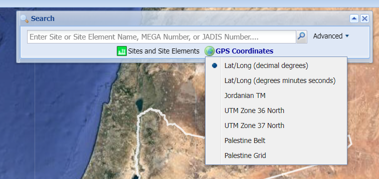

# Dev

Scheduled IT developments for the EAMENA DB and miscellaneous

## Postgres

### DB Read (only)

*expected behaviour*: give users access to query the Postgres database using functions [eamenaR](https://github.com/eamena-project/eamenaR#eamenar-) package.

*hints*: create Postgres views, change the Potgres configuration file `pg_hba.conf` 

see: https://community.archesproject.org/t/give-access-to-a-custom-postgresql-view/1900/1

## Spatial

Development on Mapbox

### Cluster zooming

*expected behaviour*: after clicking on a cluster, this cluster explode and there's an automatic zoom-in to its minimum bound rectangle. The behaviour we expect is similar to Arches v3

see: https://community.archesproject.org/t/mapbox-cluster-zooming/1964

### Reverse geocoding

*expected behaviour*: be able to find a place (zoom-in) from its coordinates 

  
   
    <em>caption</em>

see: https://community.archesproject.org/t/reverse-geocoding-zoom-in-from-coordinates/1852

### search by different type of coordinates

  
   
    <em>caption</em>

### Collect the coordinates

*expected behaviour*: on a click in the map, lon/lat coordinates of the point are shown in the bottom-right or bottom-left of the map and can be copied in the clipboard

### Cluster of Clusters

*expected behaviour*: group in cluster or explode clusters depending on zoom-in zoom-ou

  
   
    <em>caption</em>

see: https://community.archesproject.org/t/mapbox-cluster-grouping/1999/1

---

## Images

Restore the path of images

  
   
    <em>caption</em>

  
example: Search INFORMATION-0104667

---

## Audit

### Translate https://mareastats.drashsmith.com/ from PHP to Python

  
   
    <em>caption</em>

### Data completness

Develop a Python function to model the quality of HP (or HR) with a radar diagram

https://github.com/eamena-project/eamena-arches-5-project/blob/master/eamena/statistics/hr_quality_rec.py
