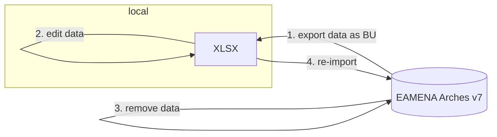
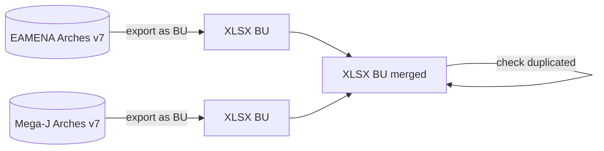
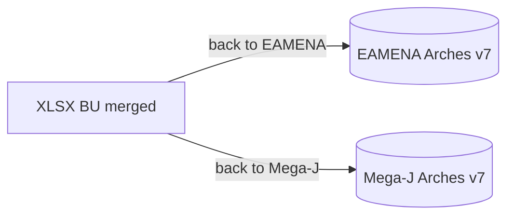

# Dev

Scheduled IT developments for the EAMENA DB and miscellaneous. Test on [EA training instance](https://github.com/eamena-project/eamena-arches-dev/tree/main/dev#instance-ea) or main database. All scripts will be moved to an another place once the dev part is acomplished.

* (*in progress*) i18n/l10n to Central Kurdish (Sorani) ([here](https://github.com/eamena-project/eamena-arches-dev/tree/main/dbs/kahd)) nd [French](https://github.com/eamena-project/eamena-arches-dev/tree/main/dbs/database.eamena/i18n#i18n))
* (*in progress*) EAMENA/APAAME "tight links", linking the DB with the new ArchDAMS ResourceSpace-based server ([here](https://github.com/eamena-project/eamena-arches-dev/blob/main/projects/apaame/README.md#apaame-server)) 
* (*in progress*) `emenar_temp` user (readonly user) to query the DB backend:
	- [eamenar-readonly.ipynb](https://colab.research.google.com/github/eamena-project/eamena-arches-dev/blob/main/dbs/database.eamena/postgres/eamenar-readonly.ipynb)
* (*in progress*) [citation-generator](https://github.com/eamena-project/eamena-arches-dev/tree/main/dbs/database.eamena/citation)
* (*in progress*) i18n/l10n to French ([here](https://github.com/eamena-project/eamena-arches-dev/tree/main/dbs/database.eamena/i18n#internationalisation))


## Instance

### EA
> EA training instance

```
Host EA-training-instance
  HostName 34.244.241.250
  IdentityFile "C:/Users/Thomas Huet/Desktop/EAMENA/IT/keys/EA_training.pem"
  User ubuntu
```

## Arches

### Deployement

- Docker deployement of Arches v7.6 (stable version)

**doc**

- https://github.com/Central-Asian-Archaeological-Landscapes/arches-via-docker/issues/1

### Citation
> cf. https://github.com/eamena-project/eamena-arches-dev/tree/main/data/bibref

### Card permission

*expected behaviour*: hide coordinates to Guest users withou hiding the map (zoom-in can be limited)

see: https://community.archesproject.org/t/card-permission/1675/1

## Postgres

### DB Read (only)

*expected behaviour*: give users access to query the Postgres database using functions [eamenaR](https://github.com/eamena-project/eamenaR#eamenar-) package in READ only mode ([example](https://github.com/eamena-project/eamenaR/blob/107bd73656180f34c06880df36ea5aa601f859b5/R/ref_hps.R#L75-L107))

*hints*: create Postgres views, change the Potgres default configuration file (renammed) [pg_hba_old.conf](https://github.com/eamena-project/eamena-arches-dev/blob/main/dev/postgres/pg_hba_old.conf) to a new file [pg_hba.conf](https://github.com/eamena-project/eamena-arches-dev/blob/main/dev/postgres/pg_hba.conf). 

see: https://community.archesproject.org/t/give-access-to-a-custom-postgresql-view/1900/1

---

## Citation Plugin


## Spatial

Development on Mapbox

### Clusters

#### Cluster zooming

*expected behaviour*: after clicking on a cluster, this cluster explode and there's an automatic zoom-in to its minimum bound rectangle. The behaviour we expect is similar to Arches v3

see: https://community.archesproject.org/t/mapbox-cluster-zooming/1964


#### Cluster of Clusters

*expected behaviour*: group in cluster or explode clusters depending on zoom-in zoom-ou

<p align="center">
  
  <br>
    <em>caption</em>
</p>

see: https://community.archesproject.org/t/mapbox-cluster-grouping/1999/1


### Reverse geocoding

*expected behaviour*: be able to find a place (zoom-in) from its coordinates 

<p align="center">
  
  <br>
    <em>caption</em>
</p>


For example, the [Mega-J](../www/megaj-search-coordinates.png) DB autorise the search by different type of coordinates

**doc**

- https://community.archesproject.org/t/reverse-geocoding-zoom-in-from-coordinates/1852
- https://community.archesproject.org/t/enable-reverse-geocoding-in-the-geocoding-box/2327/4

### Collect the coordinates

*expected behaviour*: on a click in the map, lon/lat coordinates of the point are shown in the bottom-right or bottom-left of the map and can be copied in the clipboard

---


## BU exchanges

[Bulk Upload](https://github.com/eamena-project/eamena-arches-dev/tree/main/data/bulk) exchanges. Objectives are:

- [1️)](https://github.com/eamena-project/eamena-arches-dev/tree/main/data/bulk#eamena-%EF%B8%8F-eamena-workflow) facilitate the edition of already existing data in the EAMENA DB;
- [2)](https://github.com/eamena-project/eamena-arches-dev/tree/main/data/bulk#eamena-%EF%B8%8F-other-db-workflow) exchange data between EAMENA and national instances BDs;

### EAMENA ↔️ EAMENA workflow

For selected HPs



### EAMENA ↔️ Other DB workflow

To exchange data between different Arches-based databases (eg: Mega-J once this database has been ported to Arches v7), the workflow will be to:



In this example, the merged XLSX dataset will be sorted and/or filtered by toponyms, coordinates, or any relevant fields to group rows refering to the same HPs. Then two cases can occur:

1. total matching/perfect duplicates: one of them is removed
2. partial matching: the *n* rows are merged in a single record (ie, with the same UNIQUEID), like this (see ID 5):

<div align = "center">

| UNIQUEID | Assessment.Investigator.-.Actor | Investigator.Role.Type   | Assessment.Activity.Type | Assessment.Activity.Date | GE.Assessment(Yes/No) | Resource.Name | Name.Type             |
|----------|---------------------------------|--------------------------|--------------------------|--------------------------|-----------------------|---------------|-----------------------|
| ...      | ...                             | ...                      | ...                      | ...                      | ...                   | ...           | ...                   |
| 4        | Mohamed Kenawi                  | EAMENA Project Staff     | Desk-based Assessment    | 2022-10-05               | Yes                   |               |                       |
| 5        | Martin Sterry                   | **MEGA-J Project Staff** |                          | 2028-09-12               |                       | AAA f.37.5    | Alternative Reference |
| 5        | Mohamed Kenawi                  | **EAMENA Project Staff** | Desk-based Assessment    | 2022-10-05               | Yes                   | Metkaouak     | Toponym               |
| ...      | ...                             | ...                      | ...                      | ...                      | ...                   | ...           | ...                   |

Example of a merged XLSX BU record resulting from the merge of EAMENA (bolded) and Mega-J (bolded) BUs

</div>

Once done, the merged BU will be returned to the databases.




---

## Images

Restore the path of images

<p align="center">
  
  <br>
    <em>caption</em>
</p>
  
example: Search INFORMATION-0104667

---


