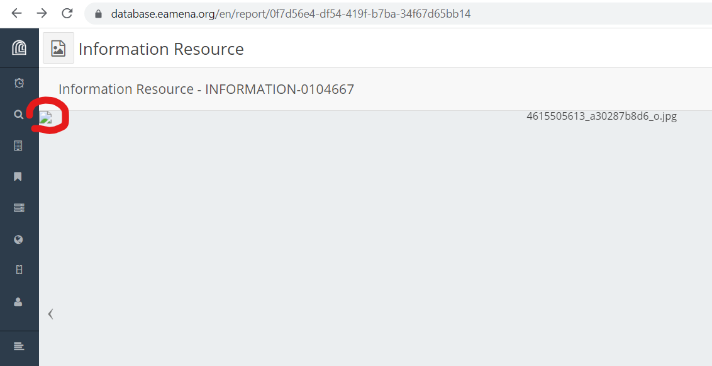
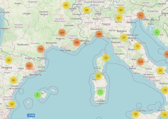
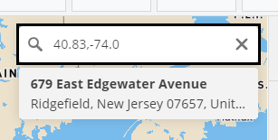
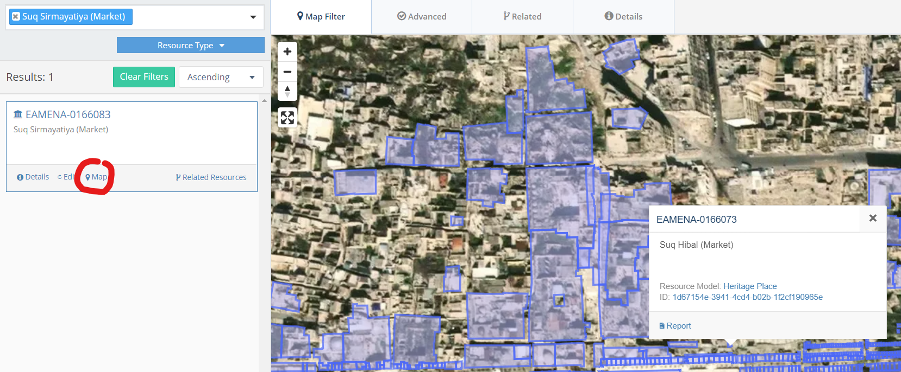
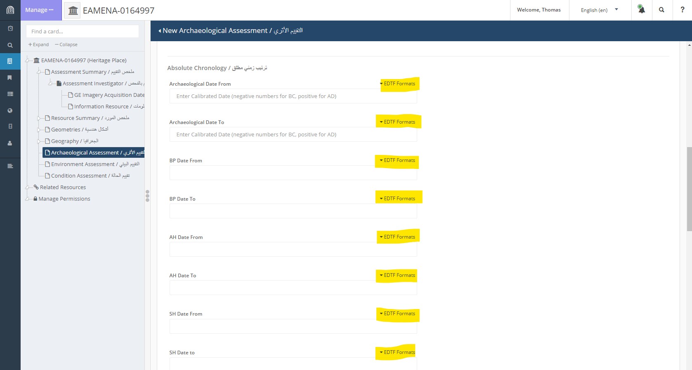
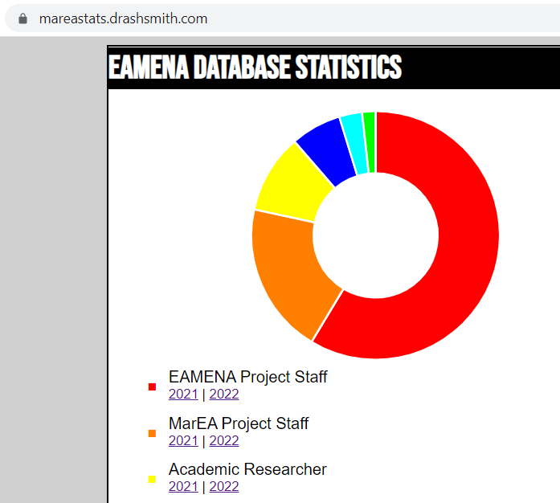
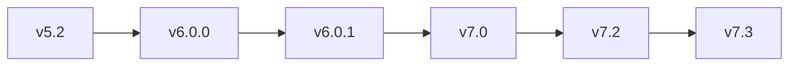
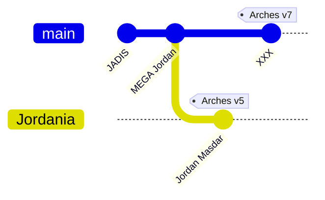
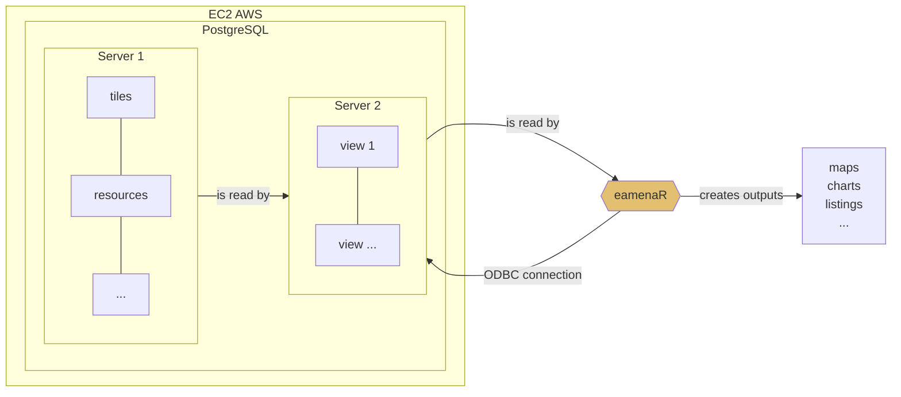

# Dev
> scheduled developments and miscellaneous

## Images

Restore the path of images

  
   
    <em>caption</em>

  
example: Search INFORMATION-0104667

## Spatial

### Collect the coordinates

*expected behaviour*: on a click in the map, lon/lat coordinates of the point are shown in the bottom-right or bottom-left of the map and can be copied in the clipboard

### Cluster of Clusters

*expected behaviour*: group in cluster or explode clusters depending on zoom-in zoom-ou

Restore the path of images

  
   
    <em>caption</em>

  

### Cluster zooming

*expected behaviour*: after clicking on a cluster, this cluster explode and there's an automatic zoom-in to its minimum bound rectangle. The behaviour we expect is similar to Arches v3

see: https://community.archesproject.org/t/mapbox-cluster-zooming/1964

### Reverse geocoding

*expected behaviour*: be able to find a place (zoom-in) from its coordinates 

  
   
    <em>caption</em>

see: https://community.archesproject.org/t/reverse-geocoding-zoom-in-from-coordinates/1852

### Zoom level

+ Keep the same level of zoom when clicking on the 'map' button 

  
   
    <em>caption</em>

Today when click on the 'map' button, there's a de-zoom

example: Search 'Suq Sirmayatiya (Market)' = [EAMENA-0166083](https://database.eamena.org/search?paging-filter=1&tiles=true&format=tilecsv&precision=6&total=336316&term-filter=%5B%7B%22inverted%22%3Afalse%2C%22type%22%3A%22string%22%2C%22context%22%3A%22%22%2C%22context_label%22%3A%22%22%2C%22id%22%3A%22Suq%20Sirmayatiya%20(Market)%22%2C%22text%22%3A%22Suq%20Sirmayatiya%20(Market)%22%2C%22value%22%3A%22Suq%20Sirmayatiya%20(Market)%22%7D%5D)

## Time

### EDTF

  
   
    <em>caption</em>

### Audit

Translate https://mareastats.drashsmith.com/ from PHP to Python

  
   
    <em>caption</em>

## Related resources
> test to add contains relation with 23test 

example: Search EAMENA-0185187
https://database.eamena.org/en/search?paging-filter=1&tiles=true&format=tilecsv&precision=6&total=336316&term-filter=%5B%7B%22context%22%3A%22%22%2C%22context_label%22%3A%22Heritage%20Place%20-%20EAMENA%20ID%22%2C%22id%22%3A0%2C%22text%22%3A%22EAMENA-0185187%22%2C%22type%22%3A%22term%22%2C%22value%22%3A%22EAMENA-0185187%22%2C%22inverted%22%3Afalse%7D%5D

## LOD
> Linked open data

See 'Related resources', try to recover the info with a SPARQL endpoint

## Quality of information

Develop a Python function to model the quality of HP (or HR) with a radar diagram

https://github.com/eamena-project/eamena-arches-5-project/blob/master/eamena/statistics/hr_quality_rec.py

## Arches v5.2 to v7.3 upgrade

### Proposed workflow
> cf. https://github.com/archesproject/arches/blob/dev/7.3.x/releases/7.3.0.md#upgrading-arches

## National instances
> [Git Mermaid diagram](https://mermaid.js.org/syntax/gitgraph.html) 

Example of a Palestinian national instance with EAMENA data

## From JADIS to a new Jordanian national instance
> [Git Mermaid diagram](https://mermaid.js.org/syntax/gitgraph.html) 

## PostgreSQL Views

Planning of Arches v7 (EAMENA v4) installation, test and release.

