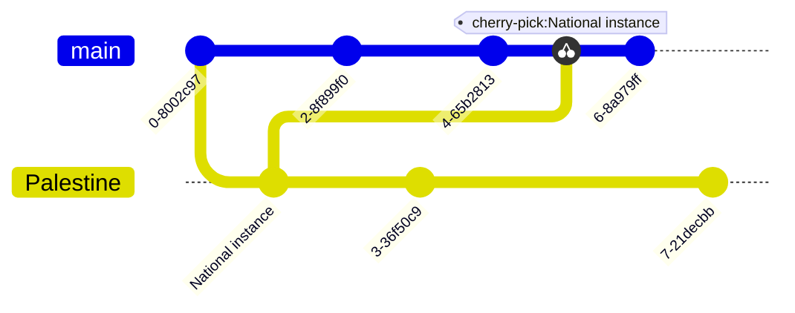
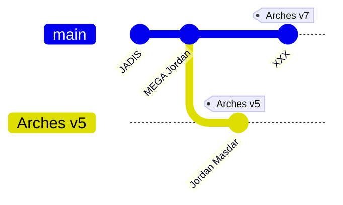
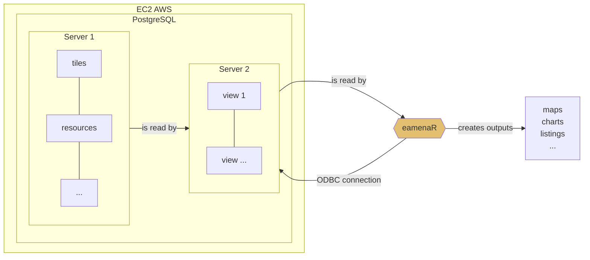

# Dev

## Mermaid Git Diagram

```mermaid
gitGraph
       commit
       branch Palestine
       commit id:"National instance"
       checkout main
       commit
       checkout Palestine
       commit
       checkout main
       commit
       cherry-pick id:"National instance"
       commit
       checkout Palestine
       commit
```

```mermaid
gitGraph
       commit id: "JADIS"
       commit id: "MEGA Jordan"
       branch "Arches v5"
       commit id: "Jordan Masdar" tag: "Arches v5"
       checkout main
       commit id: "XXX" tag: "Arches v7"
```

## PostgreSQL Views

Planning of Arches v7 (EAMENA v4) installation, test and release.

```mermaid
flowchart LR
  subgraph EC2 [EC2 AWS]
    direction TB
    subgraph PostgreSQL
        direction LR
        subgraph DB [Server 1]
            direction TB
            A[tiles] --- B[resources]
            B --- Z[...]
        end
        subgraph VIEWS [Server 2]
            direction TB
            C[view 1] --- Y[view ...]
        end
    end
  end
  DB -- is read by --> VIEWS
  VIEWS -- is read by --> D{{eamenaR}}:::eamenaRpkg
  D -- ODBC connection --> VIEWS
  D -- creates outputs --> E[maps<br>charts<br>listings<br>...]
  classDef eamenaRpkg fill:#e3c071
```