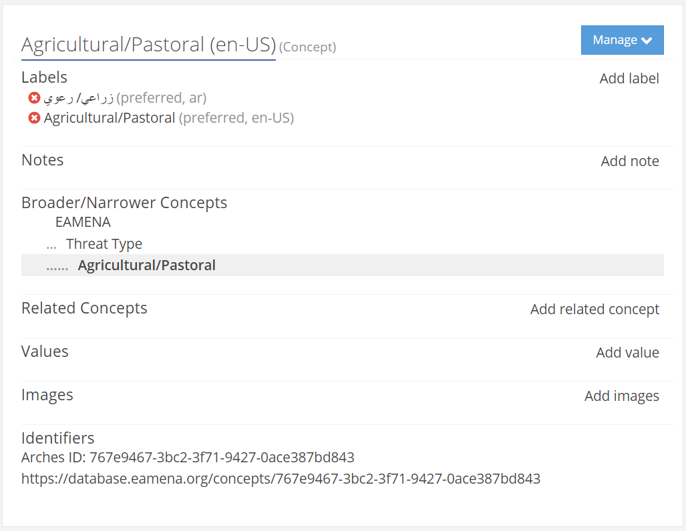
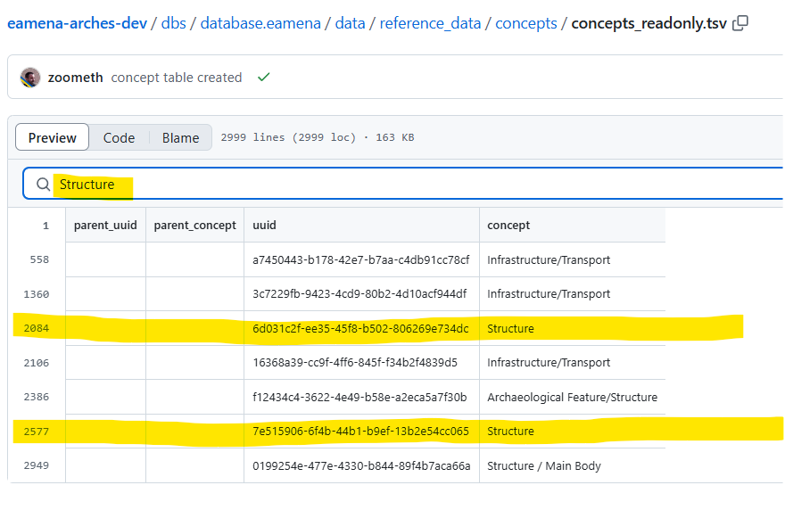
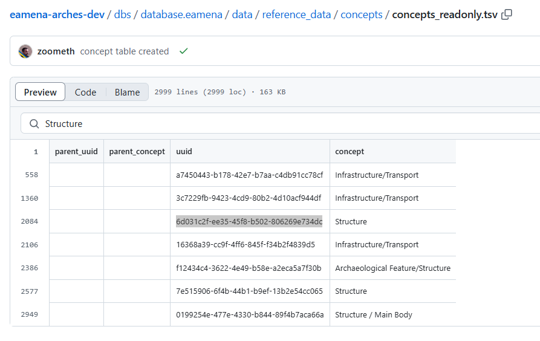
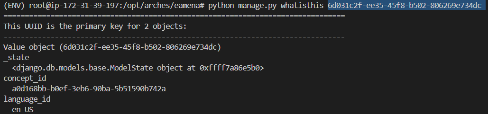
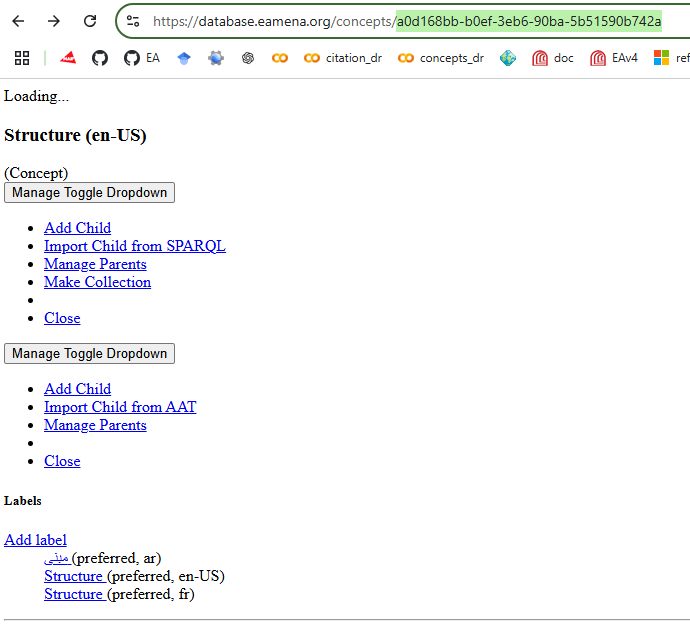

# Iconic images for EAMENA Concepts

Associate one image to an EAMENA concept to illustrate the latter (ex: Threat type = Agricultural/Pastoral).


<p align="center">
  
  
  <br>
    <em>The `Agricultural/Pastoral` threat concept in the RDM illustrated with a photograph showing  Agricultural/Pastoral (orchads) threat over cultural heritage.</em>
</p>

The objective is to link the concept image UUID to the RM ex: Threat type = Agricultural/Pastoral, UUID: `767e9467-3bc2-3f71-9427-0ace387bd843`) and display these images as leafs in the Entity-Relationship Diagram of HPs (interactive graph)


## Images metadata

* [website 'hub'](https://eamena.org/advanced-use#rm-hp-fields)
* [GitHub thread #91](https://github.com/eamena-project/eamena-arches-dev/issues/91)
* [fields](https://github.com/eamena-project/eamena-arches-dev/blob/main/dbs/database.eamena/data/reference_data/rm/hp/mds/mds-template-readonly.tsv) and [values](https://github.com/eamena-project/eamena-arches-dev/blob/main/dbs/database.eamena/data/reference_data/concepts/concepts_readonly.tsv) UUIDs
* [Concepts with images](https://github.com/eamena-project/eamena-data?tab=readme-ov-file#concepts)
* [Concepts in Google Colab](https://colab.research.google.com/drive/1qzKlquPN6c_6wzmSheujZ0mas9UzfRlg)
* [COD GitHub project](https://github.com/eamena-project/eamena-arches-dev/tree/main/projects/cod#photographs)
* [COD Resource Space server](https://cityofthedead.arch.ox.ac.uk/pages/collections_featured.php)


### Values UUIDs


* Ambiguous UUIDs for values



Check the first one



in the DB back office



The concept is:



TODO: return parent UUID and labels

```py
import requests
import json
import pandas as pd
from lxml import etree   
concept = "https://raw.githubusercontent.com/eamena-project/eamena/master/eamena/pkg/reference_data/concepts/EAMENA.xml"
response = requests.get(concept)
root = etree.fromstring(response.content)
id_value_pairs_corrected = []
ct = 0
for concept in root.xpath('//skos:Concept', namespaces=root.nsmap):
  ct = ct + 1
  if ct > 3:
    break
  parent = concept.getparent()
  # print(parent)
  parent_pref_label = parent.find('skos:prefLabel', namespaces=root.nsmap) if parent is not None else None
  parent_content = json.loads(parent_pref_label.text) if parent_pref_label is not None and '{http://www.w3.org/XML/1998/namespace}lang' in parent_pref_label.attrib and parent_pref_label.attrib['{http://www.w3.org/XML/1998/namespace}lang'] == "en-us" else {'id': None, 'value': None}
  # print(parent_content)
  for pref_label in concept.findall('skos:prefLabel', namespaces=root.nsmap):
    if '{http://www.w3.org/XML/1998/namespace}lang' in pref_label.attrib and pref_label.attrib['{http://www.w3.org/XML/1998/namespace}lang'] == "en-us":
      content = json.loads(pref_label.text)
      # Include parent id and value along with the child's
      id_value_pairs_corrected.append((parent_content['id'], parent_content['value'], content['id'], content['value']))
df = pd.DataFrame(id_value_pairs_corrected, columns=['parent_uuid', 'parent_concept', 'uuid', 'concept'])
# df = nodes_uuids(choice = "concept")
df.head()
```


See: 
* https://colab.research.google.com/github/eamena-project/eamena-data/blob/main/reference-data/concepts/heritage_places/concepts_images_graph.ipynb
* ~~https://colab.research.google.com/github/eamena-project/eamena-data/blob/main/reference-data/concepts/heritage_places/concepts_images.ipynb~~
