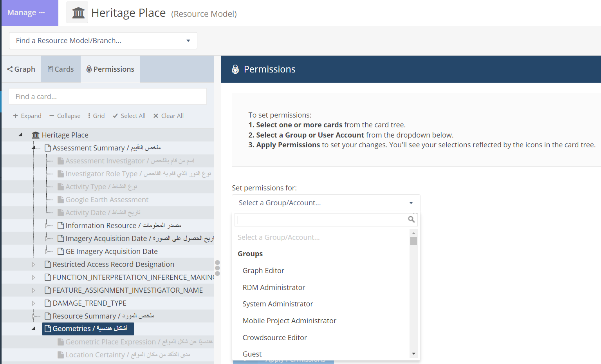

# User Permissions
> Bulk-application of instance-level permissions, Built-in permissions, ...

## Aim

1. Hide HP coordinates for Guest users
2. Don't allow Guest users to be able to Export Search Results 
2. For a specific country, Syria, 3 different groups (NE Kurdish, Itlib, Baghdad regime) should be able to input data, but the other two groups should be not able to see the data of the third one (particularly: Person names and Condition Assessment)

## IT solution

### QGIS/PostGRES
> see W. Deadman

A PostGRES DB having 3 different schemas is hosted online (AlwaysData) and accessed through QGIS. It allows 3 different groups to work on the same DB but in a siloed manner.

### Built-in

Natively, Arches allows:

Arches Designer > Resource Model > Heritage Place > Permissions >   
    - [EAMENA](https://database.eamena.org/graph_designer/34cfe98e-c2c0-11ea-9026-02e7594ce0a0)

  
   

### Custom

Duplicate EAMENA card, change the configuration of the duplicated card permissions in a way it can be seen by people in a particular group (user [permission level](https://github.com/eamena-project/eamena-arches-dev/tree/main/dbs/database.eamena/users#eamena-new-groups))

- duplicate the `eamena-default-card`  
- rename the duplicate `eamena-permission-card`  

* see
	- the Card: https://github.com/search?q=repo%3Aeamena-project%2Feamena%20eamena-default-card&type=code
	- Arches forum: https://community.archesproject.org/t/card-permission/1675?u=zoometh

## Documentation

* Issue thread: [#11](https://github.com/achp-project/cultural-heritage/issues/11)
* Arches forum:
  - https://community.archesproject.org/t/hiding-spatial-locations-in-the-report-template/1020
  - https://community.archesproject.org/t/hide-places-coordinates-from-an-user-group-in-a-report-without-hiding-them-on-the-map/2042
  - https://community.archesproject.org/t/guest-group-and-anonymous-user-permissions/2301/4

* Phil Carlisle (HE) is developping a new paradigm to handle Arches permissions at very different levels
* [ring-fencing plugin](https://github.com/eamena-project/eamena-arches-dev/tree/main/functions/permissions)
* [IT draft](doc/SyrianDB_KH_WD.pdf)

