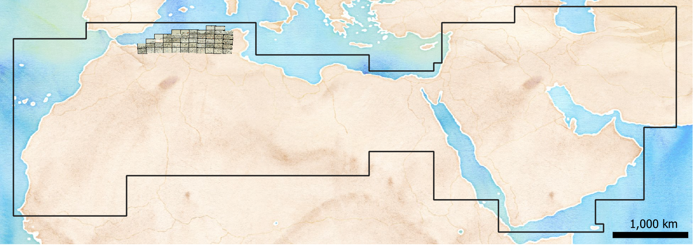

# GeoServer

  
   
    <em>Screenshot of the QGIS project with connected to the GeoServer: grids (WFS) and the 'Atlas Archéologique d'Algérie'</em>

EAMENA GeoServer (http://54.155.109.226:8080/geoserver) host different files

| Service  	|  URL 	|
|---	|---	|
| WFS  	|  http://54.155.109.226:8080/geoserver/ows?acceptversions=2.0.0 	|
| WMS 	|  http://54.155.109.226:8080/geoserver/ows?version=1.3.0 	|

## WFS

Web File Services

| type | Name  	|   description	| map |
|---	|---	|---	|--- |
| Grids | EAMENA_Grid_contour  	| EAMENA Grid Squares perimeter	|  |
| Grids | EAMENA_Grid  	|  EAMENA Grid Squares 	|  |
| Grids | grids_nb_hp_230704  |  Nb of heritage places by Grid Squares (see eamenaR) 	|   |

## WMS

Web Map Services

| type | Name  	|   description	| map |
|---	|---	|---	|--- |
| Atlas | AAA  	| Atlas Archéologique d'Algérie	|  |
| Climate | Beck_KG_V1_present_0p008  	| Koppen Climate Classification	|  |

