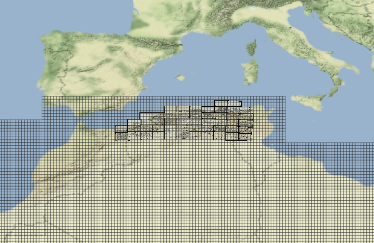

# QGIS

## GeoServer

The QGIS project, with already set connections to the GeoServer (WMS, WFS, etc.), is here: https://github.com/eamena-project/eamena-arches-dev/blob/main/gis/qgis/projet_gesoserver.qgz

  
   
    <em>Screenshot of the QGIS project</em>

