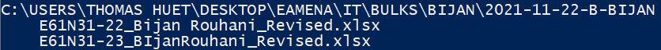
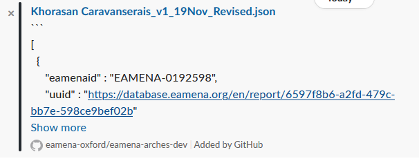
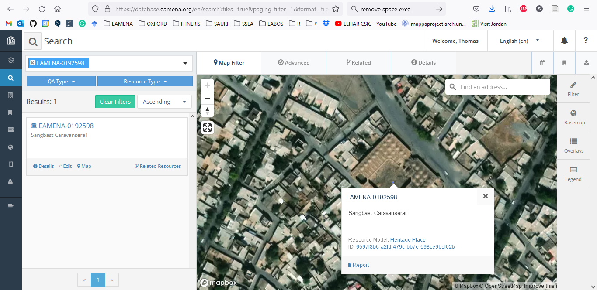

# Bulk Upload (BU)  

A Bulk Upload is a process allowing to upload **several XLSX files contained in a single folder**

  
   
    <em>The folder `2021-11-22-B-BIJAN` contains two XLSX files</em>

## BU process
> step-by-step BU procedure from the user-side

- choose a short and self-explanatory names for your **XLSX file(s)**, for example, the name of `gridcell-subpart-name` (ex: `E61N31-23-Bijan.xlsx`), avoid using dots in the filename (~~`E61N31.23.Bijan.xlsx`~~) 

- add the BUs worksheets on a **folder** named YYYY-MM-DD-Name (ex: 2021-11-23-Bijan). If you run various BUs processes the same day, you will have to name your folders with different suffixes (ex: 2021-11-22-Bijan, 2021-11-22a-Bijan)

- add these folders on **your OneDrive**, and send a Slack message to the DB Manager with the **name(s) of the XLSX file(s)** and the **link to their folder** 

- if **the BU does not work**, because there are errors, the DB Manager will send you an **error report** in the form of an error JSON file named in the same way as your BU files (ex: [`E61N31-22-Bijan.json`](https://github.com/eamena-oxford/eamena-arches-dev/blob/main/output/bulk/Bulks/2021-11-21-Bijan/E61N31-21-Bijan.json))

  - follow the recommendations of the error JSON file, correcting the content of your file. Once done, change the name of your file to something explicit, e.g. adding the suffix `-rev` (for `revised`) at the end of the file name (ex: `E61N31-22-Bijan.xlsx` -> `E61N31-22-Bijan-rev.xlsx`)

- if **the BU works**, the DB Manager will send you a **confirmation** taht your BU has been uploaded, and the JSON output will be uploaded into the **same OneDrive folder** as your BUs worksheets 

  - if you ask to, the DB Manager will send you a [BU summary](https://github.com/eamena-oxford/eamena-arches-dev/blob/main/output/bulk/BU.md#bu-summary) in the form of a JSON file named in the same way as your BU files with the suffix `-sum` (for `summary`), ex: [`E61N31-22-Bijan-rev-sum.json`](https://github.com/eamena-oxford/eamena-arches-dev/blob/main/output/bulk/Bulks/2021-11-21-Bijan/E61N31-21-Bijan-rev-sum.json)

- once you received the confirmation that your BU has been uploaded into the DB, **move your BU folder into an archive folder** 

See the 'ideal' file/folder naming/structure on the [Bulks/](https://github.com/eamena-oxford/eamena-arches-dev/tree/main/output/bulk/Bulks) folder

## BU summary
> After a successfull BU, render a short summary for the user

Once the BU process has been completed, a resume can be displayed with a Python command[^1]. The result is copied/pasted in a JSON file. A Search &Replace allows to convert the UUID into an URL[^2]

  
   
    <em>screenshot of the JSON with URL</em>

The URL opens the Resource Report

  
   
    <em>screenshot of the Resource Report</em>

The Resource name can be search in the map database

  
   
    <em>screenshot of the Resource Report</em>

[^1]: `python /opt/arches/eamena/manage.py bu -o summary -s "filename.json" | json_pp`
[^2]: Search: `"uuid" : "`, Replace by `"uuid" : "https://database.eamena.org/en/report/`
