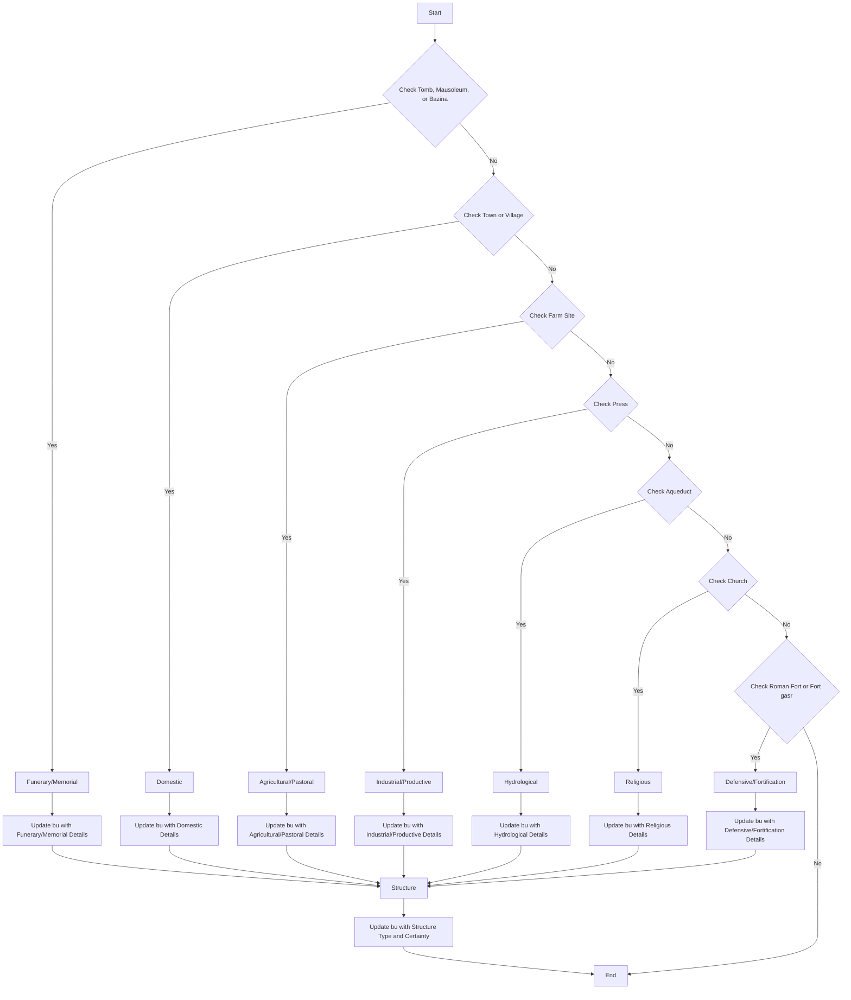

# AAA
> Atlas archéologique d'Algérie


## Data

### HP

#### Mapping



```mermaid
graph TD
    A[Start] --> B{Check Tomb, Mausoleum, or Bazina}
    B -->|Yes| C[Funerary/Memorial]
    B -->|No| D{Check Town or Village}
    D -->|Yes| E[Domestic]
    D -->|No| F{Check Farm Site}
    F -->|Yes| G[Agricultural/Pastoral]
    F -->|No| H{Check Press}
    H -->|Yes| I[Industrial/Productive]
    H -->|No| J{Check Aqueduct}
    J -->|Yes| K[Hydrological]
    J -->|No| L{Check Church}
    L -->|Yes| M[Religious]
    L -->|No| N{Check Roman Fort or Fort gasr}
    N -->|Yes| O[Defensive/Fortification]
    N -->|No| Z{Check Roman, Byzantine, or RR}
    Z -->|Yes| ZA[Classical/Protohistoric/Pre-Islamic (North Africa)]
    Z -->|No| ZB{Check Berber or BerberFor}
    ZB -->|Yes| ZC[Unknown]
    ZB -->|No| P[End]

    C --> Q[Update bu with Funerary/Memorial Details]
    E --> R[Update bu with Domestic Details]
    G --> S[Update bu with Agricultural/Pastoral Details]
    I --> T[Update bu with Industrial/Productive Details]
    K --> U[Update bu with Hydrological Details]
    M --> V[Update bu with Religious Details]
    O --> W[Update bu with Defensive/Fortification Details]
    ZA --> ZA1[Update bu with Classical/Protohistoric/Pre-Islamic (North Africa) Details]
    ZC --> ZC1[Update bu with Unknown Details]

    Q --> X[Structure]
    R --> X
    S --> X
    T --> X
    U --> X
    V --> X
    W --> X
    ZA1 --> X
    ZC1 --> X
    X --> Y[Update bu with Structure Type and Certainty]
    Y --> P
```


#### URLs

* Search URL (~7882 HP)

https://database.eamena.org/search?paging-filter=4&tiles=true&format=tilecsv&reportlink=false&precision=6&total=7882&advanced-search=%5B%7B%22op%22%3A%22and%22%2C%2234cfe9dd-c2c0-11ea-9026-02e7594ce0a0%22%3A%7B%22op%22%3A%22~%22%2C%22lang%22%3A%22en%22%2C%22val%22%3A%22AAA%22%7D%2C%2234cfea97-c2c0-11ea-9026-02e7594ce0a0%22%3A%7B%22op%22%3A%22%22%2C%22val%22%3A%224bd93e89-2c7e-4e01-9c42-7119e16092f3%22%7D%7D%5D

* GeoJSON URL 

https://database.eamena.org/api/search/export_results?paging-filter=1&tiles=true&format=geojson&reportlink=false&precision=6&language=*total=7882&advanced-search=%5B%7B%22op%22%3A%22and%22%2C%2234cfe9dd-c2c0-11ea-9026-02e7594ce0a0%22%3A%7B%22op%22%3A%22~%22%2C%22lang%22%3A%22en%22%2C%22val%22%3A%22AAA%22%7D%2C%2234cfea97-c2c0-11ea-9026-02e7594ce0a0%22%3A%7B%22op%22%3A%22%22%2C%22val%22%3A%224bd93e89-2c7e-4e01-9c42-7119e16092f3%22%7D%7D%5D&resource-type-filter=%5B%7B%22graphid%22%3A%2234cfe98e-c2c0-11ea-9026-02e7594ce0a0%22%2C%22name%22%3A%22Heritage%20Place%22%2C%22inverted%22%3Afalse%7D%5D
(*not visible*)

## Zenodo sandobx deposit
> see https://sandbox.zenodo.org/

Metadata from the Search/GeoJSON URL:

```
{'created': '2024-01-18T15:59:42.566835+00:00',
 'modified': '2024-01-18T15:59:57.343103+00:00',
 'id': 22970,
 'conceptrecid': '22969',
 'metadata': {'title': "AAA: Atlas archéologique d'Algérie. Heritage Places",
  'publication_date': '2024-01-18',
  'description': "Digitalization of the 'Atlas archéologique d'Algérie' Heritage Places Deposit from the EAMENA Database.",
  'access_right': 'open',
  'creators': [{'name': 'EAMENA database',
    'affiliation': 'University of Oxford, University of Southampton'}],
  'contributors': [{'name': 'Mohamed Kenawi',
    'affiliation': None,
    'type': 'DataCollector'},
   {'name': 'Martin Sterry', 'affiliation': None, 'type': 'DataCollector'},
   {'name': 'Nichole Sheldrick', 'affiliation': None, 'type': 'DataCollector'},
   {'name': 'Julia Nikolaus', 'affiliation': None, 'type': 'DataCollector'},
   {'name': 'Thomas Huet', 'affiliation': None, 'type': 'DataCollector'}],
  'keywords': ['EAMENA',
   'MaREA',
   'Cultural Heritage',
   'Algeria',
   'Classical/Protohistoric/Pre-Islamic (North Africa)',
   'Classical/Pre-Islamic (Levant/Mesopotamia/Iran/Northern Arabia)',
   'Islamic (North Africa)',
   'Neolithic (Maghreb)',
   '(إسلامي (شمال أفريقيا',
   'Palaeolithic (North Africa)'],
  'subjects': [{'term': 'Cultural property',
    'identifier': 'https://id.loc.gov/authorities/subjects/sh97000183.html',
    'scheme': 'url'}],
  'dates': [{'type': 'created', 'start': '2021-05-14', 'end': '2023-07-13'}],
  'license': 'cc-by-4.0',
  'imprint_publisher': 'Zenodo',
  'method': 'EAMENA data entry methodology',
  'upload_type': 'dataset',
  'prereserve_doi': {'doi': '10.5281/zenodo.22970', 'recid': 22970}},
 'title': "AAA: Atlas archéologique d'Algérie. Heritage Places",
 'links': {'self': 'https://sandbox.zenodo.org/api/records/22970',
  'html': 'https://sandbox.zenodo.org/records/22970',
  'badge': 'https://sandbox.zenodo.org/badge/doi/.svg',
  'files': 'https://sandbox.zenodo.org/api/records/22970/files',
  'latest_draft': 'https://sandbox.zenodo.org/api/deposit/depositions/22970',
  'latest_draft_html': 'https://sandbox.zenodo.org/deposit/22970',
  'publish': 'https://sandbox.zenodo.org/api/deposit/depositions/22970/actions/publish',
  'edit': 'https://sandbox.zenodo.org/api/deposit/depositions/22970/actions/edit',
  'discard': 'https://sandbox.zenodo.org/api/deposit/depositions/22970/actions/discard',
  'newversion': 'https://sandbox.zenodo.org/api/deposit/depositions/22970/actions/newversion',
  'registerconceptdoi': 'https://sandbox.zenodo.org/api/deposit/depositions/22970/actions/registerconceptdoi'},
 'record_id': 22970,
 'owner': 28,
 'files': [],
 'state': 'unsubmitted',
 'submitted': False}
```

