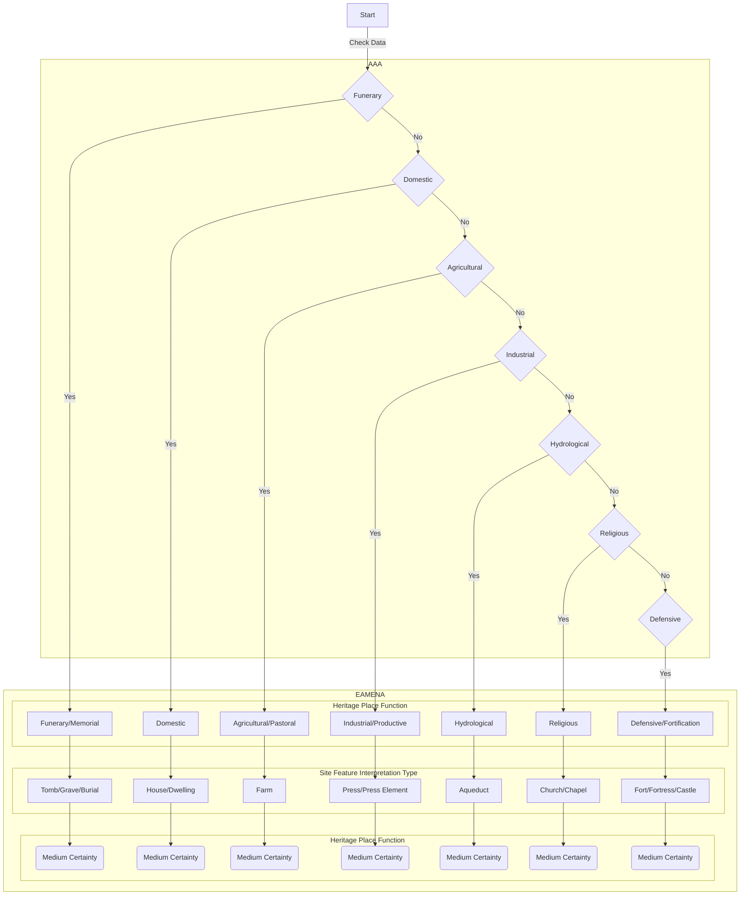

Flow chart between AAA values and EAMENA values for Heritage Places functions

```mermaid
graph TD
    A[Start] -->|Check Data| B{Funerary}
    subgraph AAA
		B -->|No| D{Domestic}
		D -->|No| G{Agricultural}
		G -->|No| J{Industrial}
		J -->|No| M{Hydrological}
		M -->|No| P{Religious}
		P -->|No| S{Defensive}
    end
    subgraph EAMENA
        subgraph "Heritage Place Function"
			B -->|Yes| C
			C[Funerary/Memorial]
			D -->|Yes| F
			F[Domestic]
			G -->|Yes| I
			I[Agricultural/Pastoral]
			J -->|Yes| L
			L[Industrial/Productive]
			M -->|Yes| O
			O[Hydrological]
			P -->|Yes| R
			R[Religious]
			S -->|Yes| U
			U[Defensive/Fortification]
        end
        subgraph "Site Feature Interpretation Type"
			E[Tomb/Grave/Burial]
			H[House/Dwelling]
			K[Farm]
			N[Press/Press Element]
			Q[Aqueduct]
			T[Church/Chapel]
			W[Fort/Fortress/Castle]
        end
        subgraph "Heritage Place Function"
			C --> E
			E --> EZ(Medium Certainty)
			F --> H
			H --> HZ(Medium Certainty)
			I --> K
			K --> KZ(Medium Certainty)
			L --> N
			N --> NZ(Medium Certainty)
			O --> Q
			Q --> QZ(Medium Certainty)
			R --> T
			T --> TZ(Medium Certainty)
			U --> W
			W --> WZ(Medium Certainty)
			EZ(Medium Certainty)
			HZ(Medium Certainty)
			KZ(Medium Certainty)
			NZ(Medium Certainty)
			QZ(Medium Certainty)
			TZ(Medium Certainty)
			WZ(Medium Certainty)
        end
    end
```