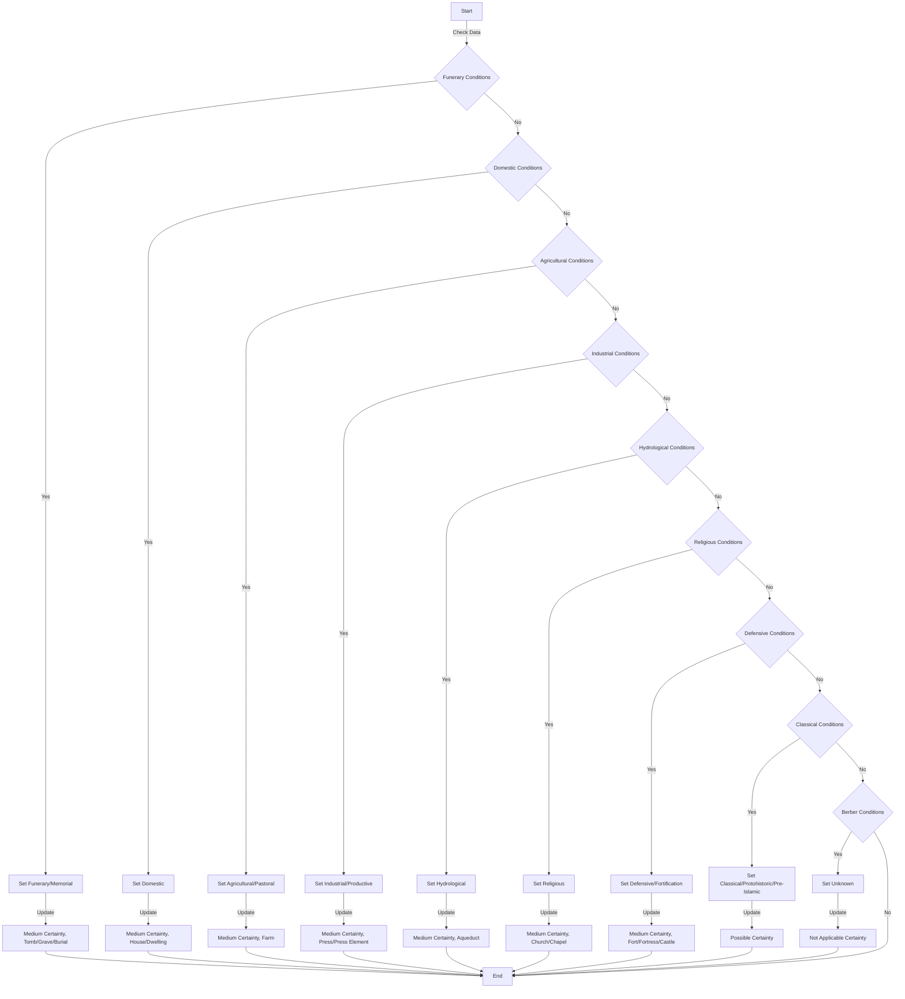

```mermaid
graph TD
    A[Start] -->|Check Data| B{Funerary Conditions}
    B -->|Yes| C[Set Funerary/Memorial]
    B -->|No| D{Domestic Conditions}
    C -->|Update| E[Medium Certainty, Tomb/Grave/Burial]
    D -->|Yes| F[Set Domestic]
    D -->|No| G{Agricultural Conditions}
    F -->|Update| H[Medium Certainty, House/Dwelling]
    G -->|Yes| I[Set Agricultural/Pastoral]
    G -->|No| J{Industrial Conditions}
    I -->|Update| K[Medium Certainty, Farm]
    J -->|Yes| L[Set Industrial/Productive]
    J -->|No| M{Hydrological Conditions}
    L -->|Update| N[Medium Certainty, Press/Press Element]
    M -->|Yes| O[Set Hydrological]
    M -->|No| P{Religious Conditions}
    O -->|Update| Q[Medium Certainty, Aqueduct]
    P -->|Yes| R[Set Religious]
    P -->|No| S{Defensive Conditions}
    R -->|Update| T[Medium Certainty, Church/Chapel]
    S -->|Yes| U[Set Defensive/Fortification]
    S -->|No| V{Classical Conditions}
    U -->|Update| W[Medium Certainty, Fort/Fortress/Castle]
    V -->|Yes| X[Set Classical/Protohistoric/Pre-Islamic]
    V -->|No| Y{Berber Conditions}
    X -->|Update| Z[Possible Certainty]
    Y -->|Yes| AA[Set Unknown]
    Y -->|No| AB[End]
    AA -->|Update| AC[Not Applicable Certainty]
    E --> AB
    H --> AB
    K --> AB
    N --> AB
    Q --> AB
    T --> AB
    W --> AB
    Z --> AB
    AC --> AB
```