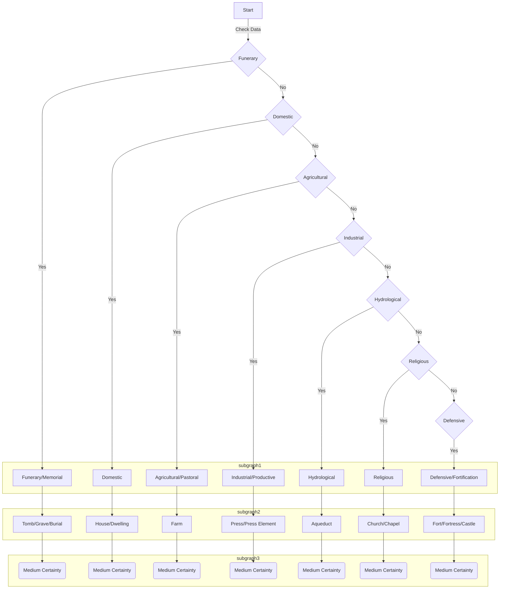
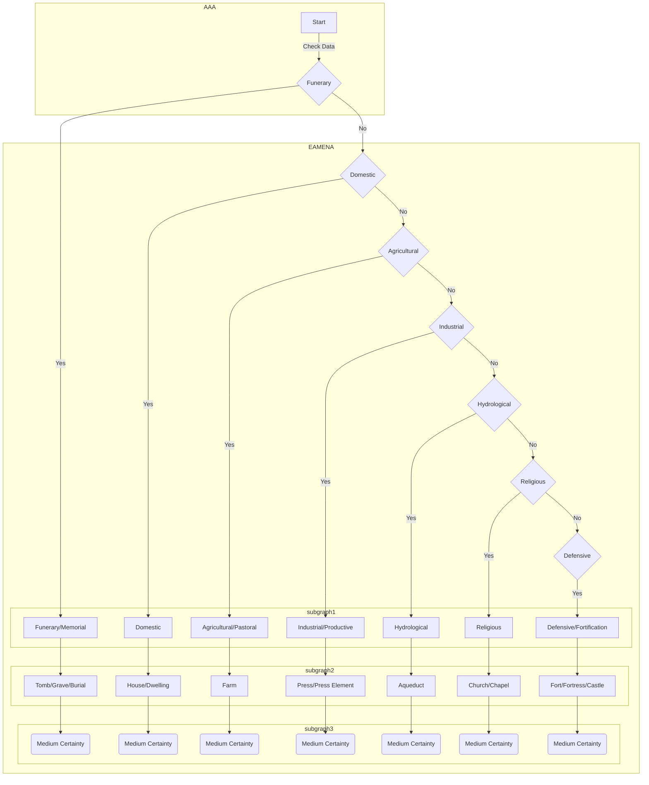
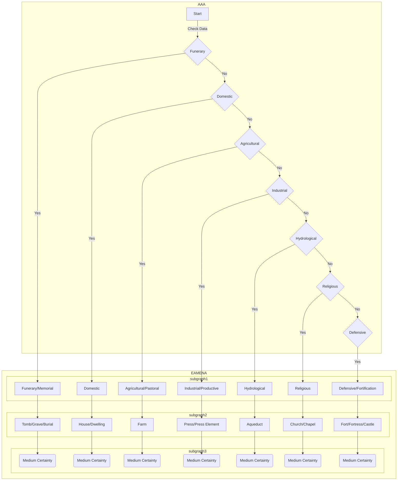

```mermaid
graph TD
    A[Start] -->|Check Data| B{Funerary}
    subgraph subgraph1
    C[Funerary/Memorial]
    F[Domestic]
    I[Agricultural/Pastoral]
    L[Industrial/Productive]
    O[Hydrological]
    R[Religious]
    U[Defensive/Fortification]
    end
    B -->|Yes| C
    B -->|No| D{Domestic}
    subgraph subgraph2
    E[Tomb/Grave/Burial]
    H[House/Dwelling]
    K[Farm]
    N[Press/Press Element]
    Q[Aqueduct]
    T[Church/Chapel]
    W[Fort/Fortress/Castle]
    end
    C --> E
    E --> EZ(Medium Certainty)
    D -->|Yes| F
    D -->|No| G{Agricultural}
    F --> H
    H --> HZ(Medium Certainty)
    G -->|Yes| I
    G -->|No| J{Industrial}
    I --> K
    K --> KZ(Medium Certainty)
    J -->|Yes| L
    J -->|No| M{Hydrological}
    L --> N
    N --> NZ(Medium Certainty)
    M -->|Yes| O
    M -->|No| P{Religious}
    O --> Q
    Q --> QZ(Medium Certainty)
    P -->|Yes| R
    P -->|No| S{Defensive}
    R --> T
    T --> TZ(Medium Certainty)
    S -->|Yes| U
    U --> W
    W --> WZ(Medium Certainty)
    subgraph subgraph3
    EZ(Medium Certainty)
    HZ(Medium Certainty)
    KZ(Medium Certainty)
    NZ(Medium Certainty)
    QZ(Medium Certainty)
    TZ(Medium Certainty)
    WZ(Medium Certainty)
    end
```

```mermaid
graph TD
    subgraph AAA
    A[Start] -->|Check Data| B{Funerary}
    end

    subgraph EAMENA
        subgraph subgraph1
        C[Funerary/Memorial]
        F[Domestic]
        I[Agricultural/Pastoral]
        L[Industrial/Productive]
        O[Hydrological]
        R[Religious]
        U[Defensive/Fortification]
        end
        B -->|Yes| C
        B -->|No| D{Domestic}
        subgraph subgraph2
        E[Tomb/Grave/Burial]
        H[House/Dwelling]
        K[Farm]
        N[Press/Press Element]
        Q[Aqueduct]
        T[Church/Chapel]
        W[Fort/Fortress/Castle]
        end
        C --> E
        E --> EZ(Medium Certainty)
        D -->|Yes| F
        D -->|No| G{Agricultural}
        F --> H
        H --> HZ(Medium Certainty)
        G -->|Yes| I
        G -->|No| J{Industrial}
        I --> K
        K --> KZ(Medium Certainty)
        J -->|Yes| L
        J -->|No| M{Hydrological}
        L --> N
        N --> NZ(Medium Certainty)
        M -->|Yes| O
        M -->|No| P{Religious}
        O --> Q
        Q --> QZ(Medium Certainty)
        P -->|Yes| R
        P -->|No| S{Defensive}
        R --> T
        T --> TZ(Medium Certainty)
        S -->|Yes| U
        U --> W
        W --> WZ(Medium Certainty)
        subgraph subgraph3
        EZ(Medium Certainty)
        HZ(Medium Certainty)
        KZ(Medium Certainty)
        NZ(Medium Certainty)
        QZ(Medium Certainty)
        TZ(Medium Certainty)
        WZ(Medium Certainty)
        end
    end
```

```mermaid
graph TD
    subgraph AAA
    A[Start] -->|Check Data| B{Funerary}
    B -->|No| D{Domestic}
	D -->|No| G{Agricultural}
	
	G -->|No| J{Industrial}
	J -->|No| M{Hydrological}
	M -->|No| P{Religious}
	P -->|No| S{Defensive}
    end

    subgraph EAMENA
        subgraph subgraph1
		B -->|Yes| C
        C[Funerary/Memorial]
		D -->|Yes| F
        F[Domestic]
		G -->|Yes| I
        I[Agricultural/Pastoral]
		J -->|Yes| L
        L[Industrial/Productive]
		M -->|Yes| O
        O[Hydrological]
		P -->|Yes| R
        R[Religious]
		S -->|Yes| U
        U[Defensive/Fortification]
        end
        subgraph subgraph2
        E[Tomb/Grave/Burial]
        H[House/Dwelling]
        K[Farm]
        N[Press/Press Element]
        Q[Aqueduct]
        T[Church/Chapel]
        W[Fort/Fortress/Castle]
        end
        C --> E
        E --> EZ(Medium Certainty)
        
        
        F --> H
        H --> HZ(Medium Certainty)

        I --> K
        K --> KZ(Medium Certainty)

        L --> N
        N --> NZ(Medium Certainty)

        O --> Q
        Q --> QZ(Medium Certainty)

        R --> T
        T --> TZ(Medium Certainty)
        
        U --> W
        W --> WZ(Medium Certainty)
        subgraph subgraph3
        EZ(Medium Certainty)
        HZ(Medium Certainty)
        KZ(Medium Certainty)
        NZ(Medium Certainty)
        QZ(Medium Certainty)
        TZ(Medium Certainty)
        WZ(Medium Certainty)
        end
    end
```