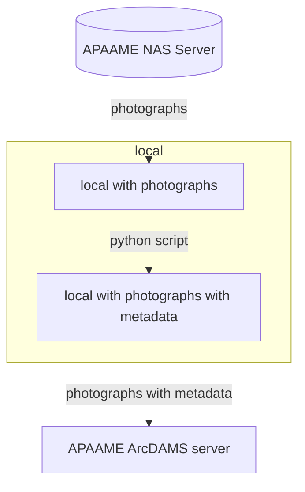

# APAAME archive to the ArcDAMS platform

The objective is to move the APAAME photographs archive stored on the [EAMENA NAS](https://eamena-nas1.arch.ox.ac.uk/cgi-bin/) to a dedicated NAS server hosting an ArcDAMS application.  

The workflow will be to:


# ArchDAMS app setup

APAAME photographs will be hosted on a NAS server and managed with a ArchDAMS app (like HEIR and Manar-Al-Athar)

# APAAME referenced in EAMENA

Once the the ArchDAMS app will be setup, the URL of the different photographs will be setup into EAMENA

## XMP metadata from the APAAME archive

Extraction of XMP metadata from the APAAME archive
  
<p align="center">
  
  <br>
    <em>APAAME_20211026_RHB-0705.DNG</em>
</p>
  
Using the [`apaame-metadata.py`](https://github.com/eamena-oxford/eamena-arches-dev/blob/main/functions/Python/apaame-metadata.py) script to extract metadata from photograph(s) (ex: APAAME_20211026_RHB-0705.DNG [📥, 25 MB](https://github.com/eamena-oxford/eamena-arches-dev/raw/main/data/photos/APAAME_20211026_RHB-0705.DNG)) 
  

```
from pyavm import AVM

path = "C:/Rprojects/eamena-arches-dev/data/photos/"
imagename = path + "APAAME_20211026_RHB-0705.DNG"
avm = AVM.from_image(imagename)
print(avm)
```

Gives this metadata:

```
MetadataVersion: b'1.2'
Creator: b'AAJ'
Rights: b'All Rights Reserved'
Title: b'Oblique view to Wisad Kite 16'
Description: b'to:31.9441084442, 37.9637896272 (Wisad Kite 16)'
Credit: b'APAAME'
Date: b'2021-10-26T12:12:05+03:00'
Contact:
   Name:
      * b'Robert Bewley'
Subject:
   Name:
      * b'Jordan'
      * b'aerial archaeology'
      * b'aerial photography'
      * b'air photography'
      * b'ancient history'
      * b'archaeological sites'
      * b'archaeology'
      * b'middle east'
```