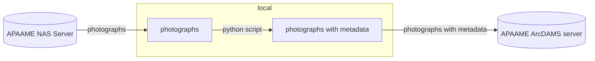
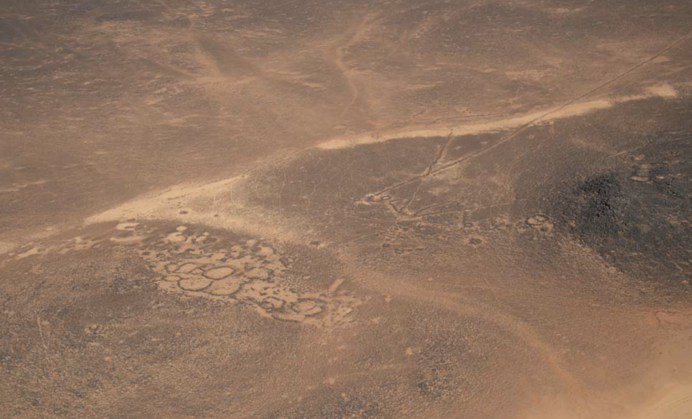

# APAAME archive to the ArcDAMS platform

The objective is to move the APAAME photographs archive stored on the [EAMENA NAS](https://eamena-nas1.arch.ox.ac.uk/cgi-bin/) to a dedicated NAS server hosting an ArcDAMS application.  

The workflow will be to:

## Python script
> extract metadata from the APAAME archive

Extraction of XMP and EXIF metadata from the APAAME archive
  

  
   
    <em>APAAME_20211026_RHB-0705.DNG</em>

  
Using the [`apaame-metadata.py`](https://github.com/eamena-oxford/eamena-arches-dev/blob/main/functions/Python/apaame-metadata.py) with the `exifread` and `pyavm` libraries, script to extract metadata from photograph(s) in a [folder](https://github.com/eamena-oxford/eamena-arches-dev/tree/main/data/photos) and record them in a [CSV file](https://github.com/eamena-oxford/eamena-arches-dev/blob/main/projects/apaame-photos/metadata.csv)
  
## Notes

**ArchDAMS app**

Application developed by Jeremy Worth (Oxford) on a pre-existing system. Used for [Manar-Al-Athar](http://www.manar-al-athar.ox.ac.uk) and [HEIR](http://heir.arch.ox.ac.uk/pages/home.php?login=true) images archives