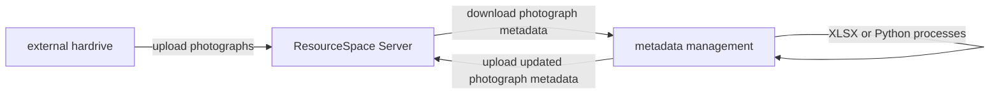
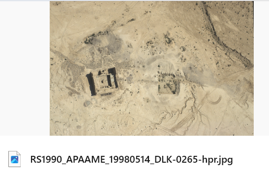
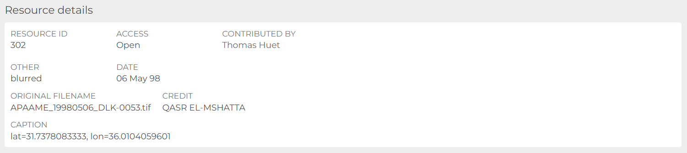
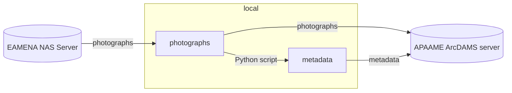

# APAAME archive
> Aerial Photographic Archive for Archaeology in the Middle East archive

## Task description

---

Work in progress: [update EAMENA's Information Resources (IR) links to APAAME](https://github.com/eamena-project/eamena-arches-dev/tree/main/projects/apaame#update-ir-apaame-links) (from the [Flickr archive](https://www.flickr.com/photos/apaame/collections) to the new [ArchDAMS platform](https://github.com/eamena-project/eamena-arches-dev/blob/main/projects/apaame/README.md#archdams-server))  ... [metadata](#metadata)

## Photographs conversion

Convert DNG photographs to TIFF or JPG, see [#47](https://github.com/eamena-project/eamena-arches-dev/issues/47#issuecomment-2250362477)

~~[NAS Server](#nas-server) -> AWS S3~~

## Upload

Work in progress listed here (folder by folders): https://github.com/eamena-project/eamena-arches-dev/issues/47#issuecomment-2003698364

(list created with the `fhs-apaame-master-catalog_*.py` script)

### Upload time

* from "D:\APAAME Master Catalog\1997\1997-05-27" to the ArcDAMS server:
  - 10 photographs * 28 Mb = 280 Mb | loading time = 3 min
  - need to validate each photograph

### Update IR-APAAME links
> Update EAMENA Information Resources and APAAME links, batch the update of APAAME links

see: Issue [#56](https://github.com/eamena-project/eamena-arches-dev/issues/56), follow this [model](https://eamena-project.github.io/eamena-arches-dev/talks/2024-chma/pres/#/data-structure)

The aim is to embed previews of APAAME photographs (hosted on ArchDAMS) into EAMENA IRs using ArchDAMS Direct links (i.e. external links). The  workflow is in ~~this Jupyter NB~~ this [Python script](https://github.com/eamena-project/eamena-arches-dev/blob/main/projects/apaame/apaame2eamena_2.py)

1. [Step 1](https://github.com/eamena-project/eamena-arches-dev/tree/main/projects/apaame#wf-step-1): in EAMENA, collect Information Resources UUIDs with their APAAME ID, store them in a dataframe.
2. [Step 2](https://github.com/eamena-project/eamena-arches-dev/tree/main/projects/apaame#wf-step-2): in ArchDAMS, collect APAAME ID and the Direct URL, store them in a dataframe.
3. [Step 3](https://github.com/eamena-project/eamena-arches-dev/tree/main/projects/apaame#wf-step-3): join the two previous dataframes on the APAAME ID
4. [Step 4](https://github.com/eamena-project/eamena-arches-dev/tree/main/projects/apaame#wf-step-4): update the EAMENA Postgres DB table with ArcDAMS external links

---

1. **Step 1** 

In EAMENA. Collect all IR having a Flickr link, using this [SQL statement](https://github.com/eamena-project/eamena-arches-dev/tree/main/dbs/database.eamena/postgres/queries#23)

| IR UUID | APAAME ID |
|----------|----------|
| c712066a-8094-11ea-a6a6-02e7594ce0a0    |  APAAME_20000906_RHB-0018   |

gives this [eamena_fickr_paths](https://docs.google.com/spreadsheets/d/1gf27xtDZZKjjGOb0rUincZU56GW_LsRlWbPn-e3HpPs/edit?usp=sharing) table

2. **Step 2** 

In ArchDAMS. Export photographs' metadata (CSV Export - metadata). A reference number (sequential, from 1 to *n*) -- the ID of the resource[^2] -- is attributed to each photograph. Here **4** in <https://apaame.arch.ox.ac.uk/pages/download.php?ref=4&size=scr&noattach=true>

  
   
    <em>ArchDAMS Direct URL https://apaame.arch.ox.ac.uk/pages/download.php?ref=4&size=scr&noattach=true</em>

[^2]: see the RS documentation: https://www.resourcespace.com/knowledge-base/api/get_resource_path

| Reference Number | APAAME ID |
|----------|----------|
| 4    |  APAAME_20000906_RHB-0018   |

A sample of the mapping table is this [metadata_export_contributions2_20240214-12_30.csv](https://github.com/eamena-project/eamena-arches-dev/blob/main/projects/apaame/metadata/metadata_export_contributions2_20240214-12_30.csv)[^3] file. Then, the Direct URL is a simple concatenation. For example, with the [reference number **8**](https://github.com/eamena-project/eamena-arches-dev/blob/main/projects/apaame/metadata/metadata_export_contributions2_20240214-12_30.csv#L2)

| Direct URL | APAAME ID |
|----------|----------|
| https://apaame.arch.ox.ac.uk/pages/download.php?ref=8&size=scr&noattach=true |  APAAME_20141020_RHB-0143   |

[^3]: previously [resource.csv](https://github.com/eamena-project/eamena-arches-dev/blob/main/projects/apaame/resource.csv)

3. **Step 3** 

Join APAAME [metadata_export_contributions2_20240214-12_30.csv](https://github.com/eamena-project/eamena-arches-dev/blob/main/projects/apaame/metadata/metadata_export_contributions2_20240214-12_30.csv) with [eamena_fickr_paths](https://docs.google.com/spreadsheets/d/1gf27xtDZZKjjGOb0rUincZU56GW_LsRlWbPn-e3HpPs/edit?usp=sharing)

| APAAME ID | Direct URL |
|----------|----------|
| APAAME_20141020_RHB-0143  | https://apaame.arch.ox.ac.uk/pages/download.php?ref=8&size=scr&noattach=true |

The result is [eamena_apaame_match.csv](https://github.com/eamena-project/eamena-arches-dev/blob/main/projects/apaame/eamena_apaame_match.csv). The match is on reference number **8** 

  
   
    <em>ArchDAMS Direct URL https://apaame.arch.ox.ac.uk/pages/download.php?ref=8&size=scr&noattach=true</em>

4. **Step 4** 

Update the EAMENA Pg database using the [eamena_apaame_match.csv](https://github.com/eamena-project/eamena-arches-dev/blob/main/projects/apaame/eamena_apaame_match.csv) file. SQL  UPDATE in a Python loop.

- find the Flickr `img_url` value in the DB (ex: `https://live.staticflickr.com/7569/15784162651_852ef747a0_o_d.jpg`) [table `tiles`?]

- replace the `img_url` value in Pg with the corresponding `direct_url`

see [SQL queries](https://github.com/eamena-project/eamena-arches-dev/tree/main/dbs/database.eamena/postgres/queries#apaame-and-archdams)

Looking in [this dataframe](https://docs.google.com/spreadsheets/d/1-shK3M3Pl5NANWWvGuSYTgjFNpJAyi-A6uf04a8WTkM/edit#gid=1837558986) (a sample of IR having Catalog ID recorded), there are different type of paths:

### ArchDAMS server
> APAAME Server(*work in progress*)

ArchDAMS server, or APAAME server, is a [NAS Server](#nas-server), hosting a customisation of ResourceSpace, a Digital Asset Management (DAM) system, named ArcDAMS.

#### URL

APAAME Server: https://apaame.arch.ox.ac.uk/

#### IT stack

|           |                   |
|-----------|-------------------|
| instance 	| ArcDAMS         	|
| software 	| ResourceSpace   	|
| hardware 	| QNAP NAS server 	|

#### File hierachical struture
> Photographs 

* ~~By Country~~ to be discussed as APAAME is mostly on Jordan

#### Metadata

CSV metadata ('CSV Export - metadata', 'CSV Upload - metadata'). Metada CSV file are ordred in folders by dates and collections (ex: 240510-Jordan)

|  folder   | file   |
|-----------|-------------------|
| 240510-Jordan 	| [metadata_export_collection9_20240510-09_50.csv](https://github.com/eamena-project/eamena-arches-dev/blob/main/projects/apaame/data/metadata/metadata/240510-Jordan/metadata_export_collection9_20240510-09_50.csv)         	|

#### Examples

##### Ex 1

  
   
    <em>APAAME_20081029_WKSHP-0095</em>

#### Other

| APAAME ID 	| description 	| notes 	| local URL 	| EAMENA record |
|-----------	|-------------	|-------	|-----	|----- |
| APAAME_19970527_DLK-0190 	| Qasr el-Hallabat | reduced size	| https://github.com/eamena-project/eamena-arches-dev/blob/main/projects/apaame/sample/APAAME_19970527_DLK-0190-small.tif  	| INFORMATION-0005901 |

#### Notes

##### DNG

DNG photographs (raw format) are not rendered in the ArcDAMS server

  
   
    <em>DNG photographs are not rendered in the ArcDAMS server</em>

see: https://groups.google.com/g/resourcespace/c/wu9FNbbVBmo

### NAS server

EAMENA NAS Server: https://eamena-nas1.arch.ox.ac.uk/cgi-bin/

#### FHS 

The main folder `APAAME Master Catalog` has been copied in a external hardrive. Its file/folder hierachical structure (FHS) is as following:

  
   
    <em>Detail of the APAAME Master Catalog FHS (XLSX file) with a maximum depth of 6 subfolders (`level6`)</em>

see the [TSV file](https://github.com/eamena-project/eamena-arches-dev/blob/main/projects/apaame/amc-fhs.tsv) or download the [XLSX file itself](https://github.com/eamena-project/eamena-arches-dev/blob/main/projects/apaame/amc-fhs.xlsx)

### Other

* Filename once exported from RS

#### Errors during the upload

* credit

---

# ~~Workflow~~

~~The workflow will be to:~~
> ⚠️ outdated, see how Jeremy is preparing this workflow

The transfer process uses :
  - a `Python script`, [apaame-metadata.ipynb](https://github.com/eamena-project/eamena-arches-dev/blob/main/projects/apaame/apaame-metadata.ipynb), with the libraries `exifread` (for EXIF) and `pyavm` (for XMP), to extract metadata from :
  - a [folder](https://github.com/eamena-project/eamena-arches-dev/tree/main/data/photos) containing one or more photographs
  - and save the metadata of these photographs in a [CSV file](https://github.com/eamena-project/eamena-arches-dev/blob/main/projects/apaame-photos/metadata.csv).
  
# Notes

**EXIF and XMP metadata**

Here are examples of:
  -[EXIF output](https://github.com/eamena-project/eamena-arches-dev/blob/main/projects/apaame-photos/exif_example.txt)  
  -[XMP output](https://github.com/eamena-project/eamena-arches-dev/blob/main/projects/apaame-photos/xmp_example.txt)  

**ResourceSpace**

It is a DAM (Digital Asset Management) application

**ArchDAMS app**

Application developed by Jeremy Worth (Oxford) on a pre-existing system. Used for [Manar-Al-Athar](http://www.manar-al-athar.ox.ac.uk) and [HEIR](http://heir.arch.ox.ac.uk/pages/home.php?login=true) images archives

[^1]: The APAAME ID is: `APAAME_20000906_RHB-0018.tif`