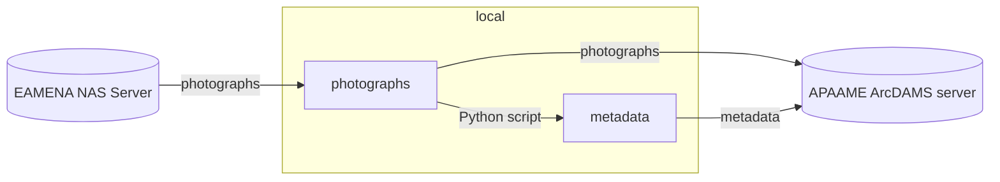

# APAAME archive
> Aerial Photographic Archive for Archaeology in the Middle East archive


## EAMENA and APAAME

In the Information Resources (IR), under the menu 'File Upload', paths to images are wrong. For example, with INFORMATION-0052511[^1], we have currently:

<p align="center">
  
  <br>
    <em>Current Flickr path: `https:/live.staticflickr.com/4118/4928802850_49ed2fdbcb_o_d.jpg` </em>
</p>

<a id="directlk-ok"></a>Should be:

<p align="center">
  
  <br>
    <em>Correct Flickr path: `https://live.staticflickr.com/4118/4928802850_fbab90b8ca_h.jpg`</em>
</p>

The path root is the same, `https://live.staticflickr.com/4118/4928802850` the difference is between the last digits:

| | |
|---	|---	|
| **current**   	|  49ed2fdbcb_o_d.jpg 	|
| **correct**   	|  fbab90b8ca_h.jpg 	|

Hover on the missing image gives this URL

<p align="center">
  
  <br>
    <em>Hover value is: `database.eamena.org/live.staticflickr.com/4118/4928802850_49ed2fdbcb_o_d.jpg` </em>
</p>

Let's consider the Information Resource - INFORMATION-0052511. It has two photographs linked:

* APAAME_20000906_RHB-0018
* SL00/4.33 (RHB) 

<p align="center">
  
  <br>
    <em>File Upolad</em>
</p>

Images paths are hosted here:

<p align="center">
  
  <br>
    <em>File Upolad. The UUID of the field 'File Upload' is: `c712066a-8094-11ea-a6a6-02e7594ce0a0`</em>
</p>

The current link of Information Resource - INFORMATION-0052511 is:

```HTML

```
<p align="center">
  
  <br>
    <em>Photo missing</em>
</p>

The correct link (ie, external link) is:

```HTML

```

<p align="center">
  
  <br>
    <em>Flickr photo from its Direct URL/external link</em>
</p>

Looking in [this dataframe](https://docs.google.com/spreadsheets/d/1-shK3M3Pl5NANWWvGuSYTgjFNpJAyi-A6uf04a8WTkM/edit#gid=1837558986) (a sample of IR having Catalog ID recorded), there are different type of paths:

* `https://live.staticflickr.com...` to the Fickr archive: APAAME only
* `https://eamena-media.s3.amazonaws.com/files/...` to the AWS S3 bucket: ⌐ APAAME
* `https://eamena-uploads-v2.s3.amazonaws.com/...` to the AWS S3 bucket (also): ⌐ APAAME

### Workflow

To batch the link update, the workflow is then to:

1. In EAMENA: collect Information Resources UUIDs with their APAAME ID, store them in a dataframe (`A`)
2. In ArchDAMS: collect APAAME ID and the Direct URL, store them in a dataframe (`B`)
3. join the dataframe `A` and `B` on the APAAME ID
4. update the EAMENA Postgres DB table with ArcDAMS external links

#### Steps

1. **Step 1**

`A` is EAMENA

| IR UUID | APAAME ID |
|----------|----------|
| c712066a-8094-11ea-a6a6-02e7594ce0a0    |  APAAME_20000906_RHB-0018   |

2. **Step 2** <a id="wf-step-2"></a>

`B` is ArchDAMS

A reference number (sequential, from 1 to *n*) is attributed to each photograph. Here **4** in <https://apaame.arch.ox.ac.uk/pages/download.php?ref=4&size=scr&noattach=true>

<p align="center">
  
  <br>
    <em>ArchDAMS Direct URL https://apaame.arch.ox.ac.uk/pages/download.php?ref=4&size=scr&noattach=true</em>
</p>


| Reference Number | APAAME ID |
|----------|----------|
| 4    |  APAAME_20000906_RHB-0018   |

Then, the Direct URL is a concatenation:

```python
rs_root = "https://apaame.arch.ox.ac.uk/pages/download.php?ref=" 
rs_refnum = str(4)
rs_options = "&size=scr&noattach=true"
direct_url = rs_root + rs_refnum + rs_options
```

| Direct URL | APAAME ID |
|----------|----------|
| https://apaame.arch.ox.ac.uk/pages/download.php?ref=4&size=scr&noattach=true   |  APAAME_20000906_RHB-0018   |

3. **Step 3**

join

| APAAME ID | IR UUID | Direct URL |
|----------|----------|----------|
| APAAME_20000906_RHB-0018   | c712066a-8094-11ea-a6a6-02e7594ce0a0   | https://apaame.arch.ox.ac.uk/pages/download.php?ref=4&size=scr&noattach=true |

4. **Step 4**

update the EAMENA Pg database

see [SQL queries](https://github.com/eamena-project/eamena-arches-dev/tree/main/dbs/database.eamena/postgres/queries#apaame-and-archdams)

* Notes

NO: https://www.flickr.com/photos/apaame/4928802850/  
NO: https://database.eamena.org/live.staticflickr.com/4118/4928802850_49ed2fdbcb_o_d.jpg  
YES: https://live.staticflickr.com/4118/4928802850_fbab90b8ca_h.jpg%60  
YES: https://apaame.arch.ox.ac.uk/pages/download.php?ref=4&size=scr&noattach=true 

## Photographs archives

Current repositories of APAAME dataset are: 

* [NAS server](https://github.com/eamena-project/eamena-arches-dev/blob/main/projects/apaame/README.md#nas-server);
* [Flickr archive](https://github.com/eamena-project/eamena-arches-dev/blob/main/projects/apaame/README.md#flickr-archive);
* [ArcDAMS server](https://github.com/eamena-project/eamena-arches-dev/blob/main/projects/apaame/README.md#archdams-server) (*work in progress*)

### ArchDAMS server
> APAAME Server(*work in progress*)

ArchDAMS server, or APAAME server, is a QNAP NAS Server, hosting a customisation of ResourceSpace, a Digital Asset Management (DAM) system, named ArcDAMS.

#### URL

APAAME Server: https://apaame.arch.ox.ac.uk/

#### IT stack

|           |                   |
|-----------|-------------------|
| instance 	| ArcDAMS         	|
| software 	| ResourceSpace   	|
| hardware 	| QNAP NAS server 	|

#### Struture
> Photographs 

* By Country

#### Examples

##### Ex 1


<p align="center">
  
  <br>
    <em>APAAME_20081029_WKSHP-0095</em>
</p>

#### Other

| APAAME ID 	| description 	| notes 	| local URL 	| EAMENA record |
|-----------	|-------------	|-------	|-----	|----- |
| APAAME_19970527_DLK-0190 	| Qasr el-Hallabat | reduced size	| https://github.com/eamena-project/eamena-arches-dev/blob/main/projects/apaame/sample/APAAME_19970527_DLK-0190-small.tif  	| INFORMATION-0005901 |

#### Notes

##### DNG

DNG photographs (raw format) are not rendered in the ArcDAMS server

<p align="center">
  
  <br>
    <em>DNG photographs are not rendered in the ArcDAMS server</em>
</p>

see: https://groups.google.com/g/resourcespace/c/wu9FNbbVBmo


### NAS server

EAMENA NAS Server: https://eamena-nas1.arch.ox.ac.uk/cgi-bin/

#### FHS 

The main folder `APAAME Master Catalog` has been copied in a external hardrive. Its file/folder hierachical structure (FHS) is as following:

<p align="center">
  
  <br>
    <em>Detail of the APAAME Master Catalog FHS (XLSX file) with a maximum depth of 6 subfolders (`level6`)</em>
</p>


see the [TSV file](https://github.com/eamena-project/eamena-arches-dev/blob/main/projects/apaame/amc-fhs.tsv) or download the [XLSX file itself](https://github.com/eamena-project/eamena-arches-dev/blob/main/projects/apaame/amc-fhs.xlsx)


### Flickr archive

Flickr archive is here: https://www.flickr.com/photos/apaame/collections


## ArchmDAMS and EAMENA links

The aim is to embed previews of APAAME photographs (hosted on ArchDAMS) into EAMENA Information resources using ArchDAMS external links


---

# ~~Workflow~~

~~The workflow will be to:~~
> ⚠️ outdated, see how Jeremy is preparing this workflow



The transfer process uses :
  - a `Python script`, [apaame-metadata.ipynb](https://github.com/eamena-project/eamena-arches-dev/blob/main/projects/apaame/apaame-metadata.ipynb), with the libraries `exifread` (for EXIF) and `pyavm` (for XMP), to extract metadata from :
  - a [folder](https://github.com/eamena-project/eamena-arches-dev/tree/main/data/photos) containing one or more photographs
  - and save the metadata of these photographs in a [CSV file](https://github.com/eamena-project/eamena-arches-dev/blob/main/projects/apaame-photos/metadata.csv).
  
# Notes

**EXIF and XMP metadata**

Here are examples of:
  -[EXIF output](https://github.com/eamena-project/eamena-arches-dev/blob/main/projects/apaame-photos/exif_example.txt)  
  -[XMP output](https://github.com/eamena-project/eamena-arches-dev/blob/main/projects/apaame-photos/xmp_example.txt)  

**ResourceSpace**

It is a DAM (Digital Asset Management) application

**ArchDAMS app**

Application developed by Jeremy Worth (Oxford) on a pre-existing system. Used for [Manar-Al-Athar](http://www.manar-al-athar.ox.ac.uk) and [HEIR](http://heir.arch.ox.ac.uk/pages/home.php?login=true) images archives


[^1]: The APAAME ID is: `APAAME_20000906_RHB-0018.tif`