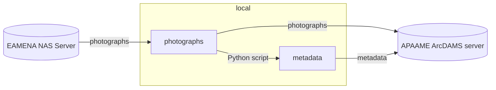

# Transfer of the APAAME archive to an ArcDAMS platform

The objective is to move the APAAME photographs archive stored on the [EAMENA NAS Server](https://eamena-nas1.arch.ox.ac.uk/cgi-bin/) to the [APAAME Server](https://github.com/eamena-project/eamena-arches-dev/blob/main/projects/apaame/README.md#apaame-server).  

## APAAME Server

APAAME Server is a QNAP NAS Server, hosting an ArcDAMS application which is a customisation of : https://apaame.arch.ox.ac.uk/.

### IT stack

| instance 	| ArcDAMS         	|
| software 	| ResourceSpace   	|
| hardware 	| QNAP NAS server 	|

### Questions

- How can we transfer from EAMENA NAS to APAAME NAS without downloading on a labtop?
- Is it possible to fetch image from ResourceSpace URL to use it into EAMENA (as a thumbnail)? See: https://groups.google.com/g/resourcespace/c/vAE77DCxWPo?pli=1
- Is it possible to batch the add new Keywords after the transfer from EAMENA NAS to APAAME NAS? For example, we would like to append the corresponding Information Resource (ex: `APAAME_20000906_RHB-0018.tif` is recorded in `INFORMATION-0052511.png`). See: https://docs.google.com/spreadsheets/d/1-shK3M3Pl5NANWWvGuSYTgjFNpJAyi-A6uf04a8WTkM/edit?usp=sharing

## Flickr images

In the Information Resources (IR), under the menu 'File Upload', paths to images are wrong. For example, with INFORMATION-0052511[^1], we have currently:

  
   
    <em>Current Flickr path: `https:/live.staticflickr.com/4118/4928802850_49ed2fdbcb_o_d.jpg` </em>

Should be:

  
   
    <em>Correct Flickr path: `https://live.staticflickr.com/4118/4928802850_fbab90b8ca_h.jpg`</em>

The path root is the same, `https://live.staticflickr.com/4118/4928802850` the difference is between the last digits:

| | |
|---	|---	|
| **current**   	|  49ed2fdbcb_o_d.jpg 	|
| **correct**   	|  fbab90b8ca_h.jpg 	|

* Note: 

Hover on the missing image gives this URL

  
   
    <em>Hover value is: `database.eamena.org/live.staticflickr.com/4118/4928802850_49ed2fdbcb_o_d.jpg` </em>

## EAMENA Image paths

Looking in [this dataframe](https://docs.google.com/spreadsheets/d/1-shK3M3Pl5NANWWvGuSYTgjFNpJAyi-A6uf04a8WTkM/edit#gid=1837558986) (a sample of IR having Catalog ID recorded), there are different type of paths:

* `https://live.staticflickr.com...` to the Fickr archive: APAAME only
* `https://eamena-media.s3.amazonaws.com/files/...` to the AWS S3 bucket: ⌐ APAAME
* `https://eamena-uploads-v2.s3.amazonaws.com/...` to the AWS S3 bucket (also): ⌐ APAAME

---

## ~~Workflow~~

~~The workflow will be to:~~
> ⚠️ outdated, see how Jeremy is preparing this workflow

The transfer process uses :
  - a `Python script`, [apaame-metadata.py](https://github.com/eamena-project/eamena-arches-dev/blob/main/functions/Python/apaame-metadata.py), with the libraries `exifread` (for EXIF) and `pyavm` (for XMP), to extract metadata from :
  - a [folder](https://github.com/eamena-project/eamena-arches-dev/tree/main/data/photos) containing one or more photographs
  - and save the metadata of these photographs in a [CSV file](https://github.com/eamena-project/eamena-arches-dev/blob/main/projects/apaame-photos/metadata.csv).
  
## Notes

**EXIF and XMP metadata**

Here are examples of:
  -[EXIF output](https://github.com/eamena-project/eamena-arches-dev/blob/main/projects/apaame-photos/exif_example.txt)  
  -[XMP output](https://github.com/eamena-project/eamena-arches-dev/blob/main/projects/apaame-photos/xmp_example.txt)  

**ResourceSpace**

It is a DAM (Digital Asset Management) application

**ArchDAMS app**

Application developed by Jeremy Worth (Oxford) on a pre-existing system. Used for [Manar-Al-Athar](http://www.manar-al-athar.ox.ac.uk) and [HEIR](http://heir.arch.ox.ac.uk/pages/home.php?login=true) images archives

[^1]: The APAAME ID is: `APAAME_20000906_RHB-0018.tif`