# APAAME archive
> Aerial Photographic Archive for Archaeology in the Middle East archive

Work in progress: [update EAMENA's Information Resources (IR) links to APAAME](https://github.com/eamena-project/eamena-arches-dev/tree/main/projects/apaame#update-ir-apaame-links) (from the [Flickr archive](https://www.flickr.com/photos/apaame/collections) to the new [ArchDAMS platform](https://github.com/eamena-project/eamena-arches-dev/blob/main/projects/apaame/README.md#archdams-server))

## EAMENA IR links

Grouped by types of repository (Flickr, AWS S3, etc.), totals of photographs are:

|    | img_url                        |   count |
|---:|:-------------------------------|--------:|
|  0 | https://live.staticflickr.com/ |  116745 |
|  1 | https://eamena-uploads-v2.s3.a |    2071 |
|  2 | https://eamena-media.s3.amazon |     541 |
|  3 | https://eamena-media.s3.eu-wes |      26 |
|  4 | /files/b43a7f50-d532-11ec-b91a |       2 |
|  5 | /files/8761035b-11fc-45ce-a4cb |       2 |
|  6 | https://apaame.arch.ox.ac.uk/p |       1 |
|  7 | /files/601bc682-2d7f-44af-9f23 |       1 |
|  8 | /files/e102ac38-fbab-4ea8-b113 |       1 |

Examples by decreasing number of photograhs for the 4<su>th</sup> main repos (✅: displayed; ❌: not displayed)

### https://live.staticflickr.com

|    | ir_id                                | information_id      | catalog_id               | img_url                                                           |
|---:|:-------------------------------------|:--------------------|:-------------------------|:------------------------------------------------------------------|
|  0 | 00012dab-00cf-4cf1-90b5-d09c5cf3c6d6 | INFORMATION-0090288 | APAAME_20091008_KRH-0062 | https://live.staticflickr.com/7559/15976540576_f78c5c5355_o_d.jpg |
|  1 | 0002dce4-8a0b-4eb4-908f-92ec2eff8fa8 | INFORMATION-0101891 | APAAME_20100516_RHB-0082 | https://live.staticflickr.com/4013/4616248328_0610d38320_o_d.jpg  |
|  2 | 00030cf8-6a42-46d8-9542-ba6c42b06772 | INFORMATION-0095691 | APAAME_20181017_RHB-0098 | https://live.staticflickr.com/1923/45408035381_012a36622f_o_d.jpg |
|  ❌ | 000348ec-dd61-48bb-97be-6ca6677d5fbe | INFORMATION-0110777 | APAAME_20101021_KRH-0050 | https://live.staticflickr.com/1244/5135603365_88730e84ef_o_d.jpg  |
|  ❌ | 00043464-0e2b-478b-b7fa-f957575bcf1e | INFORMATION-0075120 | APAAME_20170927_MND-0067 | https://live.staticflickr.com/4443/36914020933_9abbd87dbd_o_d.jpg |


#### Known issues

Currently in EAMENA, in the IR, under the menu 'File Upload', paths to images are wrong. For example, with INFORMATION-0052511[^1], we have currently:

<p align="center">
  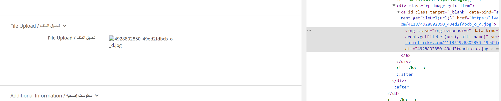
  <br>
    <em>Current Flickr path: `https:/live.staticflickr.com/4118/4928802850_49ed2fdbcb_o_d.jpg` in the [Flickr archive](https://www.flickr.com/photos/apaame/collections)</em>
</p>

<a id="directlk-ok"></a>Should be:

<p align="center">
  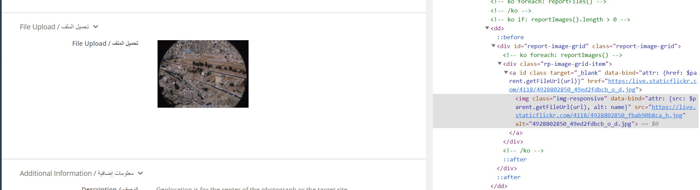
  <br>
    <em>Correct Flickr path: `https://live.staticflickr.com/4118/4928802850_fbab90b8ca_h.jpg`</em>
</p>

The path root is the same, `https://live.staticflickr.com/4118/4928802850` the difference is between the last digits:

| | |
|---	|---	|
| **current**   	|  49ed2fdbcb_o_d.jpg 	|
| **correct**   	|  fbab90b8ca_h.jpg 	|

Hover on the missing image gives this URL

<p align="center">
  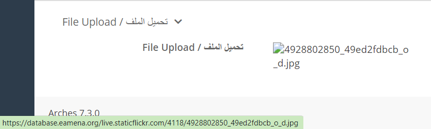
  <br>
    <em>Hover value is: `database.eamena.org/live.staticflickr.com/4118/4928802850_49ed2fdbcb_o_d.jpg` </em>
</p>

Let's consider the Information Resource - INFORMATION-0052511. It has two photographs linked:

* APAAME_20000906_RHB-0018
* SL00/4.33 (RHB) 

<p align="center">
  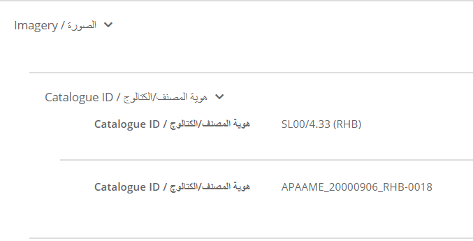
  <br>
    <em>File Upolad</em>
</p>

Images paths are hosted here:

<p align="center">
  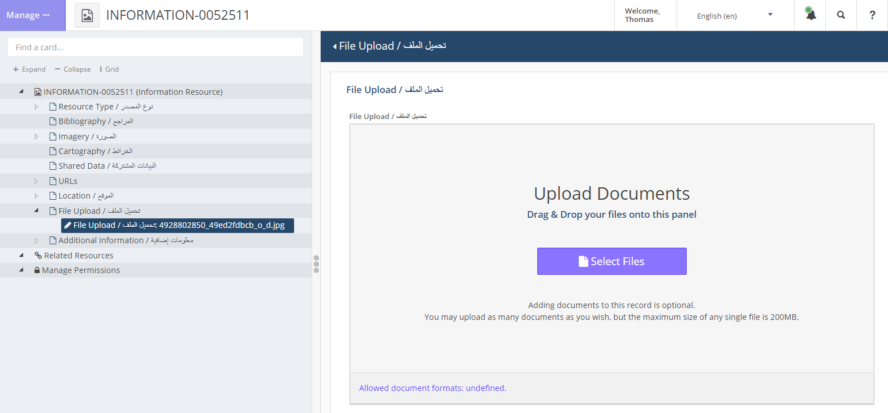
  <br>
    <em>File Upolad. The UUID of the field 'File Upload' is: `c712066a-8094-11ea-a6a6-02e7594ce0a0`</em>
</p>

The current link of Information Resource - INFORMATION-0052511 is:

```HTML

```
<p align="center">
  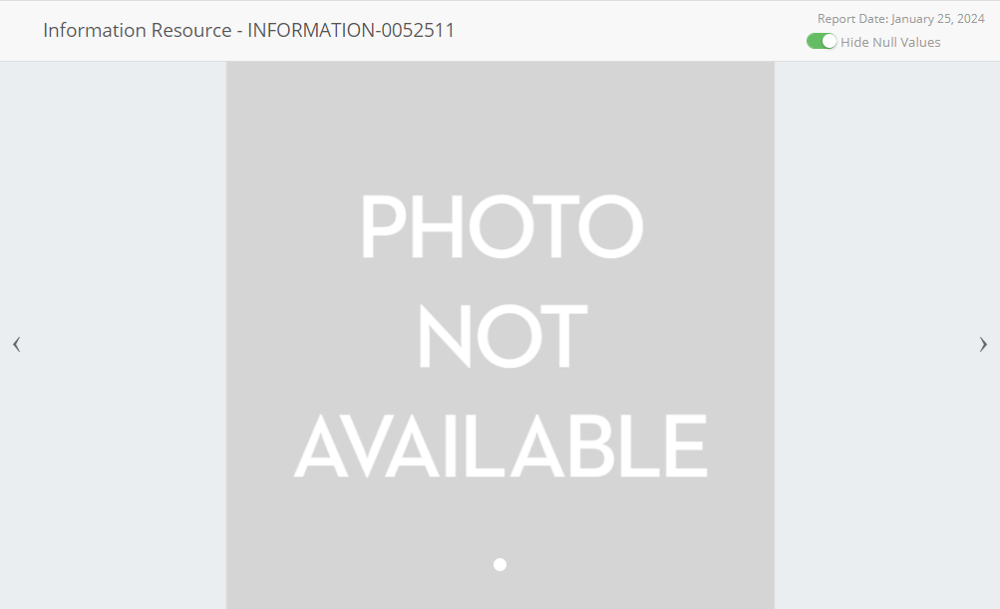
  <br>
    <em>Photo missing</em>
</p>

The correct link (ie, external link) is:

```HTML

```

<p align="center">
  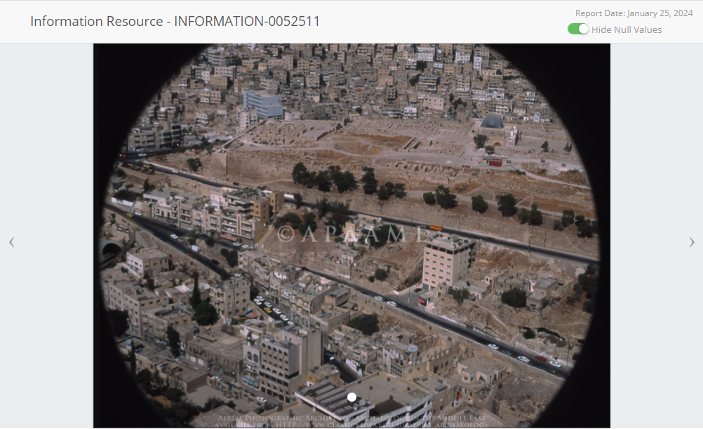
  <br>
    <em>Flickr photo from its Direct URL/external link</em>
</p>

### https://eamena-uploads-v2.s3.amazonaws.com
> AWS S3 bucket, ⌐ APAAME

|    | ir_id                                | information_id      | catalog_id                               | img_url                                                                                 |
|---:|:-------------------------------------|:--------------------|:-----------------------------------------|:----------------------------------------------------------------------------------------|
|  0 | 00088a67-db92-4f89-b0fe-782244abab49 | INFORMATION-0144482 | JORDAN_45B-SQN_JordanValley_Run-10_10848 | https://eamena-uploads-v2.s3.amazonaws.com/JORDAN_45B-SQN_JordanValley_Run-10_10848.jpg |
|  1 | 00408a39-ea66-45e8-bc19-b6dac01fd547 | INFORMATION-0133262 | EGYPT_113C_MATRUH_A13_2056               | https://eamena-uploads-v2.s3.amazonaws.com/EGYPT_113C_MATRUH_A13_2056.jpg               |
|  2 | 00602573-d948-41b7-a7db-ce0a43e81263 | INFORMATION-0133953 | EGYPT_113C_MATRUH_B11_2557               | https://eamena-uploads-v2.s3.amazonaws.com/EGYPT_113C_MATRUH_B11_2557.jpg               |
| ❌ | 009503a5-44e6-4eb7-b6fe-b5cdc9a3b95e | INFORMATION-0133675 | EGYPT_113C_MATRUH_B5_2724                | https://eamena-uploads-v2.s3.amazonaws.com/EGYPT_113C_MATRUH_B5_2724.jpg                |
| ❌ | 0096c8be-6ff7-44be-89bc-9dc7019bedf6 | INFORMATION-0138546 | EAMENA-20191008-PF-0274                  | https://eamena-uploads-v2.s3.amazonaws.com/files/EAMENA-20191008-PF-0274.jpg            |


### https://eamena-media.s3.amazonaws.com/files/
> AWS S3 bucket, ⌐ APAAME

|    | ir_id                                | information_id      | catalog_id                  | img_url                                                                     |
|---:|:-------------------------------------|:--------------------|:----------------------------|:----------------------------------------------------------------------------|
|  0 | 001e8ca1-6db8-494a-b647-10502adb07bb | INFORMATION-0049668 | A View of Petra             | https://eamena-media.s3.amazonaws.com/files/Petra_AZ.JPG                    |
|  1 | 006f6e49-e224-4b9d-bf75-ed679f32b831 | INFORMATION-0049921 | MAA39920_019_IMG_4528-scr   | https://eamena-media.s3.amazonaws.com/files/MAA39920_019_IMG_4528-scr.jpg   |
|  2 | 006f6e49-e224-4b9d-bf75-ed679f32b831 | INFORMATION-0049921 | Manar al-Athar 39920        | https://eamena-media.s3.amazonaws.com/files/MAA39920_019_IMG_4528-scr.jpg   |
|  ❌ | 012d43ed-70a3-48ca-9169-4c16bd228287 | INFORMATION-0086786 | JW_20182302_Lehun_00025     | https://eamena-media.s3.amazonaws.com/files/Lehun25Compressed.JPG           |
|  ❌ | 0268f4ce-b5c6-483c-843a-89df4e554d95 | INFORMATION-0050835 | PF_20170917_SmarJbail_00037 | https://eamena-media.s3.amazonaws.com/files/PF_20170917_SmarJbail_00037.JPG |


### https://eamena-media.s3.eu-west-2.amazonaws.com/uploadedfiles/
> AWS S3 bucket, ⌐ APAAME

|    | ir_id                                | information_id      | catalog_id               | img_url                                                                                                           |
|---:|:-------------------------------------|:--------------------|:-------------------------|:------------------------------------------------------------------------------------------------------------------|
|  0 | 024a72cb-575a-404a-b3ab-e8dd028e6513 | INFORMATION-0144919 | APAAME_20180215_RHB-0323 | https://eamena-media.s3.eu-west-2.amazonaws.com/uploadedfiles/50953259052_a00cf75618_o.jpg                        |
|  1 | 07b8ecdd-21d3-44d4-b1f1-0f0271e29310 | INFORMATION-0104660 | APAAME_20100601_DLK-0413 | https://eamena-media.s3.eu-west-2.amazonaws.com/uploadedfiles/4907651170_11c6ef62d9_c.jpg                         |
|  2 | 0999896c-d5f6-4ed6-9410-06b108e6397f | INFORMATION-0144920 | APAAME_20180215_RHB-0350 | https://eamena-media.s3.eu-west-2.amazonaws.com/uploadedfiles/50729348183_b255e5f50a_o.jpg                        |
|  ❌ | 0f7d56e4-df54-419f-b7ba-34f67d65bb14 | INFORMATION-0104667 | APAAME_20100516_SES-0014 | https://eamena-media.s3.eu-west-2.amazonaws.com/uploadedfiles/4615505613_a30287b8d6_o.jpg                         |
|  ❌ | 2130fc3d-63f4-465c-8283-acf56c78d1d2 | INFORMATION-0144797 | Unknown                  | https://eamena-media.s3.eu-west-2.amazonaws.com/uploadedfiles/36671359_1207660499368407_9199987662209941504_o.jpg |


## Update IR-APAAME links
> Update EAMENA Information Resources and APAAME links, batch the update of APAAME links

The aim is to embed previews of APAAME photographs (hosted on ArchDAMS) into EAMENA IRs using ArchDAMS Direct links (i.e. external links). The  workflow is in ~~this Jupyter NB~~ this [Python script](https://github.com/eamena-project/eamena-arches-dev/blob/main/projects/apaame/apaame2eamena_2.py)

1. [Step 1](https://github.com/eamena-project/eamena-arches-dev/tree/main/projects/apaame#wf-step-1): in EAMENA, collect Information Resources UUIDs with their APAAME ID, store them in a dataframe.
2. [Step 2](https://github.com/eamena-project/eamena-arches-dev/tree/main/projects/apaame#wf-step-2): in ArchDAMS, collect APAAME ID and the Direct URL, store them in a dataframe.
3. [Step 3](https://github.com/eamena-project/eamena-arches-dev/tree/main/projects/apaame#wf-step-3): join the two previous dataframes on the APAAME ID
4. [Step 4](https://github.com/eamena-project/eamena-arches-dev/tree/main/projects/apaame#wf-step-4): update the EAMENA Postgres DB table with ArcDAMS external links

---

1. **Step 1** <a id="wf-step-1"></a>

In EAMENA. Collect all IR having a Flickr link, using this [SQL statement](https://github.com/eamena-project/eamena-arches-dev/tree/main/dbs/database.eamena/postgres/queries#23)

| IR UUID | APAAME ID |
|----------|----------|
| c712066a-8094-11ea-a6a6-02e7594ce0a0    |  APAAME_20000906_RHB-0018   |

gives this [eamena_fickr_paths](https://docs.google.com/spreadsheets/d/1gf27xtDZZKjjGOb0rUincZU56GW_LsRlWbPn-e3HpPs/edit?usp=sharing) table

2. **Step 2** <a id="wf-step-2"></a>

In ArchDAMS. Export photographs' metadata (CSV Export - metadata). A reference number (sequential, from 1 to *n*) -- the ID of the resource[^2] -- is attributed to each photograph. Here **4** in <https://apaame.arch.ox.ac.uk/pages/download.php?ref=4&size=scr&noattach=true>

<p align="center">
  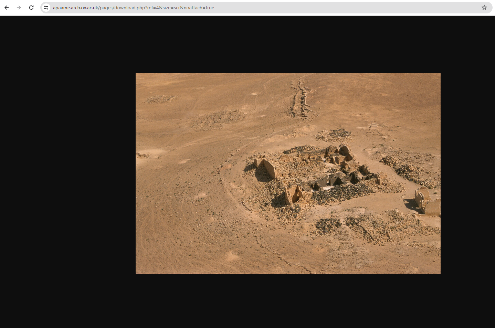
  <br>
    <em>ArchDAMS Direct URL https://apaame.arch.ox.ac.uk/pages/download.php?ref=4&size=scr&noattach=true</em>
</p>

[^2]: see the RS documentation: https://www.resourcespace.com/knowledge-base/api/get_resource_path

| Reference Number | APAAME ID |
|----------|----------|
| 4    |  APAAME_20000906_RHB-0018   |

A sample of the mapping table is this [metadata_export_contributions2_20240214-12_30.csv](https://github.com/eamena-project/eamena-arches-dev/blob/main/projects/apaame/metadata_export_contributions2_20240214-12_30.csv)[^3] file. Then, the Direct URL is a simple concatenation. For example, with the [reference number **8**](https://github.com/eamena-project/eamena-arches-dev/blob/main/projects/apaame/metadata_export_contributions2_20240214-12_30.csv#L2)

| Direct URL | APAAME ID |
|----------|----------|
| https://apaame.arch.ox.ac.uk/pages/download.php?ref=8&size=scr&noattach=true |  APAAME_20141020_RHB-0143   |

[^3]: previously [resource.csv](https://github.com/eamena-project/eamena-arches-dev/blob/main/projects/apaame/resource.csv)

3. **Step 3** <a id="wf-step-3"></a>

Join APAAME [metadata_export_contributions2_20240214-12_30.csv](https://github.com/eamena-project/eamena-arches-dev/blob/main/projects/apaame/metadata_export_contributions2_20240214-12_30.csv) with [eamena_fickr_paths](https://docs.google.com/spreadsheets/d/1gf27xtDZZKjjGOb0rUincZU56GW_LsRlWbPn-e3HpPs/edit?usp=sharing)

| APAAME ID | Direct URL |
|----------|----------|
| APAAME_20141020_RHB-0143  | https://apaame.arch.ox.ac.uk/pages/download.php?ref=8&size=scr&noattach=true |

The result is [eamena_apaame_match.csv](https://github.com/eamena-project/eamena-arches-dev/blob/main/projects/apaame/eamena_apaame_match.csv). The match is on reference number **8** 

<p align="center">
  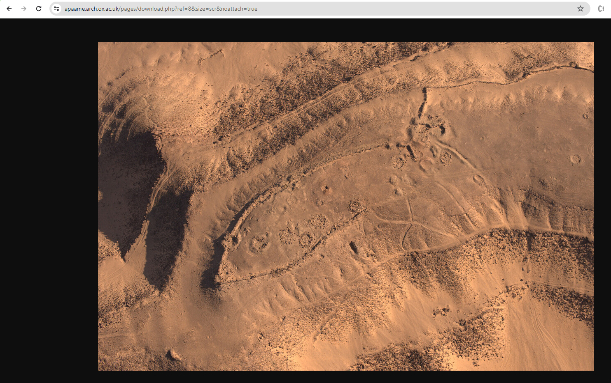
  <br>
    <em>ArchDAMS Direct URL https://apaame.arch.ox.ac.uk/pages/download.php?ref=8&size=scr&noattach=true</em>
</p>


4. **Step 4** <a id="wf-step-4"></a>

Update the EAMENA Pg database using the [eamena_apaame_match.csv](https://github.com/eamena-project/eamena-arches-dev/blob/main/projects/apaame/eamena_apaame_match.csv) file. SQL  UPDATE in a Python loop.

- find the Flickr `img_url` value in the DB (ex: `https://live.staticflickr.com/7569/15784162651_852ef747a0_o_d.jpg`) [table `tiles`?]

- replace the `img_url` value in Pg with the corresponding `direct_url`

see [SQL queries](https://github.com/eamena-project/eamena-arches-dev/tree/main/dbs/database.eamena/postgres/queries#apaame-and-archdams)


Looking in [this dataframe](https://docs.google.com/spreadsheets/d/1-shK3M3Pl5NANWWvGuSYTgjFNpJAyi-A6uf04a8WTkM/edit#gid=1837558986) (a sample of IR having Catalog ID recorded), there are different type of paths:


### ArchDAMS server
> APAAME Server(*work in progress*)

ArchDAMS server, or APAAME server, is a QNAP NAS Server, hosting a customisation of ResourceSpace, a Digital Asset Management (DAM) system, named ArcDAMS.

#### URL

APAAME Server: https://apaame.arch.ox.ac.uk/

#### IT stack

|           |                   |
|-----------|-------------------|
| instance 	| ArcDAMS         	|
| software 	| ResourceSpace   	|
| hardware 	| QNAP NAS server 	|

#### Struture
> Photographs 

* By Country

#### Examples

##### Ex 1


<p align="center">
  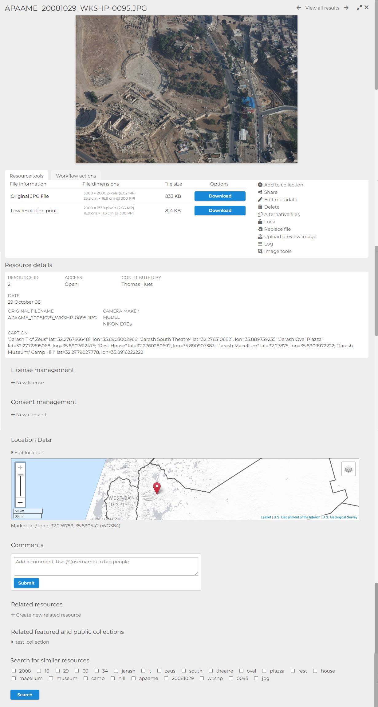
  <br>
    <em>APAAME_20081029_WKSHP-0095</em>
</p>

#### Other

| APAAME ID 	| description 	| notes 	| local URL 	| EAMENA record |
|-----------	|-------------	|-------	|-----	|----- |
| APAAME_19970527_DLK-0190 	| Qasr el-Hallabat | reduced size	| https://github.com/eamena-project/eamena-arches-dev/blob/main/projects/apaame/sample/APAAME_19970527_DLK-0190-small.tif  	| INFORMATION-0005901 |

#### Notes

##### DNG

DNG photographs (raw format) are not rendered in the ArcDAMS server

<p align="center">
  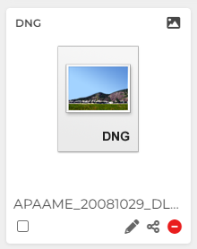
  <br>
    <em>DNG photographs are not rendered in the ArcDAMS server</em>
</p>

see: https://groups.google.com/g/resourcespace/c/wu9FNbbVBmo


### NAS server

EAMENA NAS Server: https://eamena-nas1.arch.ox.ac.uk/cgi-bin/

#### FHS 

The main folder `APAAME Master Catalog` has been copied in a external hardrive. Its file/folder hierachical structure (FHS) is as following:

<p align="center">
  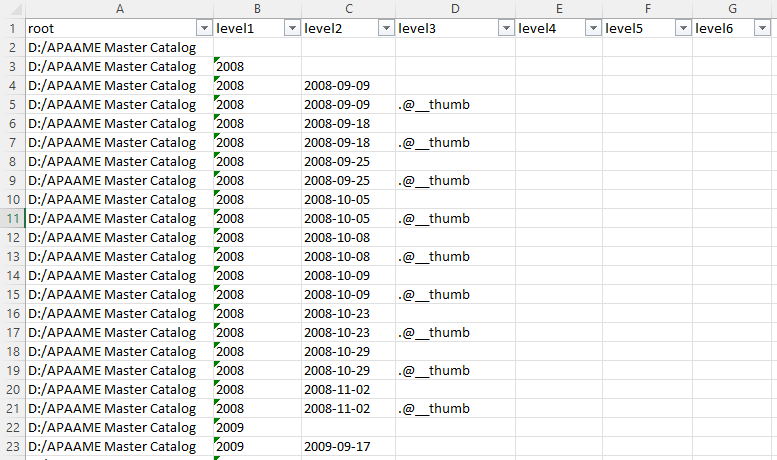
  <br>
    <em>Detail of the APAAME Master Catalog FHS (XLSX file) with a maximum depth of 6 subfolders (`level6`)</em>
</p>


see the [TSV file](https://github.com/eamena-project/eamena-arches-dev/blob/main/projects/apaame/amc-fhs.tsv) or download the [XLSX file itself](https://github.com/eamena-project/eamena-arches-dev/blob/main/projects/apaame/amc-fhs.xlsx)


---

# ~~Workflow~~

~~The workflow will be to:~~
> ⚠️ outdated, see how Jeremy is preparing this workflow

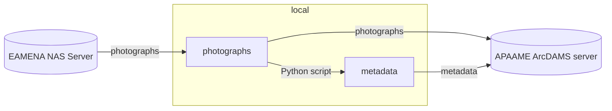

The transfer process uses :
  - a `Python script`, [apaame-metadata.ipynb](https://github.com/eamena-project/eamena-arches-dev/blob/main/projects/apaame/apaame-metadata.ipynb), with the libraries `exifread` (for EXIF) and `pyavm` (for XMP), to extract metadata from :
  - a [folder](https://github.com/eamena-project/eamena-arches-dev/tree/main/data/photos) containing one or more photographs
  - and save the metadata of these photographs in a [CSV file](https://github.com/eamena-project/eamena-arches-dev/blob/main/projects/apaame-photos/metadata.csv).
  
# Notes

**EXIF and XMP metadata**

Here are examples of:
  -[EXIF output](https://github.com/eamena-project/eamena-arches-dev/blob/main/projects/apaame-photos/exif_example.txt)  
  -[XMP output](https://github.com/eamena-project/eamena-arches-dev/blob/main/projects/apaame-photos/xmp_example.txt)  

**ResourceSpace**

It is a DAM (Digital Asset Management) application

**ArchDAMS app**

Application developed by Jeremy Worth (Oxford) on a pre-existing system. Used for [Manar-Al-Athar](http://www.manar-al-athar.ox.ac.uk) and [HEIR](http://heir.arch.ox.ac.uk/pages/home.php?login=true) images archives


[^1]: The APAAME ID is: `APAAME_20000906_RHB-0018.tif`