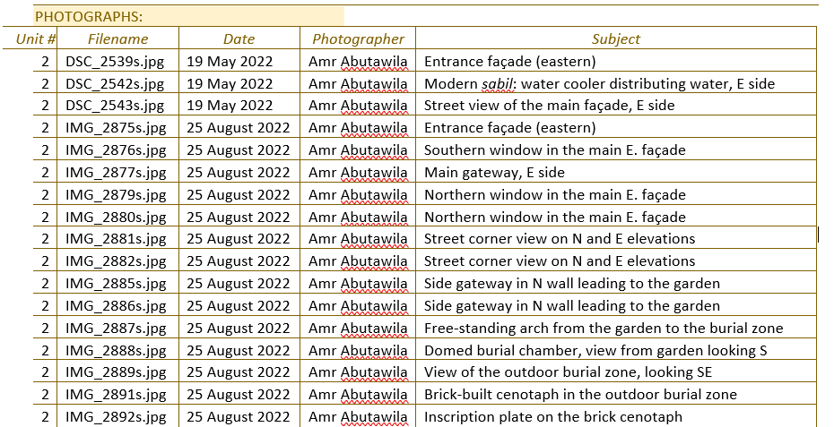

# Cairo project 
> Unknown Heritage in the 'City of the Dead', DOCUMENTATION OF THE UNREGISTERED HERITAGE OF THE EASTERN CEMETERY IN CAIRO

# Aims

Uploading an existing database into EAMENA v4

# Data

For each Heritage Place (HP), there is two kinds of data:

1. Textual data
2. Photographs

## Textual data

  
   
    <em>Detail of a Cairo's project record</em>

* solution

1. Map correspondances between Cairo's project DB fieldnames with EAMENA field names, using the [mapping correspondance table](https://github.com/eamena-project/eamenaR#mapping-file) (fields: `cairo` and `cairo_type`)

  
   
    <em>Alignement *source* (`cairo` and `cairo_type`) and *target*</em>

2. Run the [list_mapping_bu()](https://eamena-project.github.io/eamenaR/doc/list_mapping_bu) function

## Photographs

  
   
    <em>Listing of photographs for a given HP</em>

* solution

<*to be discussed*>

