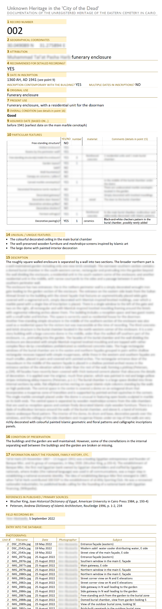

# City of the Dead
> Unknown Heritage in the 'City of the Dead', DOCUMENTATION OF THE UNREGISTERED HERITAGE OF THE EASTERN CEMETERY IN CAIRO, *aka* Cairo project, *aka* CoD

## Aims

Uploading an existing database into EAMENA v4

## CoD data

  
   
    <em>Detail of a CoD's project record</em>

## CoD to EAMENA

CoD records gather informations that will belong both to EAMENA Heritage Places (HP, [example](https://github.com/eamena-project/eamena-arches-dev/blob/main/projects/cairo/business_data/hp.csv)) and EAMENA Built Components (BC, [example](https://github.com/eamena-project/eamena-arches-dev/blob/main/projects/cairo/business_data/bc.csv)). For each CoD record there is two kinds of data:

1. Textual data
2. Photographs

## Textual data

* solution

1. Values: Map CoD's values to those used in EAMENA (controled vocab), see for example [condition.csv](https://github.com/eamena-project/eamena-arches-dev/blob/main/projects/cairo/reference_data/condition.csv)

2. For a BU Upload (HP Fields): Map correspondances between CoD's project DB fieldnames with EAMENA field names, using the [mapping correspondance table](https://github.com/eamena-project/eamenaR#mapping-file) (fields: `cairo` and `cairo_type`)

  
   
    <em>Alignement 'source' (columns `cairo` and `cairo_type`) and 'target'</em>

3. Run the [list_mapping_bu()](https://eamena-project.github.io/eamenaR/doc/list_mapping_bu) function

## Photographs

1. Importing each photograph as an Information Resource (IR)

* solution

<*to be discussed*>

