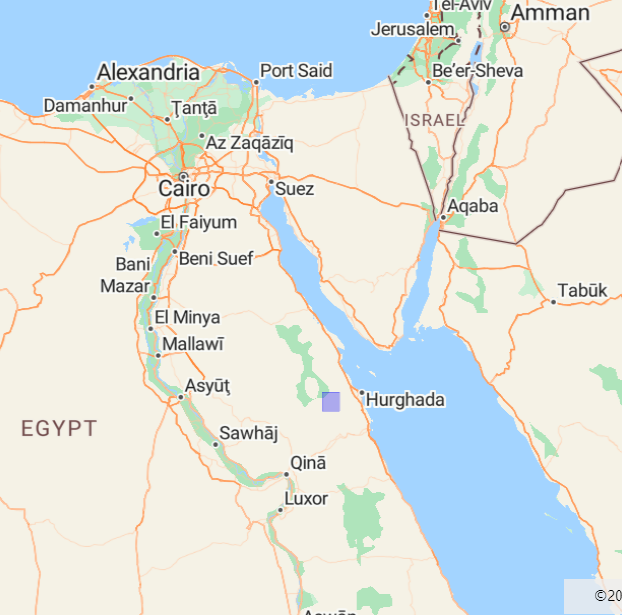
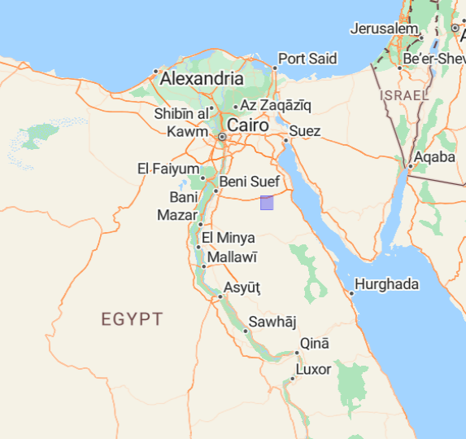
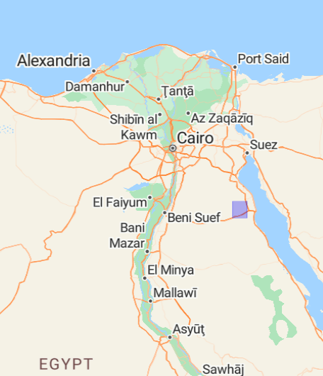
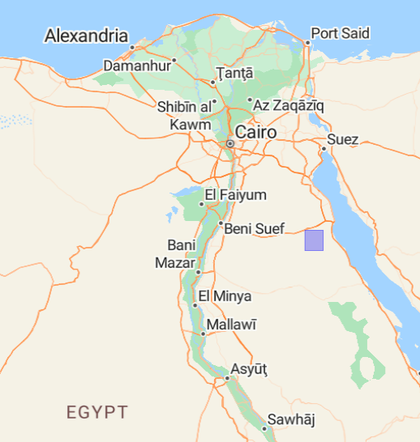
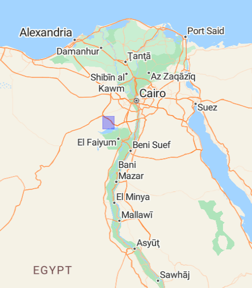
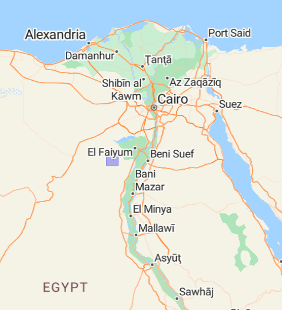
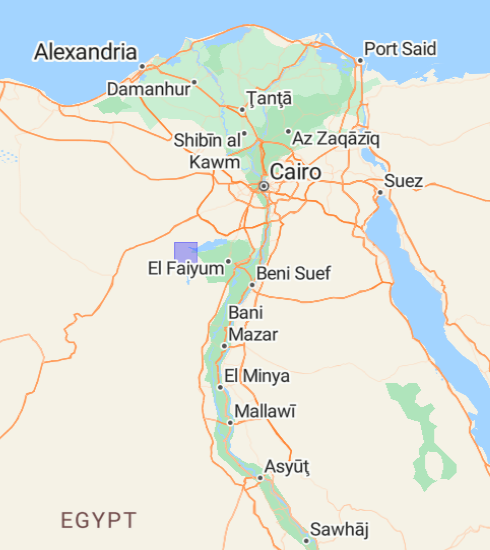
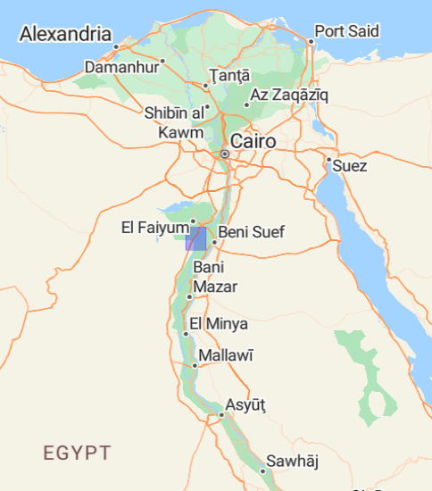

# CMHA
> Coptic Monastic Heritage Archive, CMHArchive, Coptic Monastic Heritage in Egypt, *aka* Endangered Monastic Heritage in Egypt

Dataset for the ["Documenting Coptic Monastic Heritage" project](https://www.ff.uni-lj.si/en/news/documenting-coptic-monastic-heritage-project), [datasets](#datasets), [workshop](#dcmh)

* Issue: [#55](https://github.com/eamena-project/eamena-arches-dev/issues/55)

## Datasets

Cluster of sites (ex: Wadi Naqqat) are tagged with the triconsonantal root (ex: n-q-ṭ, ن-ق-ط) and grouped in this document by Grid Squares.

### E33N27-12

<p align="center">
  
  <br>
    Egyptian Eastern Desert (blue rectangle) west of Hurghada (Red Sea)
</p>

[GS](https://github.com/eamena-project/eamena-arches-dev/blob/main/projects/_gs/E33N27-12.geojson)


####  NQT0
> Wadi Naqqat

##### Search URL

Find HP `WN01`, `WN09`, ... by searching `NQT0` (NQT for Wadi Naqqat)

```
https://database.eamena.org/search?paging-filter=1&tiles=true&format=tilecsv&reportlink=false&precision=6&total=383332&term-filter=%5B%7B%22context%22%3A%22%22%2C%22context_label%22%3A%22Heritage%20Place%20-%20Resource%20Name%22%2C%22id%22%3A0%2C%22text%22%3A%22NQT0%22%2C%22type%22%3A%22term%22%2C%22value%22%3A%22NQT0%22%2C%22inverted%22%3Afalse%7D%5D&language=*
```
<p align="center">
  
  <br>
    Search `NQT0` (2 heritage places on 01/08/2024)
</p>


##### GeoJSON URL

```
https://database.eamena.org/api/search/export_results?paging-filter=1&tiles=true&format=geojson&reportlink=false&precision=6&term-filter=%5B%7B%22context%22%3A%22%22%2C%22context_label%22%3A%22Heritage%20Place%20-%20Resource%20Name%22%2C%22id%22%3A0%2C%22text%22%3A%22NQT0%22%2C%22type%22%3A%22term%22%2C%22value%22%3A%22NQT0%22%2C%22inverted%22%3Afalse%7D%5D&language=*&resource-type-filter=%5B%7B%22graphid%22%3A%2234cfe98e-c2c0-11ea-9026-02e7594ce0a0%22%2C%22name%22%3A%22Heritage%20Place%22%2C%22inverted%22%3Afalse%7D%5D&total=12
```


### E32N28-33

<p align="center">
  
  <br>
</p>

[GS](https://github.com/eamena-project/eamena-arches-dev/blob/main/projects/_gs/E32N28-33.geojson)

####  KRZ0
> Wadi Kharaza

##### Search URL

Find HP `WK01`, `WK02`, ... by searching `KRZ0` (KRZ for Wadi Kharaza)

```
https://database.eamena.org/search?paging-filter=1&tiles=true&format=tilecsv&reportlink=false&precision=6&total=383574&language=*&term-filter=%5B%7B%22context%22%3A%22%22%2C%22context_label%22%3A%22Heritage%20Place%20-%20Resource%20Name%22%2C%22id%22%3A0%2C%22text%22%3A%22KRZ0%22%2C%22type%22%3A%22term%22%2C%22value%22%3A%22KRZ0%22%2C%22inverted%22%3Afalse%7D%5D
```

### E32N29-12

<p align="center">
  
  <br>
</p>


[GS](https://github.com/eamena-project/eamena-arches-dev/blob/main/projects/_gs/E32N29-12.geojson)

####  BKT0
> Bir Bikheit

##### Search URL

```
https://database.eamena.org/search?paging-filter=1&tiles=true&format=tilecsv&reportlink=false&precision=6&total=383724&language=*&term-filter=%5B%7B%22context%22%3A%22%22%2C%22context_label%22%3A%22Heritage%20Place%20-%20Resource%20Name%22%2C%22id%22%3A0%2C%22text%22%3A%22BKT0%22%2C%22type%22%3A%22term%22%2C%22value%22%3A%22BKT0%22%2C%22inverted%22%3Afalse%7D%5D
```

### E32N28-34

<p align="center">
  
  <br>
</p>

[GS](https://github.com/eamena-project/eamena-arches-dev/blob/main/projects/_gs/E32N28-34.geojson)

####  JRF0
> Wadi Mudjaref

##### Search URL

```
https://database.eamena.org/search?paging-filter=1&tiles=true&format=tilecsv&reportlink=false&precision=6&total=383723&language=*&term-filter=%5B%7B%22context%22%3A%22%22%2C%22context_label%22%3A%22Heritage%20Place%20-%20Resource%20Name%22%2C%22id%22%3A0%2C%22text%22%3A%22JRF0%22%2C%22type%22%3A%22term%22%2C%22value%22%3A%22JRF0%22%2C%22inverted%22%3Afalse%7D%5D
```

### E30N29-41

<p align="center">
  
  <br>
</p>

GS E30N29-41: [GeoJSON file](https://github.com/eamena-project/eamena-arches-dev/blob/main/projects/_gs/E30N29-41.geojson) / [EAMENA DB](https://database.eamena.org/search?paging-filter=1&tiles=true&format=tilecsv&reportlink=false&precision=6&total=376144&term-filter=%5B%7B%22context%22%3A%22%22%2C%22context_label%22%3A%22Grid%20Square%20-%20Grid%20ID%22%2C%22id%22%3A0%2C%22text%22%3A%22E30N29-41%22%2C%22type%22%3A%22term%22%2C%22value%22%3A%22E30N29-41%22%2C%22inverted%22%3Afalse%7D%5D&language=*)


####  DAL0
> Deir Abu Lifa

##### Search URL

Search for `DAL0` to retrieve all Abu Lifa Heritage Places, or `DAL01`, `DAL02`, etc., to find them individually.

```
https://database.eamena.org/search?paging-filter=1&tiles=true&format=tilecsv&reportlink=false&precision=6&total=383724&language=*&term-filter=%5B%7B%22context%22%3A%22%22%2C%22context_label%22%3A%22Heritage%20Place%20-%20Resource%20Name%22%2C%22id%22%3A2%2C%22text%22%3A%22DAL0%22%2C%22type%22%3A%22term%22%2C%22value%22%3A%22DAL0%22%2C%22inverted%22%3Afalse%7D%5D
```

####  SYG0
>  Qasr Sagha hermitage

##### Search URL

```
https://database.eamena.org/search?paging-filter=1&tiles=true&format=tilecsv&reportlink=false&precision=6&total=383724&language=*&term-filter=%5B%7B%22context%22%3A%22%22%2C%22context_label%22%3A%22Heritage%20Place%20-%20Resource%20Name%22%2C%22id%22%3A0%2C%22text%22%3A%22SYG0%22%2C%22type%22%3A%22term%22%2C%22value%22%3A%22SYG0%22%2C%22inverted%22%3Afalse%7D%5D
```

### E30N29-12

<p align="center">
  
  <br>
</p>

[GS](https://github.com/eamena-project/eamena-arches-dev/blob/main/projects/_gs/E30N29-12.geojson)

####  RYN0
>  Wadi Rayan

##### Search URL

```
https://database.eamena.org/search?paging-filter=1&tiles=true&format=tilecsv&reportlink=false&precision=6&total=383724&language=*&term-filter=%5B%7B%22context%22%3A%22%22%2C%22context_label%22%3A%22Heritage%20Place%20-%20Resource%20Name%22%2C%22id%22%3A0%2C%22text%22%3A%22RYN0%22%2C%22type%22%3A%22term%22%2C%22value%22%3A%22RYN0%22%2C%22inverted%22%3Afalse%7D%5D
```

### E30N29-14

<p align="center">
  
  <br>
</p>

[GS](https://github.com/eamena-project/eamena-arches-dev/blob/main/projects/_gs/E30N29-14.geojson)

####  SLM0
>  Deir es-Salam

##### Search URL

```
https://database.eamena.org/search?paging-filter=1&tiles=true&format=tilecsv&reportlink=false&precision=6&total=383724&language=*&term-filter=%5B%7B%22context%22%3A%22%22%2C%22context_label%22%3A%22Heritage%20Place%20-%20Resource%20Name%22%2C%22id%22%3A0%2C%22text%22%3A%22SLM0%22%2C%22type%22%3A%22term%22%2C%22value%22%3A%22SLM0%22%2C%22inverted%22%3Afalse%7D%5D
```

### E30N29-22

<p align="center">
  
  <br>
</p>

[GS](https://github.com/eamena-project/eamena-arches-dev/blob/main/projects/_gs/E30N29-22.geojson)

#### NQL0
> Naqlun (Deir el Malak Gabriel)


##### Search URL

```
https://database.eamena.org/search?paging-filter=1&tiles=true&format=tilecsv&reportlink=false&precision=6&total=383724&language=*&term-filter=%5B%7B%22context%22%3A%22%22%2C%22context_label%22%3A%22Heritage%20Place%20-%20Resource%20Name%22%2C%22id%22%3A0%2C%22text%22%3A%22NQL0%22%2C%22type%22%3A%22term%22%2C%22value%22%3A%22NQL0%22%2C%22inverted%22%3Afalse%7D%5D
```

## DCMH
> DOCUMENTING COPTIC MONASTIC HERITAGE, 11-13 November 2024, Bibliotheca Alexandrina, Alexandria, Egypt

Organized by:

**Bibliotheca Alexandrina**

In collaboration with: 

**University of Ljubljana; Institute for Monastic Studies and Contemplative Sciences, and the EAMENA project (University of Oxford,  University of Leicester, University of Durham)**

### Workshop Program

**Main Presenters**:

* **Dr. Jan Ciglenečki** (University of Ljubljana; Institute for Monastic Studies and Contemplative Sciences)  
* **Dr. Thomas Huet** (EAMENA project, School of Archaeology, University of Oxford)

**Guest Speakers:**

* **Dr. Bill Finlayson**  (EAMENA project, School of Archaeology, University of Oxford)   
* **Dr. Michael Fradley**  (EAMENA project, School of Archaeology, University of Oxford)   
* **Dr. Zeinab Hanafy** (Center for Coptic Studies, Bibliotheca Alexandrina)

---

#### Day 1: Understanding Endangerment

**9:00 AM \- 10:30 AM: Session 1**

* **Part 1**: *Introduction to the “Documenting Coptic Monastic Heritage” Project* (Jan Ciglenečki)  
* **Part 2**: *[Identifying and Classifying Disturbances and Threats to Archaeological Heritage](https://github.com/eamena-project/eamena-arches-dev/tree/main/talks/2024-dcmh#identifying-and-classifying-disturbances-and-threats-to-archaeological-heritage-eamena-project)* *(EAMENA Project)* (Thomas Huet)

**11:00 AM \- 12:30 PM: Session 2**

* **Part 1**: *Coptic Monastic Heritage Archive at the University of Ljubljana* (Jan Ciglenečki)  
* **Part 2**: *The EAMENA Database as an IT Framework for a Photographic Archive* (Thomas Huet)

  ---

#### Day 2: Documenting Christian Heritage in Egypt

**9:00 AM \- 10:30 AM: Session 3**

* **Part 1**: *Documenting Monastic Heritage in the Eastern Desert: Insights from the ARCE project (2018-2019)* (Jan Ciglenečki)  
* **Part 2**: *Case Study: Semi-Anchoretic Settlement in Wadi Naqqat as a Heritage Place within the EAMENA Database* (Thomas Huet)

**11:00 AM \- 12:30 PM: Session 4**

* **Part 1**: *Documenting Non-Monastic Christian Heritage across Egypt* (Jan Ciglenečki)  
* **Part 2**: *Case Study: Coptic and Greek Orthodox Churches of Alexandria* (Zeinab Hanafy)

  ---

#### Day 3: Building a Comprehensive Photo Archive for Coptic Monastic Heritage

**9:00 AM \- 10:30 AM: Session 5**

* **Part 1**: *Towards the Largest Photo Archive of Coptic Monastic Heritage: Next Steps* (Jan Ciglenečki) (15 minutes)  
* **Part 2**: *The Role of the EAMENA Project in Preserving Coptic Heritage* (Bill Finlayson, Michael Fradley – Online Session) (75 minutes)

**11:00 AM \- 12:30 PM: Session 6**

* **Part 1**: *How You Can Get Involved: Contributing to the Archive of Coptic Monastic Heritage and the EAMENA database* (Jan Ciglenečki, Thomas Huet)  
* **Part 2**: *Final Remarks and Discussion* 


## Reference data

## Cultural period mapping

Equivalences between the Coptic periodisation and the EAMENA reference data (with links to PeriodO)

| Coptic date   | Coptic period | EAMENA date | EAMENA period |
|----------|----------|----------|----------|
| 4th-7th CE| Early Coptic/Byzantine | 500 BC-640 CE | [Byzantine (Cyrenaica/Egypt)](https://client.perio.do/?page=period-view&backendID=web-https%3A%2F%2Fdata.perio.do%2F&authorityID=p0m64td&periodID=p0m64tdkbwr)|
| 7th c.-present| Coptic| **640-1900 CE** | [**Islamic (North Africa)**](https://client.perio.do/?page=period-view&backendID=web-https%3A%2F%2Fdata.perio.do%2F&authorityID=p0m64td&periodID=p0m64td5g67)|
| 7th c.-present| Coptic| 640-900 CE | [Islamic, Early (Umayyad/Abbasid) (North Africa)](https://client.perio.do/?page=period-view&backendID=web-https%3A%2F%2Fdata.perio.do%2F&authorityID=p0m64td&periodID=p0m64tdd5n9)|
| 7th c.-present| Coptic| 900-1200 CE| [Islamic, Middle (Fatimid/Zirid/Hammadid/Almoravid/Almohad) (North Africa)](https://client.perio.do/?page=period-view&backendID=web-https%3A%2F%2Fdata.perio.do%2F&authorityID=p0m64td&periodID=p0m64td6z7c)|
| 7th c.-present| Coptic| 1200-1500 CE| [Islamic, Late (Ayyubid/Hafsid/Marinid/Zayyanid/Mamluk) (North Africa)](https://client.perio.do/?page=period-view&backendID=web-https%3A%2F%2Fdata.perio.do%2F&authorityID=p0m64td&periodID=p0m64tddbt3)|
| 7th c.-present| Coptic| 1500-1900 CE| [Islamic, Late (Ottoman/Saadi/Wattasid/Alaouite/Colonial) (North Africa)](https://client.perio.do/?page=period-view&backendID=web-https%3A%2F%2Fdata.perio.do%2F&authorityID=p0m64td&periodID=p0m64tdnr6d)|
| 7th c.-present| Coptic| **1900-Present**| [**Contemporary Islamic (MENA)**](https://client.perio.do/?page=period-view&backendID=web-https%3A%2F%2Fdata.perio.do%2F&authorityID=p0m64td&periodID=p0m64tdvprx)|
| 7th c.-present| Coptic| 1900-1950 CE| Contemporary Islamic, Early 20th century (MENA)|
| 7th c.-present| Coptic| 1950-Present| [Contemporary Islamic, Modern (MENA)](https://client.perio.do/?page=period-view&backendID=web-https%3A%2F%2Fdata.perio.do%2F&authorityID=p0m64td&periodID=p0m64td8zz2)|

- **bolded**: Culture Period
- regular: Culture Sub-Period
- Contemporary Islamic, Early 20th century (MENA): missing in PeriodO


## Notes

* Relations between endangered Heritage Place (HP) and Built Component (BC) in EAMENA
* Photograph archives on a ResourceSpace server
* EAMENA ~ ResourceSpace links

## TODO

- [ ] Link external images (Public URL), ex: `INFORMATION-0150090`

- [ ] ~~Add these periods to EAMENA?~~:
	- ~~Coptic (4th-present)~~
		- ~~Early Coptic/Byzantine (4th-7th CE)~~
		- ~~Coptic (7th Century-present)~~

  

