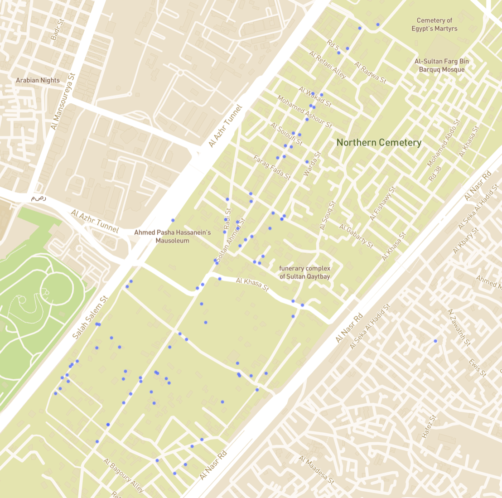
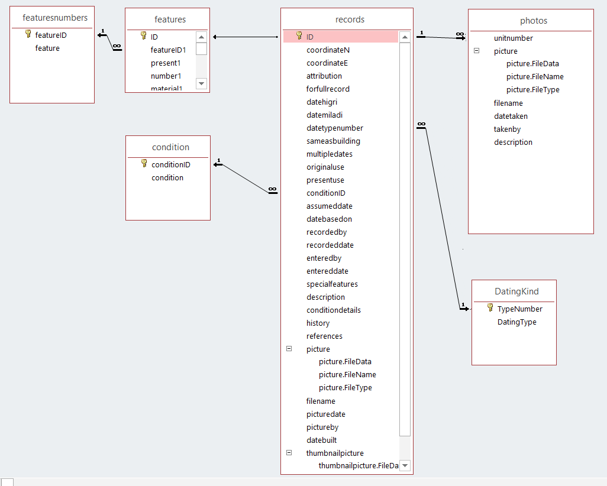
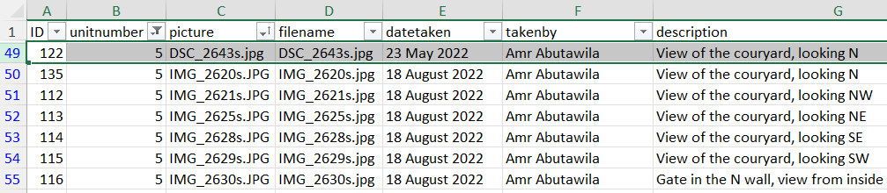
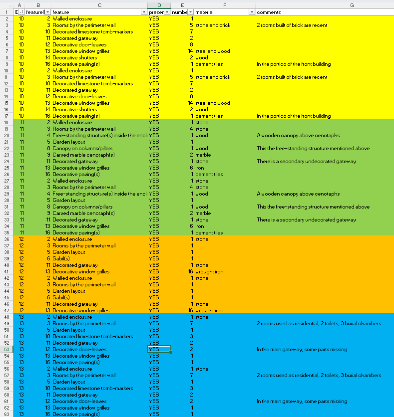
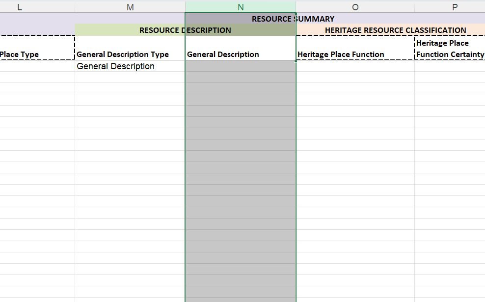
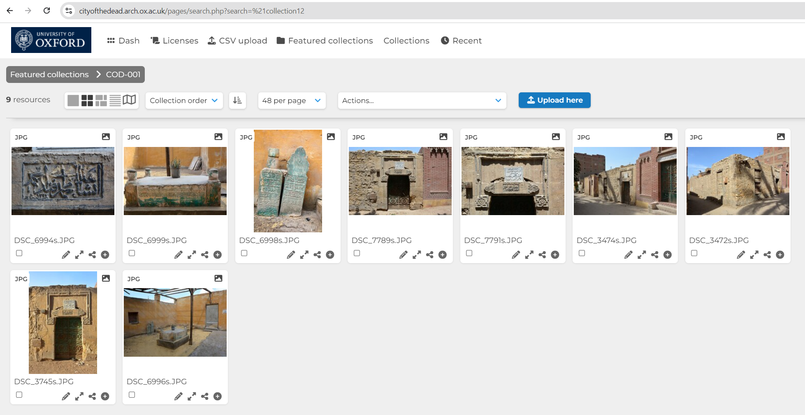
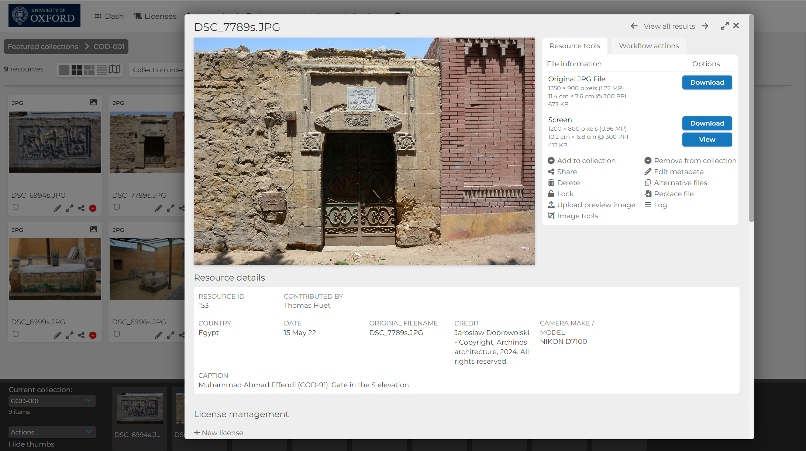

# City of the Dead
> *aka*: Cairo project, COD, Eastern Cemetery, Qarafat Ash-Sharq, QRF0, Unknown Heritage in the 'City of the Dead', DOCUMENTATION OF THE UNREGISTERED HERITAGE OF THE EASTERN CEMETERY IN CAIRO, Unlisted historic monuments of the Eastern Cemetery, (the "Desert of the Mamluks") in Cairo, Egypt.

see [Issue #54](https://github.com/eamena-project/eamena-arches-dev/issues/54)

<p align="center">
  
  <br>
  <em> location of the 91 HPs in the Northern Cemetery, Cairo, Egypt</em>
</p>

## Search URL

Search for `QRF0`

```
https://database.eamena.org/search?paging-filter=1&tiles=true&format=tilecsv&reportlink=false&precision=6&total=383432&language=*&term-filter=%5B%7B%22context%22%3A%22%22%2C%22context_label%22%3A%22Heritage%20Place%20-%20Resource%20Name%22%2C%22id%22%3A0%2C%22text%22%3A%22QRF0%22%2C%22type%22%3A%22term%22%2C%22value%22%3A%22QRF0%22%2C%22inverted%22%3Afalse%7D%5D
```

# Import
> CoD -> EAMENA

CoD records gather informations that will belong both to EAMENA Heritage Places (HP, [example](https://github.com/eamena-project/eamena-arches-dev/blob/main/projects/cod/business_data/hp.csv)) and EAMENA Built Components (BC, [example](https://github.com/eamena-project/eamena-arches-dev/blob/main/projects/cod/business_data/bc.csv)). For each CoD record there is two kinds of data:

1. Textual data
2. Photographs

**Aims**: 

1. Uploading an existing database into EAMENA v4
2. Hosting photographs on a [RS server](https://github.com/eamena-project/eamena-arches-dev/tree/main/dbs/dam)

## Data
> Textual data

* solution

1. Values: Map CoD's values to those used in EAMENA (controled vocab), see for example [condition.csv](https://github.com/eamena-project/eamena-arches-dev/blob/main/projects/cod/reference_data/condition.csv)

2. For a BU Upload (HP Fields): Map correspondances between CoD's project DB fieldnames with EAMENA field names, using the [mapping correspondance table](https://github.com/eamena-project/eamenaR#mapping-file) (fields: `cairo` and `cairo_type`)

<p align="center">
  
  <br>
    <em>Alignement 'source' (columns `cairo` and `cairo_type`) and 'target'</em>
</p>

3. Run the [list_mapping_bu()](https://eamena-project.github.io/eamenaR/doc/list_mapping_bu) function


### CoD databases

| DB       | unitnumber |
|----------|----------|
| 2022-24_UnknownHeritage-N.accdb   | 1-9;53-68   |
| 2022-24_UnknownHeritage-S.accdb   | 10-52;69-91  |

#### ERD

<p align="center">
  
  <br>
    Entity-relationships diagram
</p>

### CoD field and value description

* `unitnumber` or `record`: equivalent to the EAMENA `Heritage Places`
* `features`: equivalent to the EAMENA `Built Components`

### Data workflow

Export DBs tables to XLSX

#### XLSX -> CSV

Merge the XLSX from the two DBs, remove duplicates and export as CSV by running the function `merge2dbs` of [cod.py](https://github.com/eamena-project/eamena-arches-dev/blob/main/projects/cod/cod.py#L6). Tables are now in the [csv/](https://github.com/eamena-project/eamena-arches-dev/tree/main/projects/cod/business_data/csv) folder

- [records.csv](https://github.com/eamena-project/eamena-arches-dev/blob/main/projects/cod/business_data/csv/records.csv): n = 91, `unitnumber` or `record`: equivalent to the EAMENA `Heritage Places`.
- [features.csv](https://github.com/eamena-project/eamena-arches-dev/blob/main/projects/cod/business_data/csv/features.csv): n = 91 rows (these are the `records`) but 16 groups of columns (here in color, the left column in grey is the `record` identifier)

<p align="center">
  
  <br>
    `features` by `records` 
</p>

converted to a long format

<p align="center">
  
  <br>
    `features` by `records` 
</p>

- [featuresnumbers.csv](https://github.com/eamena-project/eamena-arches-dev/blob/main/projects/cod/business_data/csv/featuresnumbers.csv): correspondances between `featureID` and litteral description of these features, 16 values. The latter are the `features`: equivalent to the EAMENA `Built Components`.
- [photos.csv](https://github.com/eamena-project/eamena-arches-dev/blob/main/projects/cod/business_data/csv/photos.csv): some 1,935 photographs of the 91 `records`
- [DatingKind.csv](https://github.com/eamena-project/eamena-arches-dev/blob/main/projects/cod/business_data/csv/DatingKind.csv): the dating method
- [Glossary.csv](https://github.com/eamena-project/eamena-arches-dev/blob/main/projects/cod/business_data/csv/Glossary.csv): a glossary
- [condition.csv](https://github.com/eamena-project/eamena-arches-dev/blob/main/projects/cod/business_data/csv/condition.csv): condition of preservation

#### Create a BU

Create a [Bulk Upload file](https://github.com/eamena-project/eamena-arches-dev/tree/main/dbs/database.eamena/data/bulk_data#readme) for the `records` adding the `features` and the `photos` in the description field

<p align="center">
  
  <br>
    Screenshot of the BU template with the `General Description` field (free text) highlighted
</p>

##### Mapping tables and values

* Resource Name

Resource Name are usually the name of the desceased ('General Sa‘id Pasha Nasr') or the name of the deceased and the description of the tomb ('Funerary enclosure of inheritors of Basma Khatun'). When the desceased is unknown, the Resource Name is 'attribution Unknown'

* General Description Type

| CoD                | EAMENA                     |
|--------------------|----------------------------|
| conditiondetails   | Comments                   |
| history            | General Description        |
| specialfeatures    | Summary of Significance    |
| description        | Architectural Description  |

* Heritage Place Function

| CoD                | EAMENA                     |
|--------------------|----------------------------|
| presentuse         | Heritage Place Function    |

The CoD field `originaluse` hasn't been used

* Conditions

| CoD           | EAMENA      |
|---------------|-------------|
| Fair          | Fair        |
| Good          | Good        |
| Poor          | Poor        |
| Poor/Ruin     | Very Bad    |
| Ruin          | Destroyed   |

* Extent of damage

| CoD           | EAMENA              |
|---------------|---------------------|
| Fair          | 1-10%               |
| Good          | No Visible/Known    |
| Poor          | 11-30%              |
| Poor/Ruin     | 31-60%              |
| Ruin          | 61-90%              |

* Features

| featureID | feature                                        |
|-----------|------------------------------------------------|
| 1         | Free-standing structure                        |
| 2         | Walled enclosure                               |
| 3         | Rooms by the perimeter wall                    |
| 4         | Free-standing structure(s) inside the enclosure|
| 5         | Garden layout                                  |
| 6         | Sabil(s)                                       |
| 7         | Wall-fountain(s)                               |
| 8         | Canopy on columns/pillars                      |
| 9         | Carved marble cenotaph(s)                      |
| 10        | Decorated limestone tomb-markers               |
| 11        | Decorated gateway                              |
| 12        | Decorative door-leaves                         |
| 13        | Decorative window grilles                      |
| 14        | Decorative shutters                            |
| 15        | Painted ceiling(s)                             |
| 16        | Decorative paving(s)                           |


#### Append metadata to the photographs


#### TODO

- [ ] Creating IR manually based on data recorded in the field `references` (file: `records.xlsx`)
- [ ] Importing each photograph as an Information Resource (IR)

---

## Photographs

* uploading photographs to a [RS](https://github.com/eamena-project/eamena-arches-dev/tree/main/dbs/dam): [#54 (comment)](https://github.com/eamena-project/eamena-arches-dev/issues/54#issuecomment-2324241985)

### Metadata

Match the photographs metadata with the photographs themselves, using [cod.py](https://github.com/eamena-project/eamena-arches-dev/blob/main/projects/cod/cod.py)

<p align="center">
  
  <br>
    <em>Screenshot of the 'photo' table export (`photo.xlsx`) with the metadata of the photograph DSC_2643s.jpg highlighted</em>
</p>

<p align="center">
  
  <br>
    <em>Screenshot of the DSC_2643s.jpg photograph</em>
</p>

See: [photos.csv](https://github.com/eamena-project/eamena-arches-dev/blob/main/projects/cod/business_data/csv/photos.csv)

* GPS: function `add_metadata_XY_to_photo` of [cod.py](https://github.com/eamena-project/eamena-arches-dev/blob/main/projects/cod/cod.py#L94)


#### Imported 

<p align="center">
  <br>
  <br>
  Screenshot from the [COD ResourceSpace server](https://cityofthedead.arch.ox.ac.uk/), collection COD-001.
</p>

#### Metadata field descriptions

<p align="center">
  
  <br>
  Screenshot from the [COD ResourceSpace server](https://cityofthedead.arch.ox.ac.uk/), collection COD-001, photo DSC_7789s.JPG
</p>


| Field    | Description |
|----------|----------|
| RESOURCE ID   | automatic/internal numbering  |
| CONTRIBUTED BY   | name of the RS user account   |
| Country   | constant. "Egypt"   |
| Date   | date of the photograph   |
| ORIGINAL FILENAME  | original filename of the photograph   |
| CREDIT  | concatenation of the Author (`takenby`) of the image and the Copyright   |
| CAMERA MAKE/MODEL  | the model of the camera   |
| CAPTION  | concatenation of the Title (`attribution`) of the image, the EAMENA ID (ex: COD-001), the description (`description`)   |

`takenby`, `attribution` and `description` are fields from the COD database (table 'photos')

### HP and IR relationships
> HP <-> IR


1. Create IR
  - create the BU for IR, partly matching the HP for further links, using the function [create_ir_bu_from_hp()](https://github.com/eamena-project/eamena-arches-dev/blob/main/projects/cod/cod.py). Output: [bu_ir_cod.csv](https://github.com/eamena-project/eamena-arches-dev/blob/main/projects/cod/business_data/bu_ir_cod.csv)
- import [bu_ir_cod.csv](https://github.com/eamena-project/eamena-arches-dev/blob/main/projects/cod/business_data/bu_ir_cod.csv) into EAMENA `/opt/arches/data_temp/business_data/` and run `python manage.py packages -o import_business_data -s ../data_temp/business_data/bu_ir_cod.csv -c ../data_temp/business_data/Information_Resource.mapping -ow overwrite`
2. Create related ressources HP <-> IR
  - capture all the HR UUID by Seaching for 
