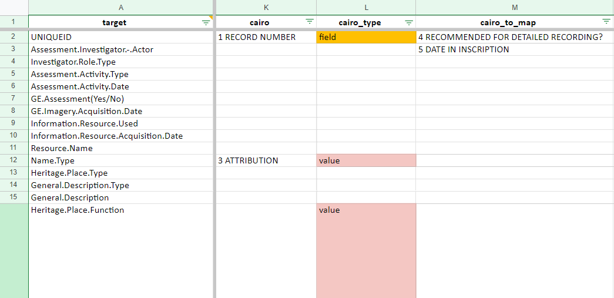
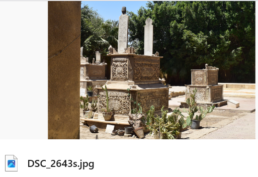

# City of the Dead
> *aka* Cairo project, *aka* CoD, Unknown Heritage in the 'City of the Dead', DOCUMENTATION OF THE UNREGISTERED HERITAGE OF THE EASTERN CEMETERY IN CAIRO

## Aims

Uploading an existing database into EAMENA v4

## CoD databases

| DB       | unitnumber | Column 3 | Column 4 |
|----------|----------|----------|----------|
| 2022-24_UnknownHeritage-N.accdb   | 1-9;53-68   | Data 3   | Data 4   |
| 2022-24_UnknownHeritage-S.accdb   | 10-52;69-91  | Data 7   | Data 8   |

## CoD field and value description

* `unitnumber`: idem as `record` these are the Heritage Places
* `features`: these are the Built Components

### Access to XLSX

Microsoft Access DBs. Once exported the tables to XLSX are handled and their data re-organised using the [read_cod_tables.R](read_cod_tables.R) script

### XLSX to CSV

Running:

```py
data_in = "C:/Rprojects/eamena-arches-dev/projects/cod/db_data/tables/"
path_out = "C:/Rprojects/eamena-arches-dev/projects/cod/business_data/csv/"
xlsx2csv(data_in, path_out)
```

Tables are now in the [csv/](https://github.com/eamena-project/eamena-arches-dev/tree/main/projects/cod/business_data/csv) folder


## CoD to EAMENA

CoD records gather informations that will belong both to EAMENA Heritage Places (HP, [example](https://github.com/eamena-project/eamena-arches-dev/blob/main/projects/cod/business_data/hp.csv)) and EAMENA Built Components (BC, [example](https://github.com/eamena-project/eamena-arches-dev/blob/main/projects/cod/business_data/bc.csv)). For each CoD record there is two kinds of data:

1. Textual data
2. Photographs

## Textual data

* solution

1. Values: Map CoD's values to those used in EAMENA (controled vocab), see for example [condition.csv](https://github.com/eamena-project/eamena-arches-dev/blob/main/projects/cod/reference_data/condition.csv)

2. For a BU Upload (HP Fields): Map correspondances between CoD's project DB fieldnames with EAMENA field names, using the [mapping correspondance table](https://github.com/eamena-project/eamenaR#mapping-file) (fields: `cairo` and `cairo_type`)

<p align="center">
  
  <br>
    <em>Alignement 'source' (columns `cairo` and `cairo_type`) and 'target'</em>
</p>

3. Run the [list_mapping_bu()](https://eamena-project.github.io/eamenaR/doc/list_mapping_bu) function


## Photographs

### Metadata

Match the photographs metadata with the photographs themselves

<p align="center">
  
  <br>
    <em>Screenshot of the 'photo' table export (`photo.xlsx`) with the metadata of the photograph DSC_2643s.jpg highlighted</em>
</p>

<p align="center">
  
  <br>
    <em>Screenshot of the DSC_2643s.jpg photograph</em>
</p>


### Hosting

On a ResourceSpace server: cityofthedead.arch.ox.ac.uk, see APAAME.


### TODO

- [ ] Importing each photograph as an Information Resource (IR)


<*to be discussed*>


