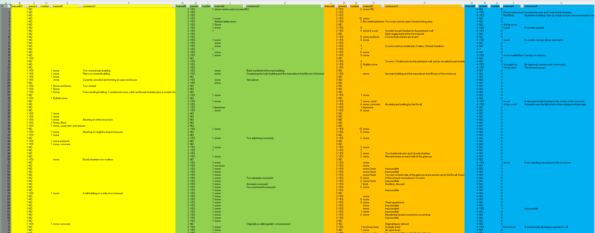

# City of the Dead
> *aka* Cairo project, *aka* CoD, Unknown Heritage in the 'City of the Dead', DOCUMENTATION OF THE UNREGISTERED HERITAGE OF THE EASTERN CEMETERY IN CAIRO

see [Issue #54](https://github.com/eamena-project/eamena-arches-dev/issues/54)

## Aims

Uploading an existing database into EAMENA v4

## CoD databases

| DB       | unitnumber |
|----------|----------|
| 2022-24_UnknownHeritage-N.accdb   | 1-9;53-68   |
| 2022-24_UnknownHeritage-S.accdb   | 10-52;69-91  |

### ERD

  
   
    Entity-relationships diagram

## CoD field and value description

* `unitnumber` or `record`: equivalent to the EAMENA `Heritage Places`
* `features`: equivalent to the EAMENA `Built Components`

## Workflow

Export DBs tables to XLSX

### XLSX -> CSV

Merge the XLSX from the two DBs, remove duplicates and export as CSV by running the function `merge2dbs` of [cod.py](https://github.com/eamena-project/eamena-arches-dev/blob/main/projects/cod/cod.py#L6). Tables are now in the [csv/](https://github.com/eamena-project/eamena-arches-dev/tree/main/projects/cod/business_data/csv) folder

- [records.csv](https://github.com/eamena-project/eamena-arches-dev/blob/main/projects/cod/business_data/csv/records.csv): n = 91, `unitnumber` or `record`: equivalent to the EAMENA `Heritage Places`.
- [features.csv](https://github.com/eamena-project/eamena-arches-dev/blob/main/projects/cod/business_data/csv/features.csv): n = 91 rows (these are the `records`) but 16 groups of columns (here in color, the left column in grey is the `record` identifier)

  
   
    `features` by `records` 

converted to a long format

  
   
    `features` by `records` 

- [featuresnumbers.csv](https://github.com/eamena-project/eamena-arches-dev/blob/main/projects/cod/business_data/csv/featuresnumbers.csv): correspondances between `featureID` and litteral description of these features, 16 values. The latter are the `features`: equivalent to the EAMENA `Built Components`.
- [photos.csv](https://github.com/eamena-project/eamena-arches-dev/blob/main/projects/cod/business_data/csv/photos.csv): some 1,935 photographs of the 91 `records`
- [DatingKind.csv](https://github.com/eamena-project/eamena-arches-dev/blob/main/projects/cod/business_data/csv/DatingKind.csv): the dating method
- [Glossary.csv](https://github.com/eamena-project/eamena-arches-dev/blob/main/projects/cod/business_data/csv/Glossary.csv): a glossary
- [condition.csv](https://github.com/eamena-project/eamena-arches-dev/blob/main/projects/cod/business_data/csv/condition.csv): condition of preservation

### Create a BU

Create a [Bulk Upload file](https://github.com/eamena-project/eamena-arches-dev/tree/main/dbs/database.eamena/data/bulk_data#readme) for the `records` adding the `features` and the `photos` in the description field

  
   
    Screenshot of the BU template with the `General Description` field (free text) highlighted

#### Mapping tables

* Conditions

| CoD           | EAMENA      |
|---------------|-------------|
| Fair          | Fair        |
| Good          | Good        |
| Poor          | Poor        |
| Poor/Ruin     | Very Bad    |
| Ruin          | Destroyed   |

* Extent of damage

| CoD           | EAMENA              |
|---------------|---------------------|
| Fair          | 1-10%               |
| Good          | No Visible/Known    |
| Poor          | 11-30%              |
| Poor/Ruin     | 31-60%              |
| Ruin          | 61-90%              |

### Append metadata to the photographs

See: [photos.csv](https://github.com/eamena-project/eamena-arches-dev/blob/main/projects/cod/business_data/csv/photos.csv)

* GPS: function `add_metadata_XY_to_photo` of [cod.py](https://github.com/eamena-project/eamena-arches-dev/blob/main/projects/cod/cod.py#L94)

### TODO

- [ ] Creating IR manually based on data recorded in the field `references` (file: `records.xlsx`)
- [ ] Importing each photograph as an Information Resource (IR)
- [ ] Hosting each photograph in a ResourceSpace server: <cityofthedead.arch.ox.ac.uk>, see APAAME

---

# Other

## CoD to EAMENA

CoD records gather informations that will belong both to EAMENA Heritage Places (HP, [example](https://github.com/eamena-project/eamena-arches-dev/blob/main/projects/cod/business_data/hp.csv)) and EAMENA Built Components (BC, [example](https://github.com/eamena-project/eamena-arches-dev/blob/main/projects/cod/business_data/bc.csv)). For each CoD record there is two kinds of data:

1. Textual data
2. Photographs

## Textual data

* solution

1. Values: Map CoD's values to those used in EAMENA (controled vocab), see for example [condition.csv](https://github.com/eamena-project/eamena-arches-dev/blob/main/projects/cod/reference_data/condition.csv)

2. For a BU Upload (HP Fields): Map correspondances between CoD's project DB fieldnames with EAMENA field names, using the [mapping correspondance table](https://github.com/eamena-project/eamenaR#mapping-file) (fields: `cairo` and `cairo_type`)

  
   
    <em>Alignement 'source' (columns `cairo` and `cairo_type`) and 'target'</em>

3. Run the [list_mapping_bu()](https://eamena-project.github.io/eamenaR/doc/list_mapping_bu) function

## Photographs

### Metadata

Match the photographs metadata with the photographs themselves

  
   
    <em>Screenshot of the 'photo' table export (`photo.xlsx`) with the metadata of the photograph DSC_2643s.jpg highlighted</em>

  
   
    <em>Screenshot of the DSC_2643s.jpg photograph</em>

<*to be discussed*>

