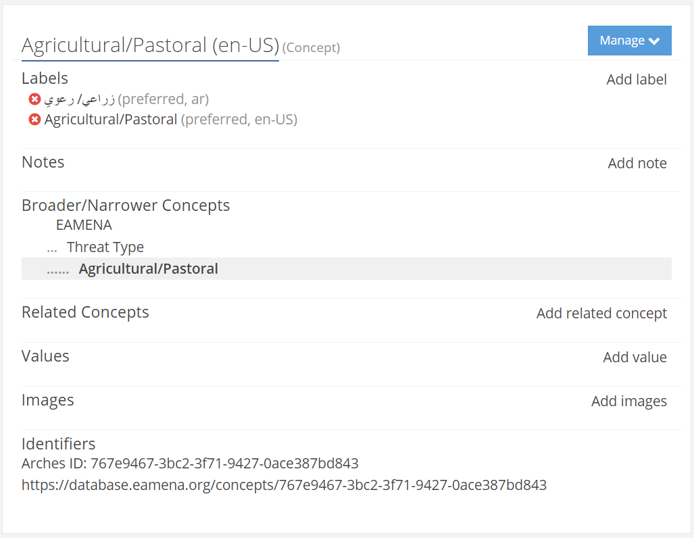

# Iconic images for EAMENA Concepts

Associate one image to a EAMENA concept to illustrate this latter (ex: Threat type = Agricultural/Pastoral). Insert the concept UUID to the image's metadata (ex: `767e9467-3bc2-3f71-9427-0ace387bd843`).

  
   
    <em>The threat `Agricultural/Pastoral` concept in the RDM</em>

The objective is to link the concept image UUID to the RM (ex: node Threat type) and display these images in a `pyvis` interactive graph

  
   
    <em>A clear case of Agricultural/Pastoral (orchads) threat over cultural hertiage </em>

See: 
* https://colab.research.google.com/github/eamena-project/eamena-data/blob/main/reference-data/concepts/heritage_places/concepts_images_graph.ipynb
* ~~https://colab.research.google.com/github/eamena-project/eamena-data/blob/main/reference-data/concepts/heritage_places/concepts_images.ipynb~~
