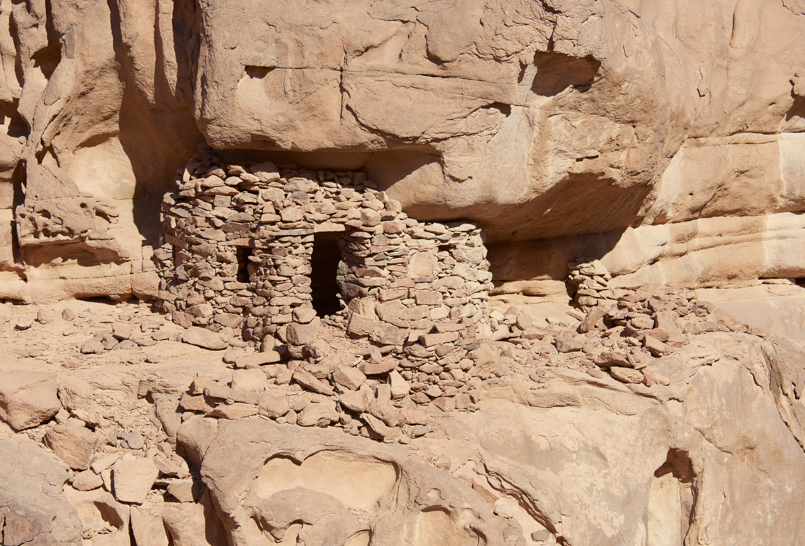

# EMHE
> "Endangered Monastic Heritage in Egypt"

Proof of concept/Pilot study for the ["Documenting Coptic Monastic Heritage" project](https://www.ff.uni-lj.si/en/news/documenting-coptic-monastic-heritage-project)

* Relations between endangered Heritage Place (HP) and Built Component (BC) in EAMENA
* Photograph archives on a ResourceSpace server
* EAMENA ~ ResourceSpace links

## Search URL

ex: the Heritage Place `WN01`

```
https://database.eamena.org/search?paging-filter=1&tiles=true&format=tilecsv&reportlink=false&precision=6&total=382272&term-filter=%5B%7B%22context%22%3A%22%22%2C%22context_label%22%3A%22Heritage%20Place%20-%20Resource%20Name%22%2C%22id%22%3A0%2C%22text%22%3A%22WN01%22%2C%22type%22%3A%22term%22%2C%22value%22%3A%22WN01%22%2C%22inverted%22%3Afalse%7D%5D&language=*
```


## Notes

### Dataset

| type | name| description | photo | related resources | coordinates |
|----------|----------|----------|----------|----------|----------|
| HP | `eamena_xxx`| Lorem Ipsum |  | contains `eamena_yyy` | 25.864722, 56.098333 |
| BC | `eamena_yyy`| Lorem Ipsum | NaN | is part of `eamena_xxx` | 25.864722, 56.098333 |


