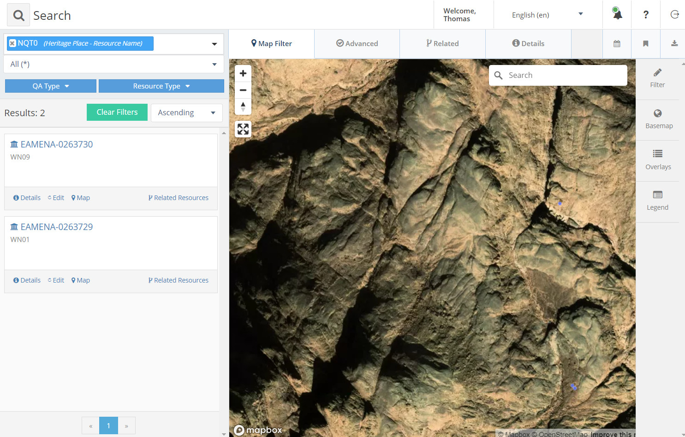

# EMHE
> "Endangered Monastic Heritage in Egypt", *aka* NQT0, Wadi Naqqat

Dataset for the ["Documenting Coptic Monastic Heritage" project](https://www.ff.uni-lj.si/en/news/documenting-coptic-monastic-heritage-project)

Issue: [#55](https://github.com/eamena-project/eamena-arches-dev/issues/55)

## Location

<p align="center">
  
  <br>
    Egyptian Eastern desert, see the GeoJSON file: <https://github.com/eamena-project/eamena-arches-dev/blob/main/projects/emhe/data/roi.geojson>
</p>


## Search URL

Find HP `WN01`, `WN09`, ... by searching `NQT0` (NQT for Wadi Naqqat)

```
https://database.eamena.org/search?paging-filter=1&tiles=true&format=tilecsv&reportlink=false&precision=6&total=383284&language=*&term-filter=%5B%7B%22context%22%3A%22%22%2C%22context_label%22%3A%22Heritage%20Place%20-%20Resource%20Name%22%2C%22id%22%3A0%2C%22text%22%3A%22NQT0%22%2C%22type%22%3A%22term%22%2C%22value%22%3A%22NQT0%22%2C%22inverted%22%3Afalse%7D%5D
```



## Cultural period mapping

| Coptic date   | Coptic period | EAMENA date | EAMENA period |
|----------|----------|----------|----------|
| 4th-7th CE| Early Coptic/Byzantine | 500 BC-640 CE | Byzantine (Cyrenaica/Egypt)|
| 7th Century-present| Coptic| **640-1900** | **Islamic (North Africa)**|
| 7th Century-present| Coptic| 640-900 CE | Islamic, Early (Umayyad/Abbasid) (North Africa)|
| 7th Century-present| Coptic| 900-1200 CE| Islamic, Middle (Fatimid/Zirid/Hammadid/Almoravid/Almohad) (North Africa)|
| 7th Century-present| Coptic| 1200-1500 CE| Islamic, Late (Ayyubid/Hafsid/Marinid/Zayyanid/Mamluk) (North Africa)|
| 7th Century-present| Coptic| 1500-1900 CE| Islamic, Late (Ottoman/Saadi/Wattasid/Alaouite/Colonial) (North Africa)|
| 7th Century-present| Coptic| **1900-Present**| **Contemporary Islamic (MENA)**|
| 7th Century-present| Coptic| 1900-1950 CE| Contemporary Islamic, Early 20th century (MENA)|
| 7th Century-present| Coptic| 1950-Present| Contemporary Islamic, Modern (MENA)|


## Notes

* Relations between endangered Heritage Place (HP) and Built Component (BC) in EAMENA
* Photograph archives on a ResourceSpace server
* EAMENA ~ ResourceSpace links

## TODO

- [ ] Add these periods to EAMENA?:
	- Coptic (4th-present)
		- Early Coptic/Byzantine (4th-7th CE)
		- Coptic (7th Century-present)

  

