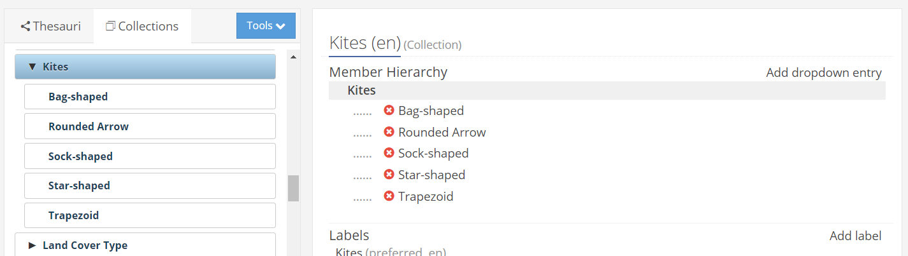
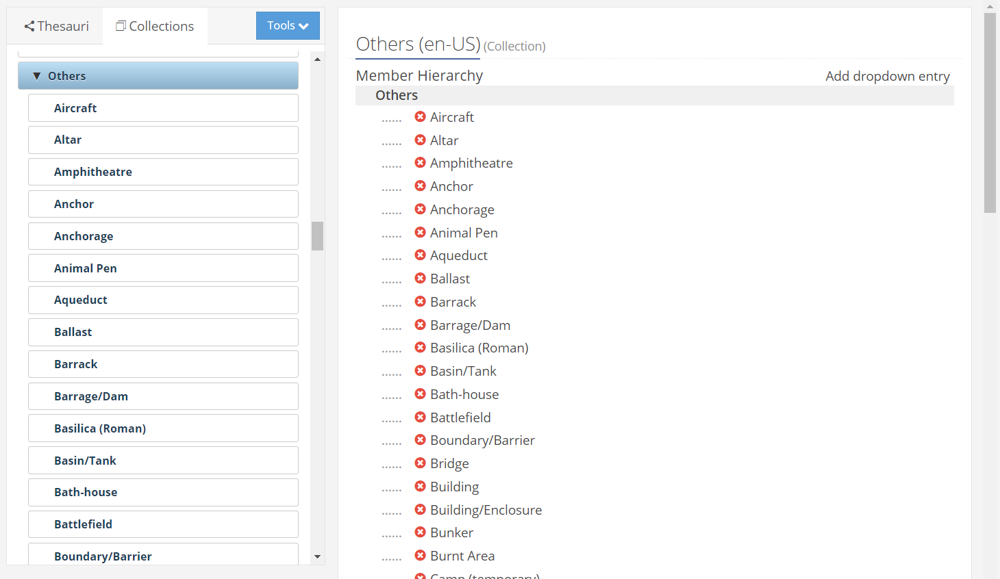
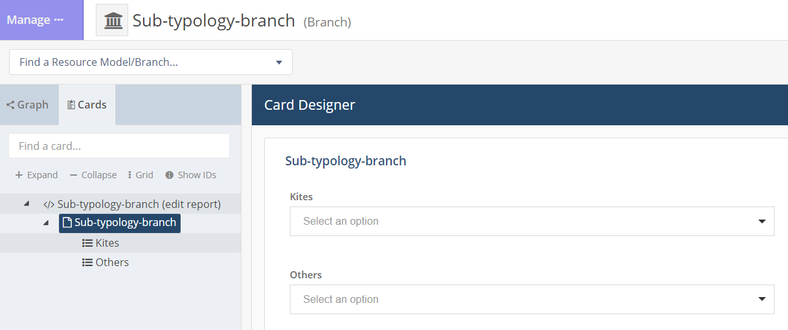

# Kites

## Holocene paper
> Michael Fradley et al., *Holocene*

## RM - branches

A typology of kites has been created in the EAMENA training instance in the form of a branch

  
   
    <em>**Kites** collection in the RDM</em>

At the same time, the value 'Kite' has been removed in the 'Site Feature Interpretation Type' collection which has been renamed 'Others'.

  
   
    <em>**Others** collection in the RDM</em>

A branch has been created with these two collections

  
   
    <em>**Others** collection in the RDM</em>

This branch has been exported to GitHub: [Sub-typology-branch.json](Sub-typology-branch.json) and can be then processed as a RM with the graph display and attaching images to it

* https://colab.research.google.com/github/eamena-project/eamena-arches-dev/blob/main/dbs/ea.train/data/reference_data/rm/hp/erd-branch/EAtrain_erd_branch.ipynb
* https://github.com/eamena-project/eamena-arches-dev/blob/main/dbs/ea.train/data/reference_data/rm/hp/erd-branch/EAtrain_erd_branch.ipynb

## datasets 

n = 400

* Search URL: https://database.eamena.org/search?paging-filter=1&tiles=true&format=shp&reportlink=false&precision=6&total=374&map-filter=%7B%22type%22%3A%22FeatureCollection%22%2C%22features%22%3A%5B%7B%22id%22%3A%22794d59db65a046bc96a9c5efdd877330%22%2C%22type%22%3A%22Feature%22%2C%22properties%22%3A%7B%22buffer%22%3A%7B%22width%22%3A10%2C%22unit%22%3A%22m%22%7D%2C%22inverted%22%3Afalse%7D%2C%22geometry%22%3A%7B%22coordinates%22%3A%5B%5B%5B40.42358021819385%2C29.05793279611764%5D%2C%5B40.13413717761895%2C29.910288179720055%5D%2C%5B40.43589694332556%2C30.57265608973826%5D%2C%5B43.28926167683315%2C30.726299530672918%5D%2C%5B45.36685309868989%2C30.636262293979215%5D%2C%5B45.39148654894964%2C26.296964277074807%5D%2C%5B40.00916682612001%2C26.448693142622034%5D%2C%5B40.42358021819385%2C29.05793279611764%5D%5D%5D%2C%22type%22%3A%22Polygon%22%7D%7D%5D%7D&advanced-search=%5B%7B%22op%22%3A%22and%22%2C%2234cfea58-c2c0-11ea-9026-02e7594ce0a0%22%3A%7B%22op%22%3A%22%22%2C%22val%22%3A%22b5cb7d7c-9564-4e73-b08f-ff8d697483ab%22%7D%2C%2234cfea44-c2c0-11ea-9026-02e7594ce0a0%22%3A%7B%22op%22%3A%22%22%2C%22val%22%3A%22%22%7D%7D%2C%7B%22op%22%3A%22and%22%2C%2234cfea81-c2c0-11ea-9026-02e7594ce0a0%22%3A%7B%22op%22%3A%22lt%22%2C%22val%22%3A%222022-08-01%22%7D%2C%2234cfea4d-c2c0-11ea-9026-02e7594ce0a0%22%3A%7B%22op%22%3A%22%22%2C%22val%22%3A%22%22%7D%2C%22d2e1ab96-cc05-11ea-a292-02e7594ce0a0%22%3A%7B%22op%22%3A%22%22%2C%22val%22%3A%22%22%7D%2C%2234cfea8a-c2c0-11ea-9026-02e7594ce0a0%22%3A%7B%22op%22%3A%22%22%2C%22val%22%3A%22%22%7D%7D%5D

* GeoJSON URL: https://database.eamena.org/api/search/export_results?paging-filter=1&tiles=true&format=geojson&reportlink=false&precision=6&total=400&map-filter=%7B%22type%22%3A%22FeatureCollection%22%2C%22features%22%3A%5B%7B%22id%22%3A%22794d59db65a046bc96a9c5efdd877330%22%2C%22type%22%3A%22Feature%22%2C%22properties%22%3A%7B%22buffer%22%3A%7B%22width%22%3A10%2C%22unit%22%3A%22m%22%7D%2C%22inverted%22%3Afalse%7D%2C%22geometry%22%3A%7B%22coordinates%22%3A%5B%5B%5B40.42358021819385%2C29.05793279611764%5D%2C%5B40.13413717761895%2C29.910288179720055%5D%2C%5B40.43589694332556%2C30.57265608973826%5D%2C%5B43.28926167683315%2C30.726299530672918%5D%2C%5B45.36685309868989%2C30.636262293979215%5D%2C%5B45.39148654894964%2C26.296964277074807%5D%2C%5B40.00916682612001%2C26.448693142622034%5D%2C%5B40.42358021819385%2C29.05793279611764%5D%5D%5D%2C%22type%22%3A%22Polygon%22%7D%7D%5D%7D&advanced-search=%5B%7B%22op%22%3A%22and%22%2C%2234cfea58-c2c0-11ea-9026-02e7594ce0a0%22%3A%7B%22op%22%3A%22%22%2C%22val%22%3A%22b5cb7d7c-9564-4e73-b08f-ff8d697483ab%22%7D%2C%2234cfea44-c2c0-11ea-9026-02e7594ce0a0%22%3A%7B%22op%22%3A%22%22%2C%22val%22%3A%22%22%7D%7D%2C%7B%22op%22%3A%22and%22%2C%2234cfea81-c2c0-11ea-9026-02e7594ce0a0%22%3A%7B%22op%22%3A%22lt%22%2C%22val%22%3A%222022-08-01%22%7D%2C%2234cfea4d-c2c0-11ea-9026-02e7594ce0a0%22%3A%7B%22op%22%3A%22%22%2C%22val%22%3A%22%22%7D%2C%22d2e1ab96-cc05-11ea-a292-02e7594ce0a0%22%3A%7B%22op%22%3A%22%22%2C%22val%22%3A%22%22%7D%2C%2234cfea8a-c2c0-11ea-9026-02e7594ce0a0%22%3A%7B%22op%22%3A%22%22%2C%22val%22%3A%22%22%7D%7D%5D&resource-type-filter=%5B%7B%22graphid%22%3A%2234cfe98e-c2c0-11ea-9026-02e7594ce0a0%22%2C%22name%22%3A%22Heritage%20Place%22%2C%22inverted%22%3Afalse%7D%5D