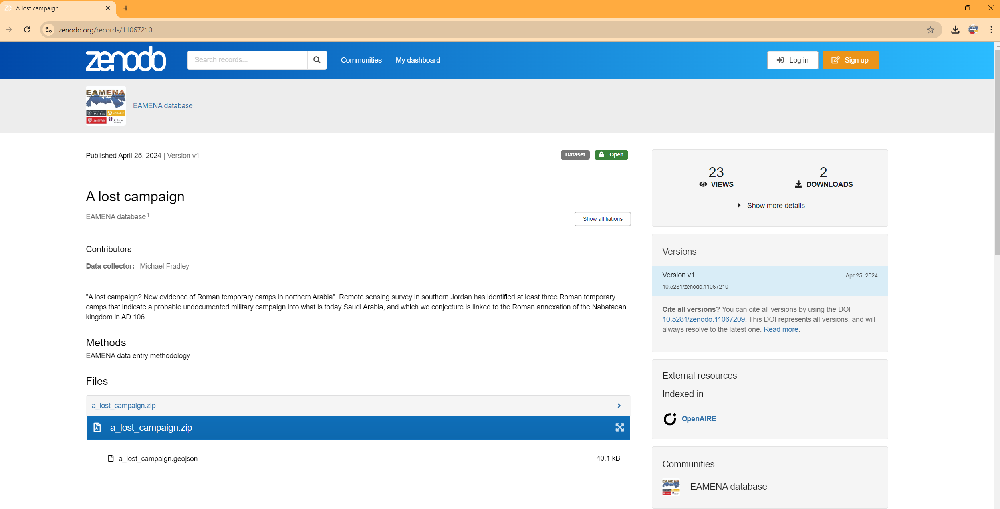

# A Lost Campaign?

* Search URL

```
https://database.eamena.org/search?paging-filter=1&tiles=true&format=tilecsv&reportlink=false&precision=6&total=383723&map-filter=%7B%22type%22%3A%22FeatureCollection%22%2C%22features%22%3A%5B%7B%22id%22%3A%22a421dfd1cf8e2071e46fe52188e7dcf6%22%2C%22type%22%3A%22Feature%22%2C%22properties%22%3A%7B%22buffer%22%3A%7B%22width%22%3A10%2C%22unit%22%3A%22m%22%7D%2C%22inverted%22%3Afalse%7D%2C%22geometry%22%3A%7B%22coordinates%22%3A%5B%5B%5B37.11103003453388%2C30.692486163331665%5D%2C%5B37.102186445415526%2C30.66674350303225%5D%2C%5B37.9640962464091%2C30.50335211102579%5D%2C%5B37.967497626839815%2C30.530896107900205%5D%2C%5B37.11103003453388%2C30.692486163331665%5D%5D%5D%2C%22type%22%3A%22Polygon%22%7D%7D%5D%7D
```


* GeoJSON URL

```
https://database.eamena.org/api/search/export_results?paging-filter=1&tiles=true&format=geojson&reportlink=false&precision=6&total=3&map-filter=%7B%22type%22%3A%22FeatureCollection%22%2C%22features%22%3A%5B%7B%22id%22%3A%22a421dfd1cf8e2071e46fe52188e7dcf6%22%2C%22type%22%3A%22Feature%22%2C%22properties%22%3A%7B%22buffer%22%3A%7B%22width%22%3A10%2C%22unit%22%3A%22m%22%7D%2C%22inverted%22%3Afalse%7D%2C%22geometry%22%3A%7B%22coordinates%22%3A%5B%5B%5B37.11103003453388%2C30.692486163331665%5D%2C%5B37.102186445415526%2C30.66674350303225%5D%2C%5B37.9640962464091%2C30.50335211102579%5D%2C%5B37.967497626839815%2C30.530896107900205%5D%2C%5B37.11103003453388%2C30.692486163331665%5D%5D%5D%2C%22type%22%3A%22Polygon%22%7D%7D%5D%7D&resource-type-filter=%5B%7B%22graphid%22%3A%2234cfe98e-c2c0-11ea-9026-02e7594ce0a0%22%2C%22name%22%3A%22Heritage%20Place%22%2C%22inverted%22%3Afalse%7D%5D
```


## Citation plugin

See: https://zenodo.org/records/11067210


### Maps


### Charts


## on Zenodo

