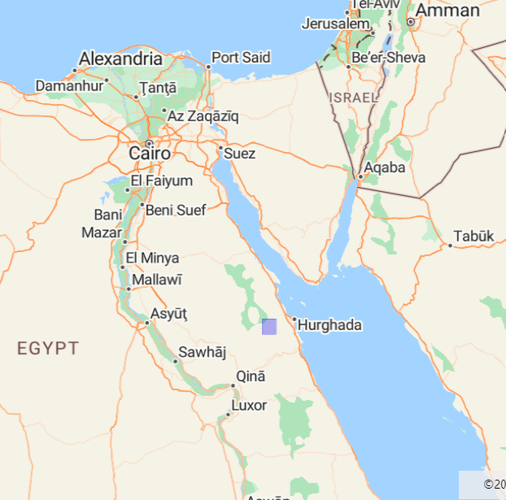
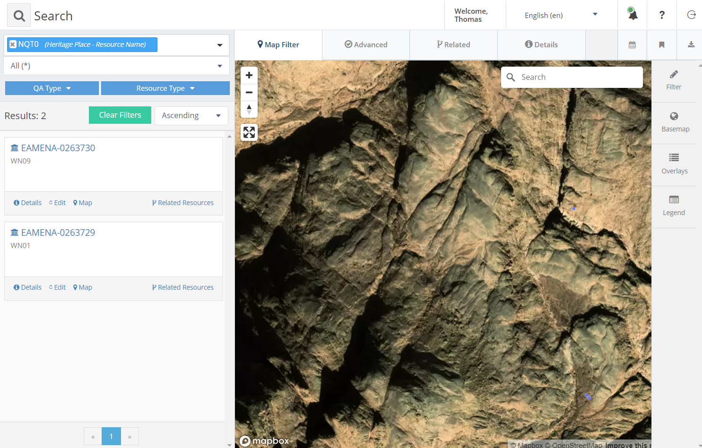
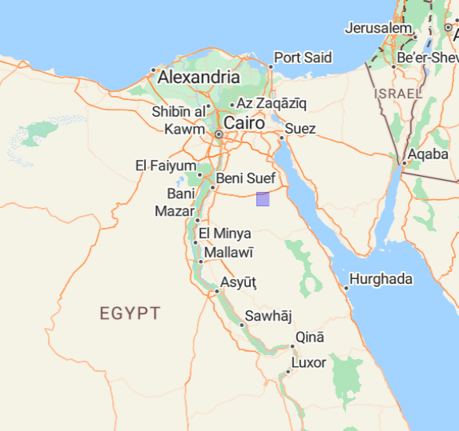

# MHE
> "Monastic Heritage in Egypt", *aka*

Dataset for the ["Documenting Coptic Monastic Heritage" project](https://www.ff.uni-lj.si/en/news/documenting-coptic-monastic-heritage-project)

Issue: [#55](https://github.com/eamena-project/eamena-arches-dev/issues/55)

##  NQT0
> Wadi Naqqat

### Location

<p align="center">
  
  <br>
    Egyptian Eastern Desert (blue rectangle) west of Hurghada (Red Sea) = EAMENA `E33N27-12`
</p>

See the [GeoJSON file](https://github.com/eamena-project/eamena-arches-dev/blob/main/projects/emhe/data/NQT0-roi.geojson)

### Search URL

Find HP `WN01`, `WN09`, ... by searching `NQT0` (NQT for Wadi Naqqat)

```
https://database.eamena.org/search?paging-filter=1&tiles=true&format=tilecsv&reportlink=false&precision=6&total=383332&term-filter=%5B%7B%22context%22%3A%22%22%2C%22context_label%22%3A%22Heritage%20Place%20-%20Resource%20Name%22%2C%22id%22%3A0%2C%22text%22%3A%22NQT0%22%2C%22type%22%3A%22term%22%2C%22value%22%3A%22NQT0%22%2C%22inverted%22%3Afalse%7D%5D&language=*
```
<p align="center">
  
  <br>
    Search `NQT0` (2 heritage places on 01/08/2024)
</p>

##  KRZ0
> Wadi Kharaza

### Location

<p align="center">
  
  <br>
</p>

See the [GeoJSON file](https://github.com/eamena-project/eamena-arches-dev/blob/main/projects/emhe/data/KRZ0-roi.geojson)

### Search URL

Find HP `WK01`, `WK02`, ... by searching `KRZ0` (KRZ for Wadi Kharaza)

```
https://database.eamena.org/search?paging-filter=1&tiles=true&format=tilecsv&reportlink=false&precision=6&total=383574&language=*&term-filter=%5B%7B%22context%22%3A%22%22%2C%22context_label%22%3A%22Heritage%20Place%20-%20Resource%20Name%22%2C%22id%22%3A0%2C%22text%22%3A%22KRZ0%22%2C%22type%22%3A%22term%22%2C%22value%22%3A%22KRZ0%22%2C%22inverted%22%3Afalse%7D%5D
```

# Reference data

## Cultural period mapping

Equivalences between the Coptic periodisation and the EAMENA reference data (with links to PeriodO)

| Coptic date   | Coptic period | EAMENA date | EAMENA period |
|----------|----------|----------|----------|
| 4th-7th CE| Early Coptic/Byzantine | 500 BC-640 CE | [Byzantine (Cyrenaica/Egypt)](https://client.perio.do/?page=period-view&backendID=web-https%3A%2F%2Fdata.perio.do%2F&authorityID=p0m64td&periodID=p0m64tdkbwr)|
| 7th c.-present| Coptic| **640-1900 CE** | [**Islamic (North Africa)**](https://client.perio.do/?page=period-view&backendID=web-https%3A%2F%2Fdata.perio.do%2F&authorityID=p0m64td&periodID=p0m64td5g67)|
| 7th c.-present| Coptic| 640-900 CE | [Islamic, Early (Umayyad/Abbasid) (North Africa)](https://client.perio.do/?page=period-view&backendID=web-https%3A%2F%2Fdata.perio.do%2F&authorityID=p0m64td&periodID=p0m64tdd5n9)|
| 7th c.-present| Coptic| 900-1200 CE| [Islamic, Middle (Fatimid/Zirid/Hammadid/Almoravid/Almohad) (North Africa)](https://client.perio.do/?page=period-view&backendID=web-https%3A%2F%2Fdata.perio.do%2F&authorityID=p0m64td&periodID=p0m64td6z7c)|
| 7th c.-present| Coptic| 1200-1500 CE| [Islamic, Late (Ayyubid/Hafsid/Marinid/Zayyanid/Mamluk) (North Africa)](https://client.perio.do/?page=period-view&backendID=web-https%3A%2F%2Fdata.perio.do%2F&authorityID=p0m64td&periodID=p0m64tddbt3)|
| 7th c.-present| Coptic| 1500-1900 CE| [Islamic, Late (Ottoman/Saadi/Wattasid/Alaouite/Colonial) (North Africa)](https://client.perio.do/?page=period-view&backendID=web-https%3A%2F%2Fdata.perio.do%2F&authorityID=p0m64td&periodID=p0m64tdnr6d)|
| 7th c.-present| Coptic| **1900-Present**| [**Contemporary Islamic (MENA)**](https://client.perio.do/?page=period-view&backendID=web-https%3A%2F%2Fdata.perio.do%2F&authorityID=p0m64td&periodID=p0m64tdvprx)|
| 7th c.-present| Coptic| 1900-1950 CE| Contemporary Islamic, Early 20th century (MENA)|
| 7th c.-present| Coptic| 1950-Present| [Contemporary Islamic, Modern (MENA)](https://client.perio.do/?page=period-view&backendID=web-https%3A%2F%2Fdata.perio.do%2F&authorityID=p0m64td&periodID=p0m64td8zz2)|

- **bolded**: Culture Period
- regular: Culture Sub-Period
- Contemporary Islamic, Early 20th century (MENA): missing in PeriodO


## Notes

* Relations between endangered Heritage Place (HP) and Built Component (BC) in EAMENA
* Photograph archives on a ResourceSpace server
* EAMENA ~ ResourceSpace links

## TODO

- [ ] Link external images (Public URL), ex: `INFORMATION-0150090`

- [ ] ~~Add these periods to EAMENA?~~:
	- ~~Coptic (4th-present)~~
		- ~~Early Coptic/Byzantine (4th-7th CE)~~
		- ~~Coptic (7th Century-present)~~

  

