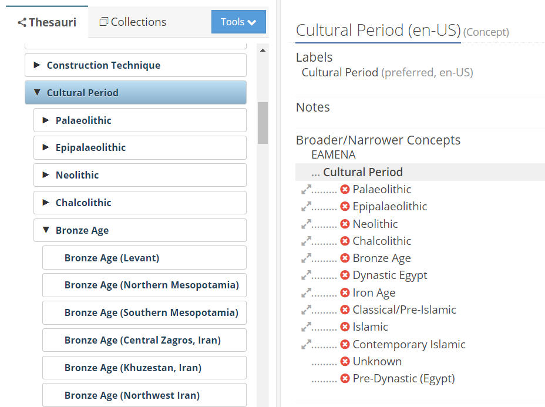
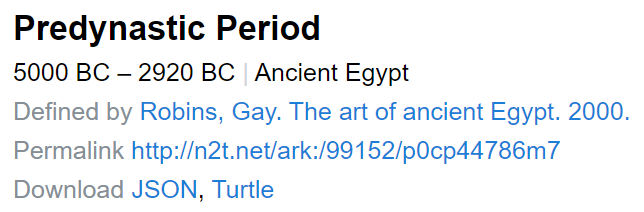

# PeriodO / EAMENA
> https://perio.do/en/

Export of EAMENA cultural periods and subperiods as new entries in PeriodO 

## PeriodO formalism
### Temporal

EAMENA registers the periods (a particular instance of the concepts) as graphs, with parent and child concepts (cf. PeriodO `PartOf`). The [list_child_concepts()](https://eamena-project.github.io/eamenaR/doc/list_child_concepts) function of the eamenaR package allows to retrieve these periods within their subgraphs.

  
   
    <em>screenshot of the Cultural Periods in the EAMENA Reference Data Manager (RDM)</em>

### Spatial

### Authority

## Example

An example of the `Predynastic` JSON is here: https://github.com/eamena-project/eamena-arches-dev/blob/main/projects/periodo/periodo-period-cp44786m7.json [^1].

  
   
    <em>screenshot of the `Predynastic` record in PeriodO</em>

## Period definitions from EAMENA

### Template

`@rybesh` (Ryan Shaw) sent a JSON [template](https://gist.github.com/rybesh/9f64c127ad8eeb69619896f22064bb0e#file-example-dataset-json) for EAMENA to create definitions from its cultural periods and sub-periods.  
As an example, this template has been modified for the EAMENA cultural period `Chalcolithic (Northern Iran) ` (see its temporal bounds [here](https://github.com/eamena-project/eamena-arches-dev/blob/main/projects/periodo/cultural_periods.tsv#L2)) and hosted [here](https://github.com/eamena-project/eamena-arches-dev/blob/main/projects/periodo/template_eamena.json)
If this structure is suitable, it will be reused in a computer routine to cast all EAMENA periods and sub-periods into a format that can be directly integrated into PeriodO.

---

The PeriodO issue thread: https://github.com/eamena-project/eamena-arches-dev/issues/12

[^1]: This example corresponding to the URL: https://client.perio.do/?page=period-view&backendID=web-https%3A%2F%2Fdata.perio.do%2F&authorityID=p0cp447&periodID=p0cp44786m7