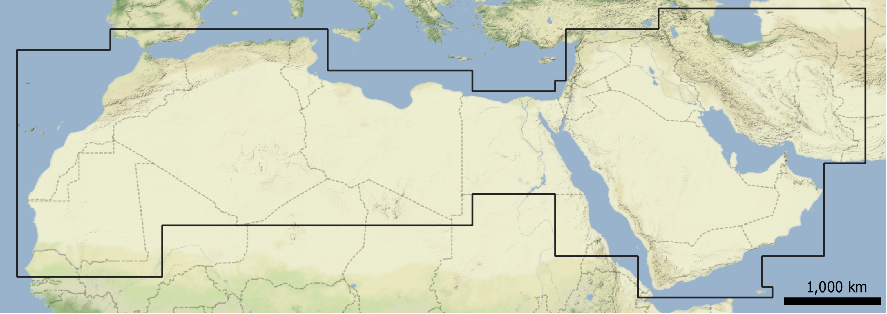
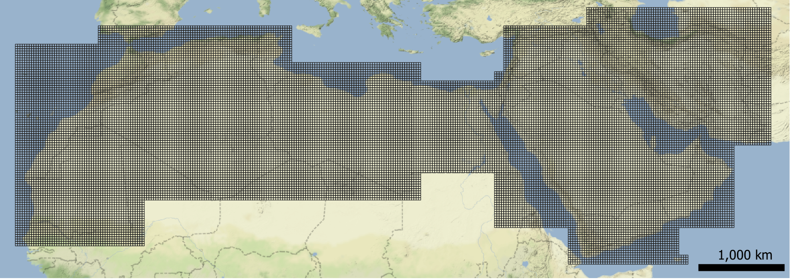
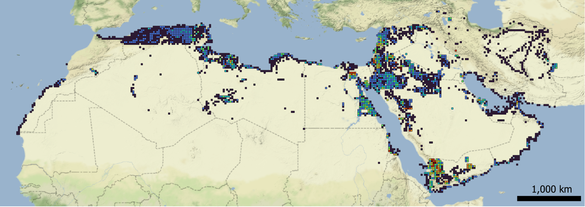
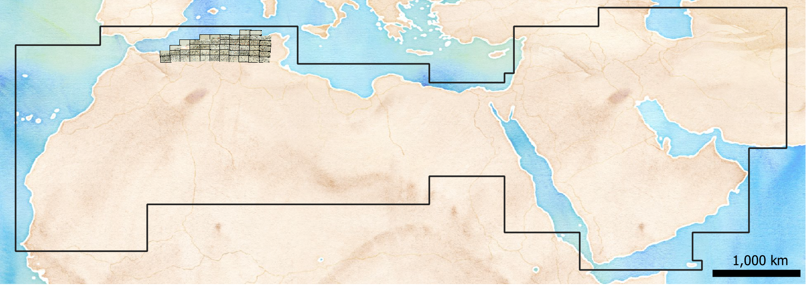
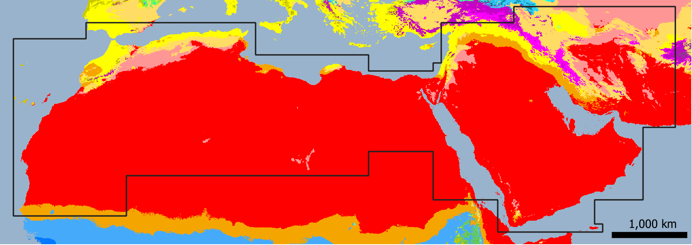

# GeoServer

## EAMENA GeoServer

The EAMENA GeoServer (http://54.155.109.226:8080/geoserver) host different files

| Service  	|  URL 	|
|---	|---	|
| WFS  	|  http://54.155.109.226:8080/geoserver/ows?acceptversions=2.0.0 	|
| WMS 	|  http://54.155.109.226:8080/geoserver/ows?version=1.3.0 	|

### WFS

Web File Services

| type | Name  	|   description	| map |
|---	|---	|---	|--- |
| Grids | EAMENA_Grid_contour  	| EAMENA Grid Squares perimeter	|  |
| Grids | EAMENA_Grid  	|  EAMENA Grid Squares 	|  |
| Grids | grids_nb_hp_230704  |  Nb of heritage places by Grid Squares (see [eamenaR](https://github.com/eamena-project/eamenaR#grids)) 	|   |

### WMS

Web Map Services

| type | Name  	|   description	| map |
|---	|---	|---	|--- |
| Atlas | AAA  	| Atlas Archéologique d'Algérie	|  |
| Climate | Beck_KG_V1_present_0p008  	| Koppen Climate Classification ([legend](../../data/layouts/koppen_climate_class.md))	|  |

## Install

Following the tutorial: https://www.youtube.com/watch?v=awR4RgJNhVU

Ubuntu 20.04 or Ubuntu 10.04

On your AWS instance, autorise the world

```
TCP/IP | 8080 | 0.0.0.0/
TCP/IP | 8080 | ::/0
```
Check your Java version, or even if Java is installed

```sh
java -version
```

If Java is not installed[^1], install it doing:

```sh
sudo apt install default-jre
```

create a geoserver/ folder and move in it

```sh
mkdir geoserver
cd geoserver
```

download the binaries (Platform Independent Binary) from https://geoserver.org, for example[^2]

```sh
wget https://sourceforge.net/projects/geoserver/files/GeoServer/2.22.1/geoserver-2.22.1-bin.zip
```

unzip the geoserver

```sh
unzip geoserver-2.22.1-bin.zip
```

setup the environment variables

```sh
~~echo "export GEOSERVER_HOME=/Downloads/" >> ~/.profile~~
echo "export GEOSERVER_HOME=/opt/arches/geoserver" >> ~/.profile
. ~/.profile
```

change the ownership of the geoserver/ folder

```sh
sudo chown -R root /opt/arches/geoserver
```

go to the bin/ folder

```sh
cd bin
```

run the install shell script

```sh
nohup sh startup.sh &
```

# access the geoserver from its public IP
http://34.243.109.142:8080/geoserver
# username = admin
# password = geoserver
```

[^1]: run `java -version`. If not installed, the message will be: `Command 'java' not found, ...`
[^2]: more recent: `wget https://sourceforge.net/projects/geoserver/files/GeoServer/2.24.2/geoserver-2.24.2-bin.zip`


