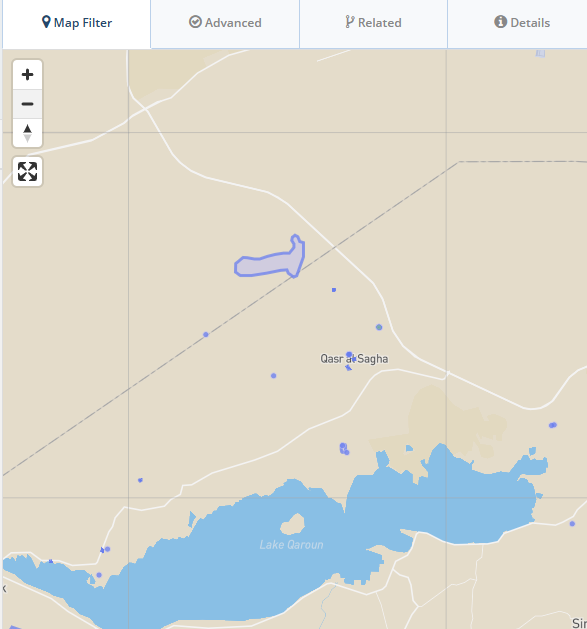
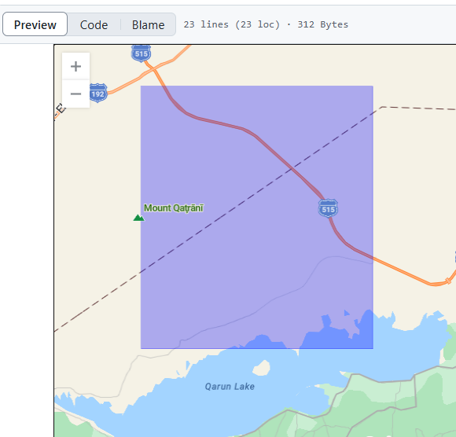
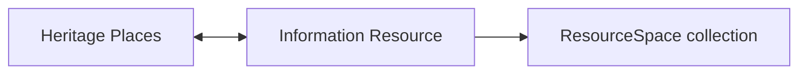

# DOCUMENTING COPTIC MONASTIC HERITAGE 
> 11-13 November 2024, Bibliotheca Alexandrina, Alexandria, Egypt. See the [CHMA project](https://github.com/eamena-project/eamena-arches-dev/tree/main/projects/cmha)

| Day 1 | Day 2   | Day 3  | 
|---|---|---|
| [Disturbances](#1-1-2)  | [Wadi Naqqat](#2-3-2)  | [Contribute](#3-6-1)  |
| [Photos](#1-2-2)  | [Church](#2-4-2)  |   |

[Teams link](https://teams.microsoft.com/l/meetup-join/19%3ameeting_NTM5YWY3ZDgtNTRkZC00ZDM4LWI0MTAtNTJiNmZiZGU0NWEz%40thread.v2/0?context=%7b%22Tid%22%3a%22cc95de1b-97f5-4f93-b4ba-fe68b852cf91%22%2c%22Oid%22%3a%229dce33a8-66a7-403f-a2c6-95948cb855d0%22%7d)

## Identifying and Classifying Disturbances and Threats to Archaeological Heritage (EAMENA Project)
> Day 1, Session 1, Part 2, 10:45 AM - 11:30 PM | Disturbances 

* section 1: Presentation of the EAMENA project
* section 2: Disturbances and Threats to Archaeological Heritage

<!-- <small><b><a href= 'https://eamena-project.github.io/eamena-arches-dev/dbs/database.eamena/data/reference_data/rm/hp/values/Archaeological_Assessment/Absolute_Chronology.html' target='_blank'>values</a><b><small>
<small><b><a href= 'https://eamena-project.github.io/eamena-arches-dev/dbs/database.eamena/data/reference_data/rm/hp/values/Archaeological_Assessment/Absolute_Chronology.html' target='_blank'>values</a><b><small> -->

## The EAMENA Database as an IT Framework for a Photographic Archive
> Day 1, Session 2, Part 2, 12:45 PM - 13:30 PM | Photos 

Case study: [Deir Abu Lifa](https://github.com/eamena-project/eamena-arches-dev/tree/main/projects/chma#dal0):

### Localisation

* Grid Square

  
  
   

GS E30N29-41: the [GeoJSON file](https://github.com/eamena-project/eamena-arches-dev/blob/main/projects/_gs/E30N29-41.geojson) and in the [EAMENA DB](https://database.eamena.org/search?paging-filter=1&tiles=true&format=tilecsv&reportlink=false&precision=6&total=376144&term-filter=%5B%7B%22context%22%3A%22%22%2C%22context_label%22%3A%22Grid%20Square%20-%20Grid%20ID%22%2C%22id%22%3A0%2C%22text%22%3A%22E30N29-41%22%2C%22type%22%3A%22term%22%2C%22value%22%3A%22E30N29-41%22%2C%22inverted%22%3Afalse%7D%5D&language=*)

* Heritage Places

## Case Study: Semi-Anchoretic Settlement in Wadi Naqqat as a Heritage Place within the EAMENA Database
> Day 2, Session 3, Part 2, 10:45 AM - 11:30 PM | Wadi Naqqat 

### Wadi Naqqat

## Case Study: Coptic and Greek Orthodox Churches of Alexandria (+ Zeinab Hanafy, Jan Ciglenečki)
> Day 2, Session 4, Part 2, 12:45 PM - 13:30 PM | Church 

## How You Can Get Involved: Contributing to the Archive of Coptic Monastic Heritage and the EAMENA database (+ Jan Ciglenečki)
> Day 3, Session 6, Part 1, 12:00 PM - 12:45 PM | Contribute 