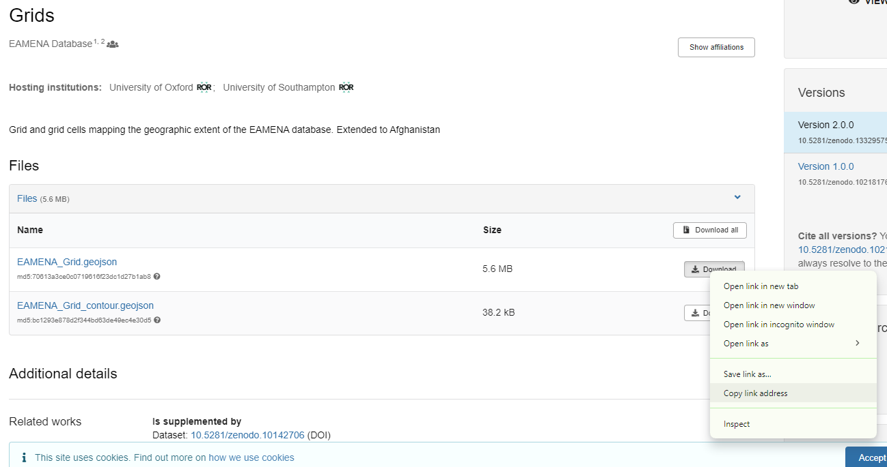

## Zenodo
> tutorial

- where: https://zenodo.org/records/13329575

- how: 

- what: https://zenodo.org/records/13329575/files/EAMENA_Grid.geojson?download=1


## Zenodo *vs* GitHub

These command lines do the same: 

* GeoJSON from GH
```py
url = 'https://raw.githubusercontent.com/eamena-project/eamena-arches-dev/main/dbs/database.eamena/data/reference_data/grids/EAMENA_Grid_contour.geojson'
response = requests.get(url)
geojson_data = response.json()
```

* GeoJSON from Zenodo
```py
geojson_data = zn.zenodo_read(file_url="https://zenodo.org/records/13329575/files/EAMENA_Grid_contour.geojson?download=1")
```


