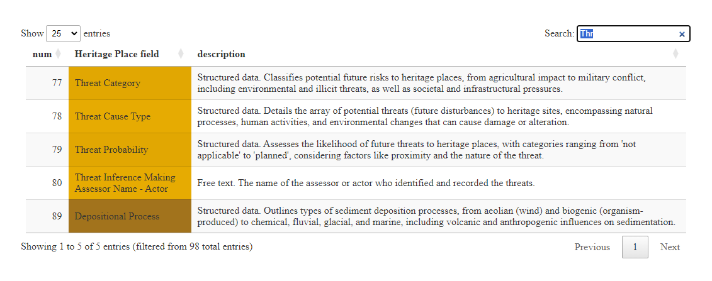
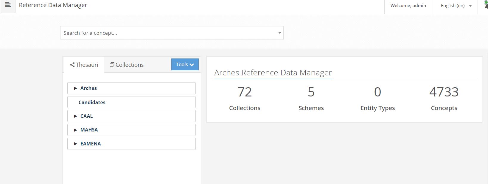

## Interop

## Reference data



EAMENA : 27,585 Grid Squares of 

### Collections



### ACHP

* We already shared our reference data, see: https://colab.research.google.com/github/achp-project/cultural-heritage/blob/main/talks/2023-bhdc/rm_compar.ipynb

## Zenodo
> tutorial

- where: https://zenodo.org/records/13329575

- how: 

- what: https://zenodo.org/records/13329575/files/EAMENA_Grid.geojson?download=1


## Zenodo *vs* GitHub

These command lines do the same: 

* GeoJSON from GH
```py
url = 'https://raw.githubusercontent.com/eamena-project/eamena-arches-dev/main/dbs/database.eamena/data/reference_data/grids/EAMENA_Grid_contour.geojson'
response = requests.get(url)
geojson_data = response.json()
```

* GeoJSON from Zenodo
```py
geojson_data = zn.zenodo_read(file_url="https://zenodo.org/records/13329575/files/EAMENA_Grid_contour.geojson?download=1")
```

## AAA

* Aim:

## EAMNEA business data sample

```json
{
    "type": "FeatureCollection",
    "features": [
        {
            "type": "Feature",
            "properties": {
                "buffer": {
                    "width": 10,
                    "unit": "m"
                },
                "inverted": false
            },
            "geometry": {
                "coordinates": [
                    [
                        [
                            63,
                            31
                        ],
                        [
                            68,
                            31
                        ],
                        [
                            68,
                            33
                        ],
                        [
                            63,
                            33
                        ],
                        [
                            68,
                            31
                        ]
                    ]
                ],
                "type": "Polygon"
            }
        }
    ]
}
```

