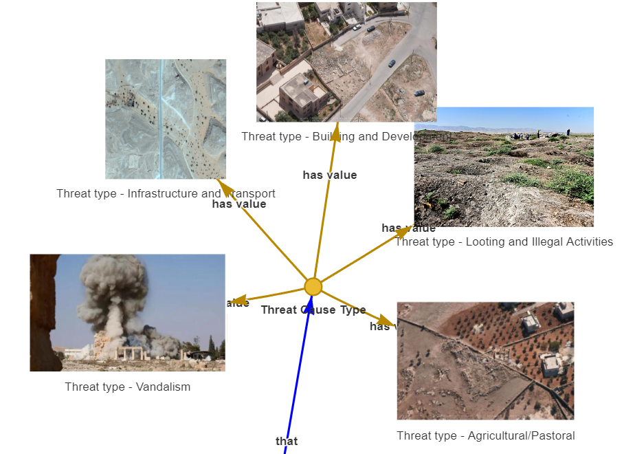
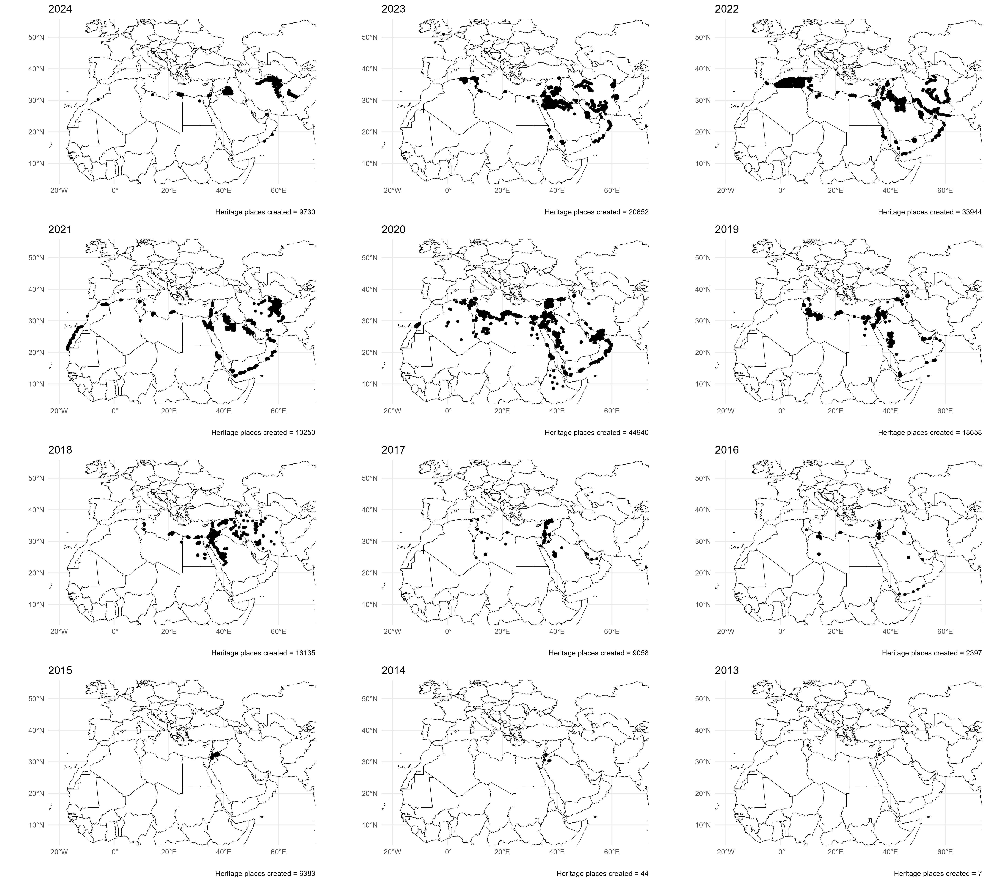

# Information systems for cultural heritage and archaeological data management. The example of the EAMENA a framework deployed on the top of Arches 
> https://github.com/eamena-project/eamena-arches-dev/blob/main/talks/2024-jcaa/paper.md

## Introduction

Archaeological objects, like a cultural heritage site, are always context-based and at the cross-road of many dimensions: spatial, temporal, typologic, etc. Such contexts are highly multi-scalar (from the site to the use-wear, passing by the "monument") and multidisciplinar (from aDNA to climate data, passing by 'chaine operatoire') but has also to deal with uncertainity, metadata (ex: bibliographic references) and paradata (ex: information of the project framework). Pooling so many heterogeneous data together in a way that this data be easily findable, navigable and editable is a complex process. 
Information system ...
The EAMENA project (Endangered Archaeology in Middle East and North Africa) has build its information system on the top of the NoSQL Arches IT stack. This paper aims to present how a work/framework around EAMENA is made available by the IT chooses by Arches and how a collaborative development enhance to reusability of the archaeological data and methods. 

## The EAMENA project background

The EAMENA project starts with the destruction of Palmyra in 2016 by ISIS. 

 

<em> Screenshot of the ERD of heritages places (detail) showing some of possible values for the field, or node 'Theart type'. On the bottom-left corner: photograph of the the destruction of the temple of Baal in Plamyra by ISIS. The complete ERD can be found here: https://colab.research.google.com/github/eamena-project/eamena-data/blob/main/reference-data/concepts/heritage_places/concepts_images_graph.ipynb</em>
 

The purpose of the project was a comprehensive mapping of the endangered inammovible cultural heritage in the Arabic speaking region, from Mauritania to Iran (extended in 2023 to Afghanistan) though remote sensing. Precisely, the objectives was to identify threats and causes of disturbances (Agricultural, Urbanist, etc.) over cultural heritage and archaeological sites in the Middle East and North Africa (MENA) region, namely Heritage Places.

**Remote sensing** through satellite imagery offers three main insights: (i) since the MENA region has almost no forest cover, a large part of the built heritage is visible on the photographs, (ii) a significant number of heritage places are located in desertic remote areas that can be hardly accessed by land, (iii) the MENA region is regularly politically shattered and some areas remains unsecure for scholars to go on the ground. 
The information provided by the project aims to be released to a general audience, to scholars, but also to inform national authorities. Data input comes from trained landscape archaeologists from our universities (Oxford, Leicester, Durham), and from our MENA colleagues. The data entry methodology is supported by a large body of training material (YouTube videos, MOOC, PDF documents) have been made publically available and thanks to the Cultural Protection Fund delivered by the British Council, numerous in-person and remote trainings have been delivered to our MENA colleagues (REF). 
The systematic remote sensing assessment, with contributions coming from XXX persons, has led to the recording of some > 200,000 heritage places.
 which some have already been published with a very different degree of agrrement with the international standards, but most of them are original heritage place that only EAMENA database gives access to. To highlight only these last years, EAMENA comprehensive surveys has led to the discovery of **354** new 'desert kites' hunting structures[^6] in northern Arabia and at least **3** roman forts in western Jordan[^7]. The latter dataset gathers heritage places distant for more than 80 km in straight line from any inhabited places. 

## IT tools

### Arches

Arches is an open-source geoweb semantic-based information purpose-built platform for cultural heritage management created by the GCI and the WMF. It is a graph database where nodes composes the table-like fields (called 'resource models' in Arches, or 'graphs') and have semamtic relation relationships, using the CIDOC-CRM by default. Arches key features are its PostGRES database, one of the top five database management system (DBMS) with an increasing popularity[^3], among the open source software (OSS), it is the closest to the Oracle the world most popular DBMS; its logics based on Python, the world-wide most used programming language[^2] and JavaScript object notation (JSON-LD, GeoJSON, Postgres JSONB type) the current standard to exchange data over the web. Arches lies also on mature technologies (Django web-application framework, Apache server among other), and comes with various built-in iso-standards (CIDOC-CRM, Dublin Core, SKOS, IIIF, EDTF, WGS84/OGC[^4]) and semantic web technologies (XML, RDF, etc.). From the version 7.3, Arches supports internationalisation (i18) and is currently located (l10n) in 10 different languages[^5]. From the version 7.5, Arches support the so-called Arches application, Python package aligned with Django standards that allow fine-tuning of possibly any kind of workflow.Arches open-source and cutting-edge IT stack offers many improvements possibilities. Among the upcoming add-ons (version 8, scheduled in Dec 2024) one can mention the Lingo Arches application allowing you to manage reference data (vocabularies, thesauries, ontologies). Arches-based platform is currently employed at the national level for managing the National Heritage List for England (Historic England) and by many University-based project. 

 

<em> The Arches software stack </em>
 

### EAMENA 

EAMENA database (currently on Arches v7.3) counts some 215,000 heritage places among other resource models (Person/Organisation, Information Resources, etc., see REF) for a total of more than 380,000 records. 

EAMENA is the oldest university-based project grounded on Arches, in comparison to sibling projects (MAHSA and MAEASaM at the University of Cambridge; CAAL at the University of London; MAPSS at the Max Planck Institute, etc.[^8]). As so, it gathered more experiences and has a leading role in working to make this projects interoperable for exemple by sharing the reference data of our projects (ontologies, data models, and thesauri in XML and JSON files) through a common GitHub organization (https://github.com/achp-project).

... 

## Design & Architecture

**EAMENA** platform is deployed on  

**Arches** ~ **EAMENA** .
**EAMENA** ~ **Arches** by providing the localisation in Arabic (`ar`), French (`fr`) and Central Kurdish (`cbk`).... The `citation generator` plugin was designed to help non-Western EAMENA contributors have a simple way to publish their research in Western peer-reviewed journals by following a path starting with data entry, Zenodo repository, LLM ~ data paper models, PCI recommendation and finally, publication of data paper and research paper.
**EAMENA**. 

## Case Study
> [kites](https://github.com/eamena-project/eamena-arches-dev/tree/main/projects/kites)

The EMANEA Search URL https://tinyurl.com/eamena-sistan [URL shortener] is the Sistan dataset published as a datapaper an hosted on Zenodo (REF). The dataset can been interoperate for example by [Python Jupyter NB](https://github.com/eamena-project/eamena-arches-dev/blob/main/talks/2024-jcaa/read_zenodo.ipynb) hosted on GitHub and displayed on Google Colab. 

As already mentioned, remote sensing assessment has been the privilegied methodology, it can lead to a lot of uncertainties on the identification of sites (That's why EAMENA use conventionaly the term of heritage place instead of site), obviously not its spatial location (where) but more for its function (what) and chronology (when). These three fondemental dimensions of a phenomena [^1] are keys to work on historical process: the graph structure of EAMENA allows the recording of multiple interpretations for the same resource at the field level. For example, a heritage place can have two different geometries (a point for its geometric centre and a polygon for its perimeter or a line for its path) or different archaeological interpretations with different levels of confidence made by two or more contributors. 
The `emenaR` package, programmed in R -- the scripting language the most used by archaeologists (REF) -- offers a series of functions to query the datastet. 
 

The EAMENA general-purposed typology can be modified to cover specifictions of HP without compromising the entire data structure. Branches / Graph.

## Sustainability

## Discussion

**Arches** In comparison to other open-source purpose-based content management systems such as Heurist and OpenAtlas, so far, Arches garners more GitHub contributions and has been also significantly more forked. Moreover, ongoing developments of Arches, such as Arches for Science (also known as DISCO), can also benefit archeosciences, including IIIF, CRMSci, etc, while Arches for HERs, due to be launched later this summer with Historic England will provide a new level of access to UK data. Arches stands then as a mature and major technology for cultural heritage management.

## Conclusion

## aclass

branch created on the CIDOC CRM v6.2

Kubernetes image

GeoServer

PeriodO

uses URL/UUID 

Jupyter NB

An Arches resource model is a structured data model designed for the Arches Platform. It encompasses the data structure (the entity-relationship model) and also includes the interface for entering data (forms) and generating reports for each resource model.4 

The database incorporates controlled vocabulary. Glossaries are rooted in resources like FISH (Forum on Information Standards in Heritage) and Getty AAT (Art and Architecture Thesaurus). These vocabularies have been adapted and expanded to align with the particular needs of the EAMENA project [22]. For example, the EAMENA ‘Heritage Place Type’ could take the value ‘Archaeological Site’, which is a direct match with the AAT term ‘Archaeological site’ (aat:300000810). Other AAT and FISH terms have been adapted but are still structured data (see: https://eamena.org/advanced-use#rm-hp-fields).

**EAMENA** ~ **Arches** Bulkupload plugin

Both the project EAMENA and the Arches software have been firstly thougth to be open. EAMENA first purpose is to gather and share cultural heriatge information about endangered sites, : it allows for example to open different windows (map layer, search bar, heritage place report, etc.) at the same time offering as many possibilties to navigate but also hinter the possibility of editing. Databases are useful for storing, sharing, etc. but are often not design in a purpose of creating new knowledge *as it* in archaeology and cultural heritage. Furthermore their management to search the data are less handy than XLSX sheet which constitute so far.

EAMENA, a framework for

SPARQL endpoint, 

LING: , integrating probably authorative data, such as the PeriodO time-space gazetteer

And we can also mention the upcoming DISCO (aka, Arches for Science) which focuses on technical art review, includes tools for annotation, material sampling, instrument data retrieval and visualization, and image and data comparison.

. More recently covers Iran and Afghanistan.

A region largely marked by large desertic remote areas but also closed borders. 
EAMENA Arches-based database, just like the entire EAMENA project has been largely founded by the Arcadia charitable fund

both  , and because of

ML EAMENA for site detection, change detection, etc.

## Footnotes

[^1]: Peuquet, D. J. (1994). It's about time: A conceptual framework for the representation of temporal dynamics in geographic information systems. Annals of the Association of american Geographers, 84(3), 441-461
[^2]: TIOBE Index (2024), URL: https://www.tiobe.com/tiobe-index/, Acceded the 01/06/2024
[^3]: DB-Engines Ranking - Trend Popularity (2024), URL: https://db-engines.com/en/ranking_trend, Acceded the 01/06/2024
[^4]: CIDOC-CRM: ISO 21127; Dublin Core: ISO 15836-1:2017; SKOS: ISO 25964; IIIF: ISO 21127:2019; EDTF: ISO 8601; WGS84: ISO 19111
[^5]: Arches GitHub, URL: https://github.com/archesproject/arches/tree/master/arches/locale, Acceded the 01/06/2024
[^6]: Fradley, M., Simi, F., & Guagnin, M. (2022). Following the herds? A new distribution of hunting kites in Southwest Asia. The Holocene, 32(11), 1160-1172. https://doi.org/10.1177/09596836221114290
[^7]: Fradley, M., Wilson, A., Finlayson, B., & Bewley, R. (2023). A lost campaign? New evidence of Roman temporary camps in northern Arabia. Antiquity, 97(393), e15. doi:10.15184/aqy.2023.50
[^8]: MAHSA:  ; MAEASaM: ; CAAL: ; MAPSS: ;