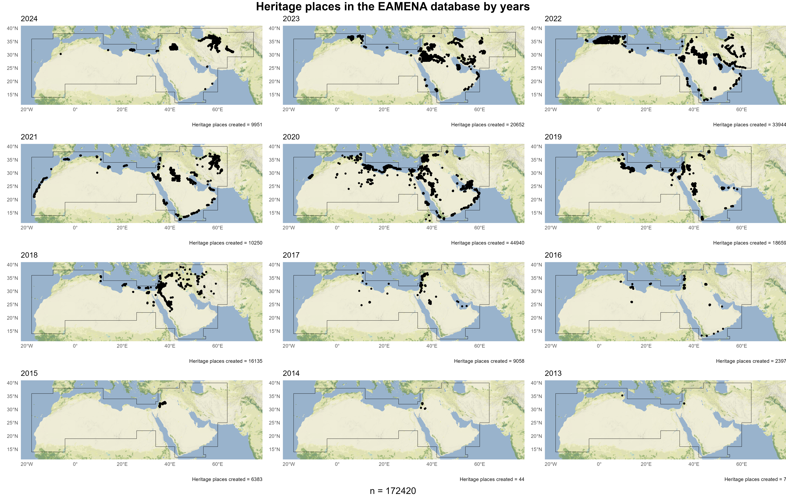

# Reusability and information systems for cultural heritage and archaeological data management. The EAMENA database built on the top of Arches.
> Building on the top of Arches. Information systems for cultural heritage and archaeological data management and the example of EAMENA  
> Information systems for cultural heritage and archaeological data management. The example of the EAMENA a framework deployed on the top of Arches 
> https://github.com/eamena-project/eamena-arches-dev/blob/main/talks/2024-jcaa/paper.md

## Introduction

 
Archaeology and cultural heritage, unlike natural sciences and mathematics, deal often with data at the cross-road of many disciplines, from rescue archaeology politicies to more scientific-based fields (aDNA, radiocarbon, etc.) passing by 'chaine operatoire' recovering, climate data, etc. Other difficulties come from the fact that archaeological objects, such as a ceramic or a cultural areas, are always context-based, highly multi-scalar, but has also to deal with uncertainity (uncomplete or missing data, fuzzy and relative chronology), metadata (ex: bibliographic references) and paradata (ex: information of the project framework) that can be, per se, subject of future historical studies (historiography).
It is now assumed that a single archaeological or cultural heritage project cannot exploit the full potential of the data it has produced during its lifespan. Pooling so many heterogeneous data together in a way that this data be easily findable, navigable and editable is a complex process. Making such data reusable is a real challenge. Making its data FAIR is therefore key. 
Information systems such as databases for being to broad (large scope, small resoultion), or too specialised (small scope, high resoultion), necessarly limit the capacity of capture the full potential of the information. 
We present here ongoing developments conducted under the EAMENA project around the IT stack Arches. Arches is one of the few state-of-art open-source software for cultural heritage management used by the EAMENA project, a documentation project on endangered archaeology in the Middle East and North Africa region, led by the University of Oxford. Our aim is to present how IT developments can enhance both the reusability of pieces of software (i.e methods), cultural and archaeological data.

> Arches is  an open-source geoweb semantic-based platform. 
> With the 3rd revolution in Archaeology [^9] as expertise of archaeologists has significantly developed with the advent of information sciences, aDNA, radiocarbon, etc., to produce serendipity. 
> Archaeological objects, such as a ceramic or a cultural areas, are always context-based and at the cross-road of many dimensions: spatial, temporal, typologic, etc. Such objects are highly multi-scalar (from the site to the use-wear, passing by the "monument") and multidisciplinar (from aDNA to climate data, passing by 'chaine operatoire') but has also to deal with uncertainity, metadata (ex: bibliographic references) and paradata (ex: information of the project framework). 
> Reusability (and sometimes reproductibility) is the ultimate goal of the FAIR policies and the main reason of the data management plan (DMP). 

## Archaeological and Cultural Heritage data

The common sense makes a difference between archaeology and the cultural heritage with a clear prevalence of the first on fondamental research, cutting edge methods (aDNA, isotops, etc.) and .... At the opposite, cultural heritage is often seen as a political usage (or misuse) of valorised archaeological and historical sites and artefacts. Whereas this distingo is real, there are no fundamental boundaries between archaeology and cultural heritage subject and even less about their data: over the time, an archaeological site can become a cultural heritage site and vice-versa. One can think of Hellenistic pilgrimage to Troya, ..., or more recently the deposit by Saddam Hussein of a brick stamped with his name in the Ur's ziggourat following a pluri-millenial tradition of rulers'. In all these cases the status of this sites (Hellenistic Troya, Contemporaneous Ur) can be interpreted as a ..
Archaeology tends to separate and study differently events, the so-called "archaeological events" (archaeological layers, node in the chaine operatoire, etc.) while cultural heritage focuses more on current use, conservation, etc. from a present-based perspective
Only in appearence archaeology focuses on multi-stratified sites, and cultural heritage on heritage places. 

In both cases these two disciplines tend to deal with palimpsestes. One might think about the 'celtic fields'. The remaining difference is that archaeology focuses more on the object itself trying to inform , and cultural heritage on the current social practices on this object. From what it follows that archaeological and cultural heritage data are fundamentaly the same and therefore should be managed in the same way. 

that is what the concept of 'heritage place', more than 'site' is made for. 


## Arches

Arches is an open-source geoweb semantic-based information purpose-built platform for cultural heritage management created by the *Getty Conservation Institute* and the *World Monument Fund*. It is a graph database where nodes composes the table-like fields (called 'resource models' in Arches, or 'graphs') and have semamtic relation relationships, using the CIDOC-CRM ontology by default. Arches is an IT stack based on mature and state-of-art technologies. Its key features are, from the back-end to the front-end: 
- a PostgreSQL database, one of the top five database management system (DBMS) with an increasing popularity[^3], among the open source software (OSS), it is the closest to the Oracle the world most popular DBMS; 
- logics based on Python, the world-wide most used programming language[^2];
- Django web-application framework to manage interactions between the server and the web browser
- data objects based on, or extending, JSON (JSON-LD, GeoJSON, Postgres JSONB type) the current standard to exchange data over the web

<br>

<em> The Arches software stack </em>
<br>

Arches also comes with various built-in iso-standards (CIDOC-CRM, Dublin Core, SKOS, IIIF, EDTF, WGS84/OGC[^4]) and semantic web technologies (XML, RDF, etc.). From the version 7.3, Arches supports internationalisation (i18) and is currently located (l10n) in 10 different languages[^5]. From the version 7.5, Arches support the so-called 'Arches application', Python packages aligned with Django standards that allow fine-tuning of possibly any kind of workflow. Among the upcoming add-ons (version 8, scheduled in Dec 2024) one can mention the Lingo Arches application allowing you to manage reference data (vocabularies, thesauries, ontologies). Arches for Science


## EAMENA 

### The project

The EAMENA project (Endangered Archaeology in Middle East and North Africa), led by the University of Oxford in partnership with the universities of Durham and Leicester and funded by Arcadia since 2015 focuses on documenting endangered archaeology and cultural heritage. 

The EAMENA project started with the destruction of Palmyra in 2016 by ISIS. 

<br>


<em> Some of possible values for the field, or node, 'Theart type' in the EAMENA's Heritage Place resource model, or graph. On the top of the images appears the 'Theart type' values (ex: 'Agricultural/Pastoral') in this case: Arches concepts. On the bottom of the images appear their UUID (ex: 767e9467-3bc2-3f71-9427-0ace387bd843). These photograph, and their location in the Entities-Relations Diagram (ERD) can be found here: https://eamena-project.github.io/eamena-arches-dev/dbs/database.eamena/data/reference_data/concepts/EAMENA-erd-concepts.html</em>
<br>


The purpose of the project was a comprehensive mapping of the endangered inammovible cultural heritage in the Arabic speaking region (Middle East and North Africa, or MENA region), from Mauritania to Iran (extended in 2023 to Afghanistan) though remote sensing. Precisely, the objectives was to identify threats and causes of disturbances (Agricultural, Urbanism, etc.) over cultural heritage and archaeological sites in the MENA region, namely Heritage Places. The information provided by the project aims to be released to a general audience, to scholars, but also to inform national authorities[^17]. 

<br>



<em> Georgahical scope of the EAMENA project, from Mauritania to Afghanistan (since xxx) with the number of heritage places created by years. EAMENA database (currently on Arches v7.3) counts some 215,000 heritage places among other resource models (Person/Organisation, Information Resources, etc., see REF) for a total of more than 380,000 records.</em>
<br>

EAMENA focuses on the built heritage. And even if the project started because of the destruction of an iconic 'monument', the Bel Temple of Palmyra, the scope of the project encompasses any possible pre-WII human-made structures. 

Condisering the very large geographical scope of the project, assessing threats over cultural heritage through remote sensing has been the privilegied method. Remote sensing through offers three main insights: (i) since the MENA region has almost no forest cover, a large part of the built heritage is visible on the aerial and satellite photographs, (ii) a significant number of heritage places are located in desertic remote areas that can be hardly accessed by land, (iii) the MENA region is regularly politically shattered and some areas remains unsecure for scholars to go on the ground. Platform like Google Earth offers free access to satellite imagery that can be completed by other image sets such as Sentinel, SPOT, Landsat, etc. or even historical aerial photographs[^16]. 

Remote sensing is a key tool of landscape archaeology, a word that seems to be coined for archaeological site such as Stonehenge and its surrondings (Tilley). Pedestrian and later aerial surveys have created the notion of palimpseste, already existing at the end of the 19th c. [^18].  

The downsides of the remote sensing assessment are obvious, when documenting an heritage place its spatial information is certain (i.e. its location) while its temporal and typological dimensions are very much uncertain, even with a trained eye. To overcome this issue the database graph structure allows the recording of multiple interpretations for the same resource (here, 'heritage place'). In that way, a single heritage place can have two or more different assumptions on its function and dating with in both cases different levels of confidence made by two or more contributors.
The information recorded in EAMENA has an important degree of reliability since it is quite hard to maintain a minimum standardisation when the database recieved contribution from more than 200 contributors and this despite a mature data entry methodology with statement on a minimal data standards [^11] supported by a large body of training material (YouTube videos, MOOC[^14], digital documentation[^15]), numerous in-person and remote trainings have been delivered to our MENA colleagues. This is why the EAMENA team is building IT tools to sample EAMENA sub-dataset carefully selected for being consistent with research question of cultural heritage management objective.


The systematic remote sensing assessment, with contributions coming from more than 200 contributors, has led to the recording of some > 200,000 heritage places. Behind this figure we find very different types of record quality, some heritage places already published sometimes ith a very different degree of agrrement with the international standards, but most of them are original heritage place that only EAMENA database gives access to. To highlight only these last years, EAMENA comprehensive surveys has led to the discovery of **354** new 'desert kites' hunting structures[^6] in northern Arabia and at least **3** roman forts in western Jordan[^7]. The latter dataset gathers heritage places distant for more than 80 km in straight line from any inhabited places. 

## IT

 Its reference data, resource models and vocabularies, have been made public on the EAMENA GitHub in a form of an Arches package[^10]. As mentioned the EAMENA platform doesn't behave like a GIS that will allow any one to create a publishable map from a simple or advanced query. That is why, alonside with the development of the database, we created tools in the form of computer script to curate its data: preferentially with Python for the backend (data management) and R for a frontend (data anlysis). We can illustrate this workflow on how integrating IT develepment with the EAMENA database, from data management to data analysis, works by focusing on the so-called 'Sistan dataset' recently published[^11].

### Sistan dataset

'Sistan dataset' dataset was exported from the database to the 'eamena' Zenodo community using the `citation generator` plugin currently hosted in a Jupyter Notebook[^12]. 

<br>

<em> Arches offers an API The UUID/URL structure of GeoJSON URL that can easily be retrieve with Python </em>
<br>

Python scripting has been mainly maintained in Jupyter Notebooks for development purpose, hosted on the project GitHUb and mirrored on Google Colab. 

The `emenaR` package, programmed in R -- the scripting language the most used by archaeologists (REF) -- offers a series of functions to query the datastet. The Sistan GeoJSON file can be retrieved and analysed with `emenaR` package, for example with the `geojson_map()` function

```R
# creates one map for each Damage Extent Type value
map.name <- "sistan_zenodo"
all.g <- geojson_map(map.name = map.name,
                     field.names = c("Damage Extent Type"),
                     geojson.path = "https://doi.org/10.5281/zenodo.10375902",
                     max.maps = 6,
                     hp.color = "black",
                     hp.color.bck = "grey",
                     hp.size = 1.5)
# and export as a PNG file
margin <- ggplot2::theme(plot.margin = ggplot2::unit(c(0.2, 0.2, 0.2, 0.2), "cm"))
ggplot2::ggsave(file = paste0("path/to/folder/", map.name, ".png"),
                gridExtra::arrangeGrob(
                  top = grid::textGrob("Damage Extent Type", gp = grid::gpar(fontsize = 14)),
                  grobs = lapply(all.g, "+", margin), ncol = 3),
                width = 18,
                height = 12)
```

<br>

<em> Damage Extent Type extents using the 'Sistan dataset' hosted on Zenodo using the eamenaR function geojson_map() </em>
<br>


As mentioned databases controled vocabularies are necessarly limited to a certain number of values which constitute a pragmatic option. When specialist want to go deeper in the specification of the objects they are assessing, they have to extend the descriptive vocabulary to capture the specificities of their studied object. Arches offers this option, based on graphs, where a 'branch' can be added to capture the specificity. For example, condisering the new desert kites discovered, the author specifies various types of kites[^6]. 

<br>

<em> Extension of the EAMENA Heritage Place resource model, or graph, with a new 'branch' to capture the different types of desert kites. The photographs represent possible values and are not part of the resource model but controled values (drop-down menus).</em>
<br>

The 'branch' created has the same structure as the Heritage Place resource model[^13]. As such Arches resource models can be seen as an aggregation of branches that can be also shared between different projects


## Reusability


EAMENA is the oldest university-based project grounded on Arches, in comparison to sibling projects (MAHSA and MAEASaM at the University of Cambridge; CAAL at the University of London; MAPSS at the Max Planck Institute, etc.[^8]). As so, it gathered more experiences and has a leading role in working to make this projects interoperable for exemple by sharing the reference data of our projects (ontologies, data models, and thesauri in XML and JSON files) through a common GitHub organization (https://github.com/achp-project). EAMENA will be also one of the first Arches-based project to be warped-up with an expected end of its funding  by 2027. EAMENA is the oldest university-based project grounded on Arches, this situation leads directly to face the sustainability of the database over the long term.

### Western routes for Middle Eastern data


## Design & Architecture

**EAMENA** platform is deployed on  


**Arches** ~ **EAMENA** .
**EAMENA** ~ **Arches** by providing the and .... The `citation generator` plugin was designed to help non-Western EAMENA contributors have a simple way to publish their research in Western peer-reviewed journals by following a path starting with data entry, Zenodo repository, LLM ~ data paper models, PCI recommendation and finally, publication of data paper and research paper.
**EAMENA**. 

## Case Study
> [kites](https://github.com/eamena-project/eamena-arches-dev/tree/main/projects/kites)

The EMANEA Search URL https://tinyurl.com/eamena-sistan [URL shortener] is the Sistan dataset published as a datapaper an hosted on Zenodo (REF). The dataset can been interoperate for example by [Python Jupyter NB](https://github.com/eamena-project/eamena-arches-dev/blob/main/talks/2024-jcaa/read_zenodo.ipynb) hosted on GitHub and displayed on Google Colab. 


 These  are keys to work on historical process: the graph structure of EAMENA allows the recording of multiple interpretations for the same resource at the field level. For example, a heritage place can have two different geometries (a point for its geometric centre and a polygon for its perimeter or a line for its path) or different archaeological interpretations with different levels of confidence made by two or more contributors. 

 Arches-based platform is currently employed at the national level for managing the National Heritage List for England (Historic England) and by many University-based project. 

The EAMENA general-purposed typology can be modified to cover specifictions of HP without compromising the entire data structure. Branches / Graph.

## Sustainability


## Discussion

**Arches** In comparison to other open-source purpose-based content management systems such as Heurist and OpenAtlas, so far, Arches garners more GitHub contributions and has been also significantly more forked. Moreover, ongoing developments of Arches, such as Arches for Science (also known as DISCO), can also benefit archeosciences, including IIIF, CRMSci, etc, while Arches for HERs, due to be launched later this summer with Historic England will provide a new level of access to UK data. Arches stands then as a mature and major technology for cultural heritage management.


## Conclusion


## Acknoledgement

Arcadia
available and thanks to the Cultural Protection Fund delivered by the British Council

## aclass

Open access DB

branch created on the CIDOC CRM v6.2

Kubernetes image

GeoServer

PeriodO

uses URL/UUID 

Jupyter NB

An Arches resource model is a structured data model designed for the Arches Platform. It encompasses the data structure (the entity-relationship model) and also includes the interface for entering data (forms) and generating reports for each resource model.4 

The database incorporates controlled vocabulary. Glossaries are rooted in resources like FISH (Forum on Information Standards in Heritage) and Getty AAT (Art and Architecture Thesaurus). These vocabularies have been adapted and expanded to align with the particular needs of the EAMENA project [22]. For example, the EAMENA ‘Heritage Place Type’ could take the value ‘Archaeological Site’, which is a direct match with the AAT term ‘Archaeological site’ (aat:300000810). Other AAT and FISH terms have been adapted but are still structured data (see: https://eamena.org/advanced-use#rm-hp-fields).

**EAMENA** ~ **Arches** Bulkupload plugin

Both the project EAMENA and the Arches software have been firstly thougth to be open. EAMENA first purpose is to gather and share cultural heriatge information about endangered sites, : it allows for example to open different windows (map layer, search bar, heritage place report, etc.) at the same time offering as many possibilties to navigate but also hinter the possibility of editing. Databases are useful for storing, sharing, etc. but are often not design in a purpose of creating new knowledge *as it* in archaeology and cultural heritage. Furthermore their management to search the data are less handy than XLSX sheet which constitute so far.

EAMENA, a framework for

SPARQL endpoint, 

LING: , integrating probably authorative data, such as the PeriodO time-space gazetteer

APAAME archive

And we can also mention the upcoming DISCO (aka, Arches for Science) which focuses on technical art review, includes tools for annotation, material sampling, instrument data retrieval and visualization, and image and data comparison.

. More recently covers Iran and Afghanistan.

A region largely marked by large desertic remote areas but also closed borders. 
EAMENA Arches-based database, just like the entire EAMENA project has been largely founded by the Arcadia charitable fund

both  , and because of

ML EAMENA for site detection, change detection, etc.

to mention only the three fondemental dimensions of a phenomena (whe) [^1]

EAMENA contribution to Arches (https://github.com/archesproject/arches) are mainly the localisation of Django messages in Arabic (`ar`) and French (`fr`) with an upcoming Central Kurdish (`cbk`)


## Footnotes

[^1]: Peuquet, D. J. (1994). It's about time: A conceptual framework for the representation of temporal dynamics in geographic information systems. Annals of the Association of american Geographers, 84(3), 441-461  
[^2]: TIOBE Index (2024), URL: https://www.tiobe.com/tiobe-index/, Acceded the 01/06/2024  
[^3]: DB-Engines Ranking - Trend Popularity (2024), URL: https://db-engines.com/en/ranking_trend, Acceded the 01/06/2024
[^4]: CIDOC-CRM: ISO 21127; Dublin Core: ISO 15836-1:2017; SKOS: ISO 25964; IIIF: ISO 21127:2019; EDTF: ISO 8601; WGS84: ISO 19111  
[^5]: Arches GitHub, URL: https://github.com/archesproject/arches/tree/master/arches/locale, Acceded the 01/06/2024  
[^6]: Fradley, M., Simi, F., & Guagnin, M. (2022). Following the herds? A new distribution of hunting kites in Southwest Asia. The Holocene, 32(11), 1160-1172. https://doi.org/10.1177/09596836221114290  
[^7]: Fradley, M., Wilson, A., Finlayson, B., & Bewley, R. (2023). A lost campaign? New evidence of Roman temporary camps in northern Arabia. Antiquity, 97(393), e15. doi:10.15184/aqy.2023.50  
[^8]: MAHSA:  ; MAEASaM: ; CAAL: ; MAPSS: ;  
[^9]: Kristiansen, K. (2014). Towards a new paradigm? The third science revolution and its possible consequences in archaeology. Current Swedish Archaeology, 22(1), 11-34.  
[^10]: EAMENA Arches package, URL: https://github.com/eamena-project/eamena, Acceded the 01/06/2024. An Arches "package" is an external container for database definitions (graphs, concept schemes), custom extensions (including functions, widgets, datatypes) and even data (resources). Packages are installed into projects, and can be used to share schema between installations (see the Arches documentation, https://arches.readthedocs.io/en/stable/installing/installation/#load-a-package, Acceded the 01/06/2024)  
[^11]: Rouhani, B., Huet, T. (2024). Historical Landscape of Sistan in Iran and Afghanistan: EAMENA Dataset for Assessing Environmental Impact on Cultural Heritage. Journal of Open Archaeology Data, 12(), 3. https://doi.org/10.5334/joad.123  
[^12]: https://github.com/eamena-project/eamena-arches-dev/blob/main/dbs/database.eamena/citation/citation_generator.ipynb, Acceded the 01/06/2024.  
[^13]: https://github.com/eamena-project/eamena-arches-dev/blob/main/dbs/ea.train/data/reference_data/rm/hp/Sub-typology-branch.json, Acceded the 01/06/2024. See also the Jupyter Notebook illustrating the workflow: https://github.com/eamena-project/eamena-arches-dev/blob/main/dbs/ea.train/data/reference_data/rm/hp/erd-branch/EAtrain_erd_branch.ipynb, Acceded the 01/06/2024.  
[^14]: MOOC 1: https://eamena.org/mooc-1-endangered-archaeology-using-remote-sensing-to-protect-cultural-heritage and MOOC 2: https://eamena.org/mooc2-advanced-archaeological-remote-sensing-site-prospection-landscape-archaeology-and-heritage-pro, Acceded the 01/06/2024.   
[^15]: https://eamena.org/cpf-training, Acceded the 01/06/2024.
[^16]: Fradley, M. (2021). British inter-war aerial photogrammetric mapping in the MENA region: archives, access and research potential. Levant, 53(3), 336-346.  
[^17]: Fradley, M., & Gyngell, S. (2022). Landscapes of Mobility and Movement in North-West Arabia: A Remote Sensing Study of the Neom Impact Zone. Land, 11(11), 1941.  
[^18]: Maitland (1850-1906) dans Domesday Book and Beyond : Three Essays in the Early History of England (1897)  
