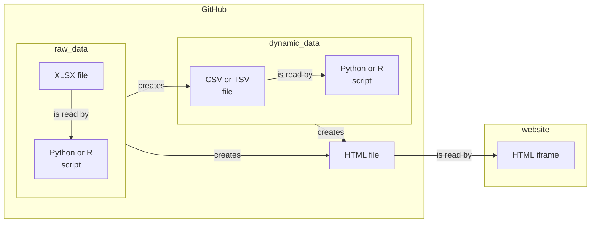
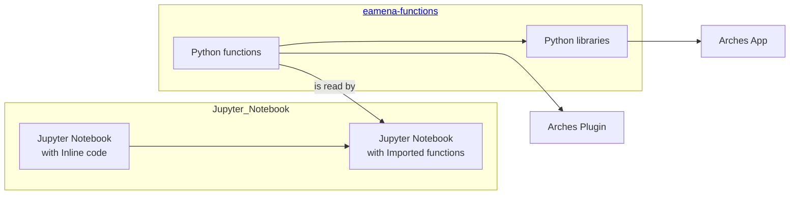

# DB Handover
> Thomas and Salah, 24/03/25 to 25/03/25, School of Archaeology, Oxford

## GitHub

* use the GH search engine
* use mermaid for [flowchart diagrams](https://mermaid.js.org/syntax/flowchart.html)

| GitHub repository | description |
|----------------|-------------|
| [eamena-arches-dev](https://github.com/eamena-project/eamena-arches-dev)    | development repository (**general purpose**) |
| [eamena-functions](https://github.com/eamena-project/eamena-functions)    | data management functions (Python) |
| [eamena-data](https://github.com/eamena-project/eamena-data)   | reference data (ex: concepts), working data, etc. |
| [eamenaR](https://github.com/eamena-project/eamenaR)   |  R package for front-end statistical analysis |
| [eamena](https://github.com/eamena-project/eamena)   |  EAMENA/Arches package to install an Arches/EAMENA-like instance |
| [EAMENA-MachineLearning-ACD](https://github.com/eamena-project/EAMENA-MachineLearning-ACD)  |  ML Automatic Change Detection (Leicester team) |
| [eamena-gee](https://github.com/eamena-project/eamena-gee)  |  development repository for GEE, AI/ML, etc. |
| ...  |  ... |
| [arches](https://github.com/eamena-project/arches)  |  fork of https://github.com/archesproject/arches for PR |

## Data management

### Reference data

Follow this workflow for reference data

### Back-end programming

