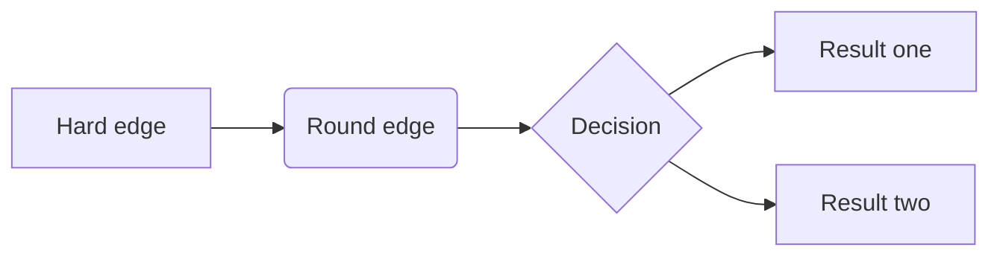
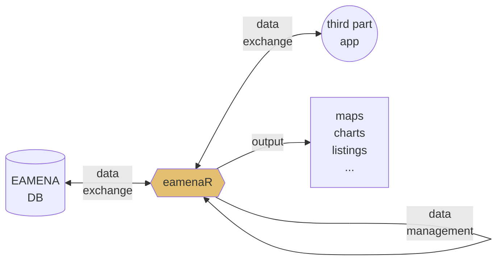
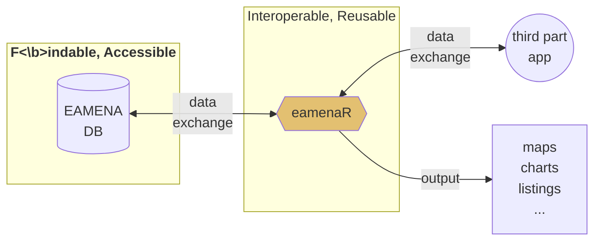

```mermaid
flowchart LR
  A[Hard edge] --> B(Round edge)
  B --> C{Decision}
  C --> D[Result one]
  C --> E[Result two]
```

```mermaid
flowchart LR
    A[(EAMENA<br>DB)] <--data<br>exchange--> B{{"eamenaR"}}:::eamenaRpkg;
    B --data<br>management--> B;
    B <--data<br>exchange--> C((third part<br>app));
    B --"output"--> D[maps<br>charts<br>listings<br>...];
    classDef eamenaRpkg fill:#e3c071;
```

```mermaid
flowchart LR
    subgraph ide1 [ <b>F<\b>indable, Accessible ]
    A[(EAMENA<br>DB)];
    end
    A[(EAMENA<br>DB)] <--data<br>exchange--> B{{"eamenaR"}}:::eamenaRpkg;
    subgraph ide2 [ Interoperable, Reusable ]
    B;
    end
    B <--data<br>exchange--> C((third part<br>app));
    B --"output"--> D[maps<br>charts<br>listings<br>...];
    classDef eamenaRpkg fill:#e3c071;
```