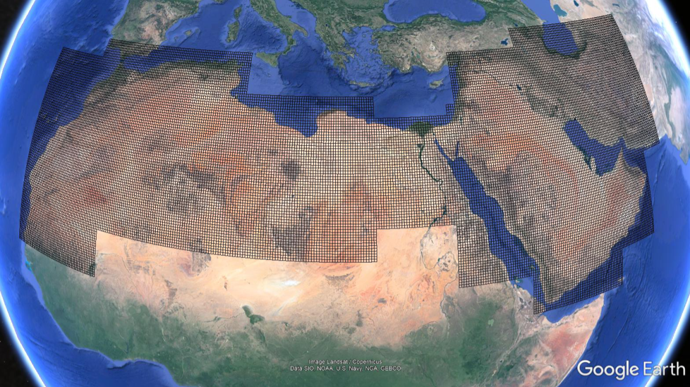

# Grids

  
   
    <em>EAMENA grids</em> <https://database.eamena.org/>

## Palestine

|num | grid id | geojson | kml |
|---|---------|---------|-----|
| 0 | all     |  [here](https://github.com/eamena-project/eamena-arches-dev/blob/main/training/2023/grids/palestine/all.geojson) |     |
| p1 | E34N31-24 |  [here](https://github.com/eamena-project/eamena-arches-dev/blob/main/training/2023/grids/palestine/E34N31-24.geojson) | [here](https://github.com/eamena-project/eamena-arches-dev/blob/main/training/2023/grids/palestine/E34N31-24.kml)  |
| p2 | E35N31-13 |  [here](https://github.com/eamena-project/eamena-arches-dev/blob/main/training/2023/grids/palestine/E35N31-13.geojson) | [here](https://github.com/eamena-project/eamena-arches-dev/blob/main/training/2023/grids/palestine/E35N31-13.kml)  |
| p3 | E35N31-31 |  [here](https://github.com/eamena-project/eamena-arches-dev/blob/main/training/2023/grids/palestine/E35N31-31.geojson) | [here](https://github.com/eamena-project/eamena-arches-dev/blob/main/training/2023/grids/palestine/E35N31-31.kml)  |
| p4 | E35N31-32 |  [here](https://github.com/eamena-project/eamena-arches-dev/blob/main/training/2023/grids/palestine/E35N31-32.geojson) | [here](https://github.com/eamena-project/eamena-arches-dev/blob/main/training/2023/grids/palestine/E35N31-32.kml)  |
| p5 | E35N31-33 |  [here](https://github.com/eamena-project/eamena-arches-dev/blob/main/training/2023/grids/palestine/E35N31-33.geojson) | [here](https://github.com/eamena-project/eamena-arches-dev/blob/main/training/2023/grids/palestine/E35N31-33.kml)  |
| p6 | E35N31-34 |  [here](https://github.com/eamena-project/eamena-arches-dev/blob/main/training/2023/grids/palestine/E35N31-34.geojson) | [here](https://github.com/eamena-project/eamena-arches-dev/blob/main/training/2023/grids/palestine/E35N31-34.kml)  |
| p7 | E35N32-11 |  [here](https://github.com/eamena-project/eamena-arches-dev/blob/main/training/2023/grids/palestine/E35N32-11.geojson) | [here](https://github.com/eamena-project/eamena-arches-dev/blob/main/training/2023/grids/palestine/E35N32-11.kml)  |
| p8 | E35N32-12 |  [here](https://github.com/eamena-project/eamena-arches-dev/blob/main/training/2023/grids/palestine/E35N32-12.geojson) | [here](https://github.com/eamena-project/eamena-arches-dev/blob/main/training/2023/grids/palestine/E35N32-12.kml)  |
| p9 | E35N32-13 |  [here](https://github.com/eamena-project/eamena-arches-dev/blob/main/training/2023/grids/palestine/E35N32-13.geojson) | [here](https://github.com/eamena-project/eamena-arches-dev/blob/main/training/2023/grids/palestine/E35N32-13.kml)  |
| p10 | E35N32-14 |  [here](https://github.com/eamena-project/eamena-arches-dev/blob/main/training/2023/grids/palestine/E35N32-14.geojson) | [here](https://github.com/eamena-project/eamena-arches-dev/blob/main/training/2023/grids/palestine/E35N32-14.kml)  |

EAMENA Search URL: https://database.eamena.org/search?paging-filter=1&tiles=true&format=tilecsv&reportlink=false&precision=6&total=11&language=*&advanced-search=%5B%7B%22op%22%3A%22and%22%2C%22b3628db0-742d-11ea-b4d0-02e7594ce0a0%22%3A%7B%22op%22%3A%22%22%2C%22lang%22%3A%22en%22%2C%22val%22%3A%22E34N31-24%22%7D%7D%2C%7B%22op%22%3A%22or%22%2C%22b3628db0-742d-11ea-b4d0-02e7594ce0a0%22%3A%7B%22op%22%3A%22%22%2C%22lang%22%3A%22en%22%2C%22val%22%3A%22E35N31-13%22%7D%7D%2C%7B%22op%22%3A%22or%22%2C%22b3628db0-742d-11ea-b4d0-02e7594ce0a0%22%3A%7B%22op%22%3A%22%22%2C%22lang%22%3A%22en%22%2C%22val%22%3A%22E35N31-31%22%7D%7D%2C%7B%22op%22%3A%22and%22%2C%22b3628db0-742d-11ea-b4d0-02e7594ce0a0%22%3A%7B%22op%22%3A%22%22%2C%22lang%22%3A%22en%22%2C%22val%22%3A%22E35N31-32%22%7D%7D%2C%7B%22op%22%3A%22or%22%2C%22b3628db0-742d-11ea-b4d0-02e7594ce0a0%22%3A%7B%22op%22%3A%22%22%2C%22lang%22%3A%22en%22%2C%22val%22%3A%22E35N31-33%22%7D%7D%2C%7B%22op%22%3A%22or%22%2C%22b3628db0-742d-11ea-b4d0-02e7594ce0a0%22%3A%7B%22op%22%3A%22%22%2C%22lang%22%3A%22en%22%2C%22val%22%3A%22E35N31-34%22%7D%7D%2C%7B%22op%22%3A%22or%22%2C%22b3628db0-742d-11ea-b4d0-02e7594ce0a0%22%3A%7B%22op%22%3A%22%22%2C%22lang%22%3A%22en%22%2C%22val%22%3A%22E35N32-11%22%7D%7D%2C%7B%22op%22%3A%22or%22%2C%22b3628db0-742d-11ea-b4d0-02e7594ce0a0%22%3A%7B%22op%22%3A%22%22%2C%22lang%22%3A%22en%22%2C%22val%22%3A%22E35N32-12%22%7D%7D%2C%7B%22op%22%3A%22or%22%2C%22b3628db0-742d-11ea-b4d0-02e7594ce0a0%22%3A%7B%22op%22%3A%22%22%2C%22lang%22%3A%22en%22%2C%22val%22%3A%22E35N32-13%22%7D%7D%2C%7B%22op%22%3A%22or%22%2C%22b3628db0-742d-11ea-b4d0-02e7594ce0a0%22%3A%7B%22op%22%3A%22%22%2C%22lang%22%3A%22en%22%2C%22val%22%3A%22E35N32-14%22%7D%7D%5D&resource-type-filter=%5B%7B%22graphid%22%3A%2277d18973-7428-11ea-b4d0-02e7594ce0a0%22%2C%22name%22%3A%22Grid%20Square%22%2C%22inverted%22%3Afalse%7D%5D
## Jordan

|num | grid id | geojson | kml |
|---|---------|---------|-----|
| 0 | all     |  [here](https://github.com/eamena-project/eamena-arches-dev/blob/main/training/2023/grids/jordan/all.geojson) |     |
| j1 | E35N29-24 |  [here](https://github.com/eamena-project/eamena-arches-dev/blob/main/training/2023/grids/jordan/E35N29-24.geojson) | [here](https://github.com/eamena-project/eamena-arches-dev/blob/main/training/2023/grids/jordan/E35N29-24.kml)  |
| j2 | E35N29-41 |  [here](https://github.com/eamena-project/eamena-arches-dev/blob/main/training/2023/grids/jordan/E35N29-41.geojson) | [here](https://github.com/eamena-project/eamena-arches-dev/blob/main/training/2023/grids/jordan/E35N29-41.kml)  |
| j3 | E35N29-42 |  [here](https://github.com/eamena-project/eamena-arches-dev/blob/main/training/2023/grids/jordan/E35N29-42.geojson) | [here](https://github.com/eamena-project/eamena-arches-dev/blob/main/training/2023/grids/jordan/E35N29-42.kml)  |
| j4 | E35N29-43 |  [here](https://github.com/eamena-project/eamena-arches-dev/blob/main/training/2023/grids/jordan/E35N29-43.geojson) | [here](https://github.com/eamena-project/eamena-arches-dev/blob/main/training/2023/grids/jordan/E35N29-43.kml)  |
| j5 | E35N29-44 |  [here](https://github.com/eamena-project/eamena-arches-dev/blob/main/training/2023/grids/jordan/E35N29-44.geojson) | [here](https://github.com/eamena-project/eamena-arches-dev/blob/main/training/2023/grids/jordan/E35N29-44.kml)  |
| j6 | E35N30-21 |  [here](https://github.com/eamena-project/eamena-arches-dev/blob/main/training/2023/grids/jordan/E35N30-21.geojson) | [here](https://github.com/eamena-project/eamena-arches-dev/blob/main/training/2023/grids/jordan/E35N30-21.kml)  |
| j7 | E35N30-22 |  [here](https://github.com/eamena-project/eamena-arches-dev/blob/main/training/2023/grids/jordan/E35N30-22.geojson) | [here](https://github.com/eamena-project/eamena-arches-dev/blob/main/training/2023/grids/jordan/E35N30-22.kml)  |
| j8 | E35N30-24 |  [here](https://github.com/eamena-project/eamena-arches-dev/blob/main/training/2023/grids/jordan/E35N30-24.geojson) | [here](https://github.com/eamena-project/eamena-arches-dev/blob/main/training/2023/grids/jordan/E35N30-24.kml)  |
| j9 | E36N30-11 |  [here](https://github.com/eamena-project/eamena-arches-dev/blob/main/training/2023/grids/jordan/E36N30-11.geojson) | [here](https://github.com/eamena-project/eamena-arches-dev/blob/main/training/2023/grids/jordan/E36N30-11.kml)  |
| j10 | E36N30-13 |  [here](https://github.com/eamena-project/eamena-arches-dev/blob/main/training/2023/grids/jordan/E36N30-13.geojson) | [here](https://github.com/eamena-project/eamena-arches-dev/blob/main/training/2023/grids/jordan/E36N30-13.kml)  |