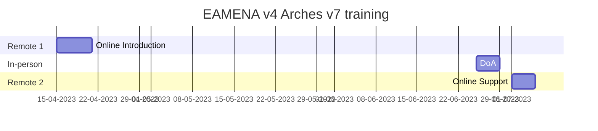
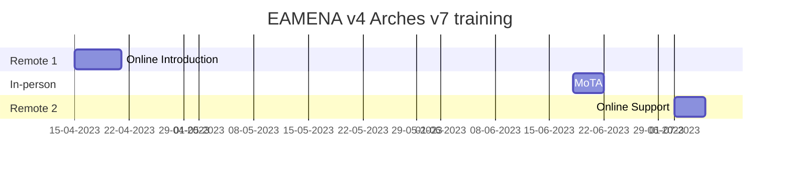

# Arches/EAMENA Trainings

---

# 2022 
> Arches/EAMENA Database Manager CPF Training (part 2/2)

This is the second part of Database Management training for Arches-powered platform, EAMENA compliant, for cultural heritage management. The previous part (part 1) took place in person, in Amman, Jordan (5/12/21 - 9/12/21). This part focuses on database management of three Arches/EAMENA instances hosted on AWS. The provisional timetable consists of 3 different slots of 3-hours each:

  1. Slot 1: Documentation and customization of the project

  2. Slot 2: Arches Management tools

  3. Slot 3: Installing the project on a server

---
## Timetable

This online training will be hosted online (ZOOM): "Arches/EAMENA Database Manager Zoom Meeting part 2"  
  
* ~~Monday 14 February, 8:00 - 11:00 (BCT) / 10:00 - 13:00 (EET)~~
  - ~~https://zoom.us/j/94050549401?pwd=VTgraWRRRGRlNkhBMXRXdWdPVHVWQT09~~  

* ~~Tuesday 15 February, 8:00 - 11:00 (BCT) / 10:00 - 13:00 (EET)~~
  - ~~https://zoom.us/j/91691114706?pwd=NTh6YlBENFVSalVCTG5IN3FtanpGQT09~~  

* ~~Wednesday 16 February, 8:00 - 11:00 (BCT) / 10:00 - 13:00 (EET)~~
  - ~~https://zoom.us/j/96809107674?pwd=d2llQXhnMDgwN2dpa2tLczZSL3VlZz09~~  

---

## Documentation

### Part 2/2

* Requirements installation tuto: 
  - https://docs.google.com/presentation/d/1qkF8w4J4BCjR_LEzWJ9Pn2lvQXO7zpW8A5MVF6obPSw/edit?usp=sharing
    + SSH clients for terminal commands and file transfer: [PuTTY](https://www.putty.org/) and [FileZilla](https://filezilla-project.org/)
    + IDE for code edition: [Microsoft VS Code](https://code.visualstudio.com/), *or* Sublime, *or* Notepad++, etc.  
    + (opt) Create a [GitHub](https://github.com/join) account for co-development between your institution and the EAMENA team

* Part 2 slides:
  - https://docs.google.com/presentation/d/1Si44scv7N9XxaGBCKYyRMorDnrj6gc362ZHQ-622cfM/edit?usp=sharing
 
* GitHub: https://github.com/eamena-project
  - training material: https://github.com/eamena-project/eamena-arches-dev/tree/main/training
    + IT reference commands: https://github.com/eamena-project/eamena-arches-dev/blob/main/training/commands.md ~~https://github.com/eamena-project/eamena-arches-dev/blob/main/training/commands.sh~~
    + Issue threads:
      + Jordan: https://github.com/eamena-project/eamena-arches-dev/issues/2
      + Lebanon: https://github.com/eamena-project/eamena-arches-dev/issues/3
      + Palestine: https://github.com/eamena-project/eamena-arches-dev/issues/4
      
  - Arches/EAMENA package: https://github.com/eamena-project/eamena-arches-package

### Part 1/2

* Part 1 slides:
  - day 1: https://docs.google.com/presentation/d/1k9JMuj5oSZXHO3Z9RSVMogn4CUSJ1EK8Plus8sK7xDo/edit#slide=id.p
  - day 2: https://docs.google.com/presentation/d/1zsqCzLDIotaShU9OUXg4tMWfaTrMF5fF5bZoLuhavKs/edit#slide=id.p
  - day 3: https://docs.google.com/presentation/d/16wjDpFGCn20tQcDdjrchhp9ZJiJvJsL6dKlF_rH-QjI/edit#slide=id.p
  - day 4: https://docs.google.com/presentation/d/1ki9Uefiop3SG3qOrLHUYrjzTekoaLXK5Iy2bMiFR0kM/edit#slide=id.p
  - day 5: https://docs.google.com/presentation/d/1G_2cqayQZDrL68W9Fcs1UIKRaSBW1k8YhnkKAysJ-zM/edit#slide=id.p

* Part 1 reference glossary:
  - https://docs.google.com/spreadsheets/d/13JwjiHjx6pqlSjRYxPc0yW0Rj3voGDJVqTe23j2kO3g/edit#gid=0

### Arches full stack

* project: https://www.archesproject.org/
* demo (v5): http://v5demo.archesproject.org/search?paging-filter=1
* documentation: https://arches.readthedocs.io/en/stable/
  - documentation 5.2: https://arches.readthedocs.io/en/5.1/
* forum: https://community.archesproject.org/
* GitHub: https://github.com/archesproject/arches
* development: https://www.archesproject.org/development/

### Main Arches dependencies

* Django: https://www.djangoproject.com/
* Python: https://www.python.org/
  - online Python compiler editor: 
    + Chrome: https://chrome.google.com/webstore/detail/python-compiler-editor/cbobmdabfjfogbodncgennjhpcmdlfin
    + other browsers: https://www.programiz.com/python-programming/online-compiler/
* PostgreSQL: https://www.postgresql.org/
  - pgAdmin4: https://www.pgadmin.org/
* ElasticSearch: https://www.elastic.co/

---

# 2023

Training on online & support on the Arches v7 (EAMENA v4) database for users, database managers and sys admin from the DoA and MoTA. The following table shows which part of the training the users, database managers and sys admin are expected to attend.

|   | user  | database manager  | sys admin  |
|---|---|---|---|
| Remote 1  |   |   | x |
| In-person  | x | x | x |
| Support |   |   | x |

Time table of the trainings and online support

## 2023 DoA
> Jordan

## 2023 MoTA
> Palestine

## Training content

### Remote 1
> Online training for sys admins prepared by Reuben Osborne and Thomas Huet

#### Introduction by Thomas Huet

* What is Arches?
* What problem does it solve?
#### Training by Reuben Osborne

Understanding the purpose, architecture and software stack of Arches
* Key features and use cases
* Software architecture diagram
* Core concepts:
    - Resource models and Branches
    - Cidoc CRM and ontologies
    - Concepts
    - Collections

How to install Arches on a Linux OS
* Pip install
* Git clone install
* Install script for deps
* Requirements file
* Docker and docker-compose
* Creating a project
* Serving to the internet, Apache, WSGI

File/Folder hierachical system

Understand project and packages
* What is a project?
* What is a package?
* Why are packages useful in Arches?
* Layout of a package

Understand the CLI reference
* Restarting Apache
* Runserver
* Collectstatic
* Load package
* Load data
* Looking at different logs
* Indexing ES

Debug
* Debug SSH connection
* Understand the `DEBUG = True` in settings.py
* Uses cases of a browser inspector

Backups
* Dumping db
* Scheduling cronjob db dump
* Creating packages
* AWS snapshot
* Other options

Usage of online and collaborative resources
* Docs
* Community Forum
* GitHub
* Popular Django forums
### In-person
> Training for users, database managers and sys admins

*to be updated*

### Online support
> Online support for sys admins

The EAMENA offers 10 days of support, lead by Reuben Osborne and Thomas Huet, on-demand (re-schedulables)

