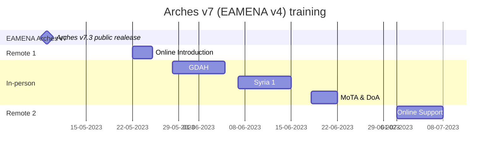
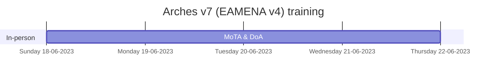

# Arches/EAMENA Trainings

by year:

* [2022](https://github.com/eamena-project/eamena-arches-dev/tree/main/training#2022)
* [2023](https://github.com/eamena-project/eamena-arches-dev/tree/main/training#2023)

---

# 2022 
> Arches/EAMENA Database Manager CPF Training (part 2/2)

This is the second part of Database Management training for Arches-powered platform, EAMENA compliant, for cultural heritage management. The previous part (part 1) took place in person, in Amman, Jordan (5/12/21 - 9/12/21). This part focuses on database management of three Arches/EAMENA instances hosted on AWS. The provisional timetable consists of 3 different slots of 3-hours each:

  1. Slot 1: Documentation and customization of the project

  2. Slot 2: Arches Management tools

  3. Slot 3: Installing the project on a server

---
## Timetable

This online training will be hosted online (ZOOM): "Arches/EAMENA Database Manager Zoom Meeting part 2"  
  
* Monday 14 February, 8:00 - 11:00 (BCT) / 10:00 - 13:00 (EET)
  - ~~https://zoom.us/j/94050549401?pwd=VTgraWRRRGRlNkhBMXRXdWdPVHVWQT09~~  

* Tuesday 15 February, 8:00 - 11:00 (BCT) / 10:00 - 13:00 (EET)
  - ~~https://zoom.us/j/91691114706?pwd=NTh6YlBENFVSalVCTG5IN3FtanpGQT09~~ 

* Wednesday 16 February, 8:00 - 11:00 (BCT) / 10:00 - 13:00 (EET)~~
  - ~~https://zoom.us/j/96809107674?pwd=d2llQXhnMDgwN2dpa2tLczZSL3VlZz09~~  

---

## Documentation

### Part 2/2

* Requirements installation tuto: 
  - https://docs.google.com/presentation/d/1qkF8w4J4BCjR_LEzWJ9Pn2lvQXO7zpW8A5MVF6obPSw/edit?usp=sharing
    + SSH clients for terminal commands and file transfer: [PuTTY](https://www.putty.org/) and [FileZilla](https://filezilla-project.org/)
    + IDE for code edition: [Microsoft VS Code](https://code.visualstudio.com/), *or* Sublime, *or* Notepad++, etc.  
    + (opt) Create a [GitHub](https://github.com/join) account for co-development between your institution and the EAMENA team

* Part 2 slides:
  - https://docs.google.com/presentation/d/1Si44scv7N9XxaGBCKYyRMorDnrj6gc362ZHQ-622cfM/edit?usp=sharing
 
* GitHub: https://github.com/eamena-project
  - training material: https://github.com/eamena-project/eamena-arches-dev/tree/main/training
    + IT reference commands: https://github.com/eamena-project/eamena-arches-dev/blob/main/training/commands.md ~~https://github.com/eamena-project/eamena-arches-dev/blob/main/training/commands.sh~~
    + Issue threads:
      + Jordan: https://github.com/eamena-project/eamena-arches-dev/issues/2
      + Lebanon: https://github.com/eamena-project/eamena-arches-dev/issues/3
      + Palestine: https://github.com/eamena-project/eamena-arches-dev/issues/4
      
  - Arches/EAMENA package: https://github.com/eamena-project/eamena-arches-package

### Part 1/2

* Part 1 slides:
  - day 1: https://docs.google.com/presentation/d/1k9JMuj5oSZXHO3Z9RSVMogn4CUSJ1EK8Plus8sK7xDo/edit#slide=id.p
  - day 2: https://docs.google.com/presentation/d/1zsqCzLDIotaShU9OUXg4tMWfaTrMF5fF5bZoLuhavKs/edit#slide=id.p
  - day 3: https://docs.google.com/presentation/d/16wjDpFGCn20tQcDdjrchhp9ZJiJvJsL6dKlF_rH-QjI/edit#slide=id.p
  - day 4: https://docs.google.com/presentation/d/1ki9Uefiop3SG3qOrLHUYrjzTekoaLXK5Iy2bMiFR0kM/edit#slide=id.p
  - day 5: https://docs.google.com/presentation/d/1G_2cqayQZDrL68W9Fcs1UIKRaSBW1k8YhnkKAysJ-zM/edit#slide=id.p

* Part 1 reference glossary:
  - https://docs.google.com/spreadsheets/d/13JwjiHjx6pqlSjRYxPc0yW0Rj3voGDJVqTe23j2kO3g/edit#gid=0

### Arches full stack

* project: https://www.archesproject.org/
* demo (v5): http://v5demo.archesproject.org/search?paging-filter=1
* documentation: https://arches.readthedocs.io/en/stable/
  - documentation 5.2: https://arches.readthedocs.io/en/5.1/
* forum: https://community.archesproject.org/
* GitHub: https://github.com/archesproject/arches
* development: https://www.archesproject.org/development/

### Main Arches dependencies

* Django: https://www.djangoproject.com/
* Python: https://www.python.org/
  - online Python compiler editor: 
    + Chrome: https://chrome.google.com/webstore/detail/python-compiler-editor/cbobmdabfjfogbodncgennjhpcmdlfin
    + other browsers: https://www.programiz.com/python-programming/online-compiler/
* PostgreSQL: https://www.postgresql.org/
  - pgAdmin4: https://www.pgadmin.org/
* ElasticSearch: https://www.elastic.co/

---

# 2023

Training on online & support on the Arches v7 (EAMENA v4) database for:
* sys admins only: [Remote 1](https://github.com/eamena-project/eamena-arches-dev/tree/main/training#sys-admin-training) and [Support](https://github.com/eamena-project/eamena-arches-dev/tree/main/training#online-support);  

* users & database managers & sysadmins: [In-person](https://github.com/eamena-project/eamena-arches-dev/tree/main/training#users--database-managers--sys-admins-training);

From the MoTA (Palestine) and DoA (Jordan). The following table shows which part of the training the users, database managers and sys admin are expected to attend.

|   | user  | database manager  | sys admin  |
|---|---|---|---|
| [Remote 1](https://github.com/eamena-project/eamena-arches-dev/tree/main/training#sys-admin-training)  |   |   | x |
| [In-person](https://github.com/eamena-project/eamena-arches-dev/tree/main/training#users--database-managers--sys-admins-training)  | x | x | x |
| [Support](https://github.com/eamena-project/eamena-arches-dev/tree/main/training#online-support) |   |   | x |

## Time table

Time table for the trainings and online support. 

## 'sys admin' training

### Remote 1
> Online training for Arches platform system administrators, prepared by Reuben Osborne and Thomas Huet

Monday 22 May, Tuesday 23 May and Wednesday 24 May 2023, between 9-11am ~~and 12-2pm~~ (UK time):

|   | Jordan/Palestine  | UK  | GMT  |
|---|---|---|---|
| morning  | 11am-1pm  | 9am-11am | 8am-10am |
| ~~afternoon~~  | ~~2pm-4pm~~ | ~~12pm-2pm~~ | ~~11am-1pm~~ |

#### Documentation

* Day 1 [Google Slides 🖺](https://docs.google.com/presentation/d/1NIwZhX9ycueAM9CKijcRdYj7vckED6yZ-0bQeCDFlyE/edit?usp=sharing) and [Video 🎞️](https://drive.google.com/file/d/14-tEVqXcNJl8Sl5OoTZkGKBfYFILVHxi/view?usp=sharing)
* Day 2 [Google Slides 🖺](https://docs.google.com/presentation/d/1bX1D7yQrF8QsgRlzymfpU-Bh6D-bE3gIYG4JIbwWFZw/edit?usp=share_link) and [Video 🎞️](https://drive.google.com/file/d/1cPg_PckmBX6WAy5inzVjHAaCHHPEAA66/view?usp=sharing)
  - Software stack
  - Installing Arches
* Day 3 [Google Slides 🖺](https://docs.google.com/presentation/d/1HFlAh7SU9lqf8PdwdjCIbisRR6fLAeORvNU4ZQOK_qU/edit?usp=sharing) and [Video 🎞️](https://drive.google.com/file/d/1axP7UwFDhbKr1vm6dMZmeLtULjruMsQY/view?usp=sharing)
  - CLI references
  - Debbuging
  - Troubleshooting SSH
  - Backups

#### Program

##### Introduction
> Thomas Huet

* What is Arches?
* What problem does it solve?

##### Training
> Reuben Osborne

Understanding the purpose, architecture and software stack of Arches
* ~~Key features and use cases~~
* Software architecture diagram
* ~~Core concepts:~~
    - ~~Resource models and Branches~~
    - ~~Cidoc CRM and ontologies~~
    - ~~Concepts~~
    - ~~Collections~~

How to install Arches on a Linux OS
* Pip install
* Git clone install
* Install script for deps
* Requirements file
* Docker and docker-compose
* ~~Creating a project~~
* Serving to the internet, Apache, WSGI

~~File/Folder hierachical system~~

~~Understand project and packages~~
* ~~What is a project?~~
* ~~What is a package?~~
* ~~Why are packages useful in Arches?~~
* ~~Layout of a package~~

Understand the CLI reference
* Apache
  - status, stop, restart
* ElasticSearch (ES)
  - status, stop, restart
  - indexing
* Others
  - Celery
* Runserver
* Collectstatic
* ~~Load package~~
* ~~Load data~~
* Looking at different logs

Debug
* Debug SSH connection
* Understand the `DEBUG = True` in settings.py
* Uses cases of a browser inspector

Backups
* Dumping db
* Scheduling cronjob db dump
* ~~Creating packages~~
* AWS snapshot
* Other options

~~Usage of online and collaborative resources~~
* ~~Docs~~
* ~~Community Forum~~
* ~~GitHub~~
* ~~Popular Django forums~~

## 'users & database managers & sys admins' training
> In-person training for users, database managers and sys admins

### Training Schedule

Amman International Hotel, Amman | فندق عمان الدولي , عمان

Click [here]() to download the PDF of the training program

#### Day 1 (18/06/2023)

##### Address by His Excellency the Director General Professor Fadi Balaawi

##### Welcome and setup

- Brief introduction to the EAMENA project
  - Slides [here](https://docs.google.com/presentation/u/0/d/1-qyVdMlZudkeA9GzGgLMV3OtspP8k5rhudYwPBg2mEU/edit)

- Trainee/Trainer introductions
- Training overview (GitHub) and setup *by Thomas*
  - Slides [here](https://docs.google.com/presentation/u/0/d/1QrYW7SxO6id6OZ8chiI9z0kh8z0jGlxemOoUECdK8AY/edit)
  - Google Drive folder [here](https://drive.google.com/drive/folders/1p3wYJPCcvfKAiUNnKoWlyq675svv7V0I?usp=sharing)

##### Introduction to the EAMENA database

- Slides [here](https://docs.google.com/presentation/u/0/d/1Q0U7n9QkCcptxVtzmZVMAst0L2noNz4kmMIMTi31_yk/edit)
- Logging in **(follow along)**
  - [https://database.eamena.org/](https://database.eamena.org/)
    - Add to bookmarks (optional)
  - Usernames [here](https://docs.google.com/spreadsheets/u/0/d/1X9oJQ5Uhs6sSxsXalhjdYnpMsQwoDHRhp2Oa8O56Edo/edit), password: ?

##### Database basics **(follow along)**

- Select language
- Basic navigation
  - Search (briefly)
  - Add New Resource
  - Recent Edits
  - Profile Manager
    - Change password (optional)
- Simple search
  - Search page overview
  - Resource Type search – Heritage Place
  - Text search – e.g. Jerash (free text), Jerash Archaeological Site (specific term)
  - Concept search – Tell (Feature Evidence Interpretation Type)
  - Multiple concepts – Classical, Temple, Jordan
  - Resource report (click on a record)
  - Map button
  - Other controls
    - Basemap
    - Overlays
    - Map filter

##### Person/Organisation **(follow along)**

- Explain how tree and cards work
- Fill in Appellation card
- Explain the other optional cards (for e.g. historic figures)
- Try a simple search for new Person/Organization records

If there is spare time then move onto Google Earth Pro, this will allow for more practice time for the following afternoon.

#### Day 2 (19/06/2023)

##### Google Earth Pro and Database Heritage Place (part 1)

- Google Earth Pro
  - Slides [here](https://docs.google.com/presentation/d/1wMobmplz3YHCt2_l9NfOBebmNSM6jMSfka5SoL6f6WQ/edit?usp=drive_link)
- GEP Download and install **(follow along)**
  - Download link [here](https://www.google.com/earth/download/gep/agree.html?gl=GB&hl=en)
- GEP Basic controls **(follow along)**
  - Navigation
  - Layers (turn off)
  - Add Placemark/Polygon/Line
  - My Places
    - Open, view and then delete the default folder inside (optional)
  - Timeslider
  - Reset view
    - Turn off tilting in options (optional)
- GEP Survey **(follow along)**
  - Download EAMENA\_Grid\_Jordan\_Palestine.kmz [here](https://drive.google.com/file/d/1CHD8v3OO6bktCoJD86QGyZFyjZR-QYpz/view?usp=drive_link)
  - Open Grid in GEP
  - Demonstrate survey methodology
  - Demonstrate site naming (optional)
- GEP practice to find a site to record in the database
  - Can be a new survey site or a previously known site
  - Tell Damiyah (Jordan) is a good example (already has a [record](https://database.eamena.org/report/e3473be0-14c1-44fa-8c7d-74e6b0270dc3) with periods etc in the database) \> 32.103917° N 35.546977° E
  - Or e.g. Tell Raza (Iraq), a Neo-Assyrian tell with diverse disturbances in the KRG \> 35.302385° N 45.684842° E
- Heritage Place - Assessment Summary card **(follow along)**

##### Heritage Place (part 2)

- Resource Summary card **(follow along)**
- Geometry card **(follow along)**
- Geography card **(follow along)**

##### Heritage Place (part 3)

- Archaeological Assessment card **(follow along)**

##### Heritage Place (part 4) and data entry practice

- Environment assessment card **(follow along)**
- Data entry practice with more sites for cards covered

#### Day 3 (20/06/2023)

##### EAMENA Condition Assessment and Heritage Place (part 5)

- Introduction to EAMENA Condition Assessment
  - Slides [here](https://docs.google.com/presentation/u/0/d/1GHW4jKUtVqInEIM9oMENzBhCEk28mG6QS493VMGHSeQ/edit)
- Heritage Place - Condition Assessment card **(follow along)**

##### Other Database Resource Models

- Introduction to other resource models
  - Slides [here](https://docs.google.com/presentation/u/0/d/1iW3HAjmJ4U4HvH8JJSWndJtimLDpybxj3cgzI_myIe4/edit)
- Information Resources **(demo only)**
  - Add new or show existing
- Built Components **(demo only)**
- Detailed Condition Assessments **(demo only)**

##### Bulk uploading Heritage Places

- Bulk upload sheet [here](https://docs.google.com/spreadsheets/d/1yTdzuad5ycZApp9u23JzdWWlBe17U-KI/edit?usp=drive_link&ouid=100772503955149566691&rtpof=true&sd=true)

##### Data entry practice

#### Day 4 (21/06/2023)

##### Advanced search, data export and record management

- Advanced Search **(follow along)**
  - E.g. Roman Imperial AND Hellenistic Heritage Places vs Roman OR Hellenistic
  - Roman Imperial AND Temple AND Jordan
  - Roman Imperial AND Temple AND Jordan OR Hellenistic AND TEMPLE AND Jordan
  - Find own sites
    - Heritage Place \> Assessment Summary \> Assessment Investigator
- Exporting data **(follow along)**
  - Discuss options
  - Export as shapefile
  - Import to Google Earth
    - Extract files
    - GEP \> File \> Open \> ESRI Shape
    - Set style template
    - Move to My Places (optional)
- Record management **(demo only)**
  - Recent Edits
  - Deleting records

##### Trainee presentation overview and making maps with Google Earth Pro

- Trainee presentation overview
- Making maps in Google Earth Pro **(follow along)**
  - GEP \> File \> Save \> Save As Image (or Save Image button)
  - Resolution
  - Map Options
    - Add elements
    - Edit elements (title, legend)
  - Save Image

##### Trainee presentation preparation

#### Day 5 (22/06/2023)

##### DoA Trainee Presentations

##### MoTA Trainee presentations

##### Awarding of certificates

### Useful links

- [EAMENA homepage](https://www.eamena.org/)
- [EAMENA database](https://database.eamena.org/)
- [Google Earth Pro download link](https://www.google.com/earth/download/gep/agree.html?gl=GB&hl=en)

### YouTube and PDF Tutorials

Please note these tutorials were created for Version 3 of the EAMENA database - we have newly upgraded to Version 4 and have not yet updated the documentation. However, the vast majority of tutorials are relevant to both versions.

YouTube tutorials are listed under each section, PDF versions are available in English and Arabic - just follow the link for your chosen language following each section heading. The YouTube videos were created in English but all have Arabic subtitles.

#### Database Basics

Introduction to the EAMENA Database (Version 3) | [English](https://eamena.web.ox.ac.uk/sites/default/files/eamena/documents/media/0_-_eamena_v3_db_general_introduction.pdf) | [عربي](https://eamena.web.ox.ac.uk/sites/default/files/eamena/documents/media/0_-_eamena_v3_db_general_introduction_arabic_compressed.pdf) |

- [Part 1: Introduction](https://youtu.be/HwGb9R1vYMw)
- [Part 2: Logging In](https://youtu.be/bfV4qRPTCxk)
- [Part 3: Resources Overview](https://youtu.be/eTzQWbLb0mk)
- [Part 4: Navigating](https://youtu.be/WWQrjI1hLhc)

Searching the Database (Basic) | [English](https://eamena.web.ox.ac.uk/sites/default/files/eamena/documents/media/1_-_eamena_v3_-_searching_the_database_-_basic.pdf) | [عربي](https://eamena.web.ox.ac.uk/sites/default/files/eamena/documents/media/1b_-_eamena_v3_-_finding_your_records.pdf) |

- [Searching the Database: Basic](https://youtu.be/9bJeTLpFvQs)

Finding your Records by Searching for your Name | [English](https://eamena.web.ox.ac.uk/sites/default/files/eamena/documents/media/1b_-_eamena_v3_-_finding_your_records.pdf) | [عربي](https://eamena.web.ox.ac.uk/sites/default/files/eamena/documents/media/1b_-_eamena_v3_-_finding_your_records_arabic.pdf) |

- [Finding your Records by Searching for your Name](https://youtu.be/LOn0DfwBCKU)

#### Person and Organization

Creating a new Person/Organization Record | [English](https://eamena.web.ox.ac.uk/sites/default/files/eamena/documents/media/2_-_eamena_v3_-_person_and_organisation.pdf) | [عربي](https://eamena.web.ox.ac.uk/sites/default/files/eamena/documents/media/2_-_eamena_v3_-_person_and_organisation_arabic.pdf) |

- [Person/Organization Records](https://youtu.be/Q35uPjthQo8)

#### Heritage Place

Assessment Summary | [English](https://eamena.web.ox.ac.uk/sites/default/files/eamena/documents/media/3_-_eamena_v3_-_assessment_summary.pdf) | [عربي](https://eamena.web.ox.ac.uk/sites/default/files/eamena/documents/media/3_-_eamena_v3_-_assessment_summary_arabic.pdf) |

- [A Heritage Place example: Rujm al Faridiyyeh, Jordan](https://youtu.be/HHGN8FJTv8Y)
- [Part 1: Assessment Summary](https://youtu.be/c7qh3PwROgI)
- [Part 2: Assessment Summary](https://youtu.be/-sopmEZY1Zc)
- [Part 3: Assessment Summary](https://youtu.be/XbAxJJQXJw8)

Resource Summary | [English](https://eamena.web.ox.ac.uk/sites/default/files/eamena/documents/media/4_-_eamena_v3_-_resource_summary.pdf) | [عربي](https://eamena.web.ox.ac.uk/sites/default/files/eamena/documents/media/4_-_eamena_v3_-_resource_summary_arabic.pdf) |

- [Resource Summary](https://youtu.be/vogizPGzk9A)

Geometries | [English](https://eamena.web.ox.ac.uk/sites/default/files/eamena/documents/media/5_-_eamena_v3_-_geometries.pdf) | [عربي](https://eamena.web.ox.ac.uk/sites/default/files/eamena/documents/media/5_-_eamena_v3_-_geometries_arabic.pdf) |

- [Part 1: Introduction](https://youtu.be/92Z_J1wwAD0)
- [Part 2: Adding a polygon](https://youtu.be/DtJ_DROyKf8)
- [Part 3: Location and Geometry Extent Certainties, Geometry Type](https://youtu.be/MK0LYdXyk2k)

Geography | [English](https://eamena.web.ox.ac.uk/sites/default/files/eamena/documents/media/6_-_eamena_v3_-_geography_updated.pdf) | [عربي](https://eamena.web.ox.ac.uk/sites/default/files/eamena/documents/media/6_-_eamena_v3_-_geography_arabic_updated.pdf) |

- [Geography (Part 1)](https://youtu.be/bDIpbBfxOw8)
- [Geography (Part 2)](https://youtu.be/wnAXmrlij3s)

Archaeological Assessment | [English](https://eamena.web.ox.ac.uk/sites/default/files/eamena/documents/media/7_-_eamena_v3_-_archaeological_assessment_updated.pdf) | [عربي](https://eamena.web.ox.ac.uk/sites/default/files/eamena/documents/media/7_-_eamena_v3_-_archaeological_assessment_arabic_updated.pdf) |

- [Part 1: Overall Morphology and Chronology](https://youtu.be/38ElNVPEBKI)
- [Part 2: Site Features](https://youtu.be/oUYDVzyCp6M)
- [Part 3: Measurements, Materials and Geoarchaeology](https://youtu.be/ikvU6TdRBpk)

Environment Assessment | [English](https://eamena.web.ox.ac.uk/sites/default/files/eamena/documents/media/8_-_eamena_v3_-_environment_assessment.pdf) | [عربي](https://eamena.web.ox.ac.uk/sites/default/files/eamena/documents/media/8_-_eamena_v3_-_environment_assessment_arabic.pdf) |

- [Environment Assessment](https://youtu.be/7HzOIo4a3UM)

Condition Assessment | [English](https://eamena.web.ox.ac.uk/sites/default/files/eamena/documents/media/12_-_eamena_v3_-_condition_assessment.pdf) | [عربي](https://eamena.web.ox.ac.uk/sites/default/files/eamena/documents/media/12_-_eamena_v3_-_condition_assessment_site_arabic.pdf) |

[Part 1: Condition Assessment](https://youtu.be/HnQF4EiOCFA)

[Part 2: Condition Assessment](https://youtu.be/pGrob0SeNfc)

[Part 3: Condition Assessment](https://youtu.be/niK2J33PTRA)

Related Resources

- [Related Resources](https://youtu.be/R98ZMM6m_Tw)

#### MarEA/Geoarchaeology

The MarEA Project| [English](https://eamena.web.ox.ac.uk/sites/default/files/eamena/documents/media/cpf-marea-2020.pdf) |

- [An Introduction to the MarEA Project](https://youtu.be/Cl4ri-tT8Mg)

Introduction to Geoarchaeology | [English](https://eamena.web.ox.ac.uk/sites/default/files/eamena/documents/media/10_-_eamena_v3_-_intro_to_geoarchaeology_records.pdf) | [عربي](https://eamena.web.ox.ac.uk/sites/default/files/eamena/documents/media/10_-_eamena_v3_-_intro_to_geoarchaeology_records_arabic.pdf) |

[Geoarchaeology: Introduction](https://youtu.be/4TyIgo8rVws)

Geoarchaeology Assessment | [English](https://eamena.web.ox.ac.uk/sites/default/files/eamena/documents/media/11_-_eamena_v3_-_geoarchaeology_assessment.pdf) | [عربي](https://eamena.web.ox.ac.uk/sites/default/files/eamena/documents/media/11_-_eamena_v3_-_geoarchassessment_arabic.pdf) |

- [Part 1: Resource Summary](https://youtu.be/fOSfxOLykZg)
- [Part 2: Geometry and Geography](https://youtu.be/pX3IhRaDhN0)
- [Part 3: Environment Assessment](https://youtu.be/-1i_WI9Yz0g)
- [Part 4: Geoarchaeology Assessment](https://youtu.be/rQaqvfbYQAc)
- [Part 5: How to Record a Complex Site](https://youtu.be/9K0Px-EC9OM)

#### Built Component

Built Component: Observation, Measurements, Material, Geometry, Assessment Summary | [English](https://eamena.web.ox.ac.uk/sites/default/files/eamena/documents/media/13_-_eamena_v3_-_built_component.pdf) | [عربي](https://eamena.web.ox.ac.uk/sites/default/files/eamena/documents/media/13_-_eamena_v3_-_built_component_arabic.pdf) |

- [Part 1: Introduction](https://youtu.be/NHSuz8XeqgY)
- [Part 2: How to Create a Built Component](https://youtu.be/gph1hz7qKuQ)

#### Detailed Condition Assessment

Detailed Condition Assessment | [English](https://eamena.web.ox.ac.uk/sites/default/files/eamena/documents/media/14_-_eamena_v3_-_detailed_condition_assessment.pdf) | [عربي](https://eamena.web.ox.ac.uk/sites/default/files/eamena/documents/media/14_-_eamena_v3_-_detailed_condition_assessment_arabic.pdf) |

- [Part 1: Introduction](https://youtu.be/Dq64KukGyIA)
- [Part 2: Measurements, Location, Modification and Construction](https://youtu.be/kSaDkEmLrh4)
- [Part 3: Damage Assessment](https://youtu.be/saes0xtNy6s)
- [Part 4: Threat and Risk Assessment](https://youtu.be/6agJZB2A0-4)
- [Part 5: Overall Condition, File Upload and Related Resources](https://youtu.be/pA_zkWaa1Uc)

#### Information Resource

Information Resource | [English](https://eamena.web.ox.ac.uk/sites/default/files/eamena/documents/media/15_-_eamena_v3_-_information_resource_1_compressed.pdf) | [عربي](https://eamena.web.ox.ac.uk/sites/default/files/eamena/documents/media/15_-_eamena_v3_-_information_resource_arabic_compressed.pdf) |

- [Part 1: Introduction](http://youtu.be/WE3GZ0Xj8As)
- [Part 2a: Bibliography](https://youtu.be/7jRXBp6Mkqo)
- [Part 2b: Photographs](https://youtu.be/fOgKYzZU0yU)
- [Part 2c: Google Earth](https://youtu.be/fmqTkwhsi1o)
- [Part 2d: Cartography](https://youtu.be/IQ4zbqQttsk)
- [Part 3: Location, File Upload and Additional Information](https://youtu.be/iqegOtkkugw)

#### Record/Resource Management

Record/Resource Management | [English](https://eamena.web.ox.ac.uk/sites/default/files/eamena/documents/media/16_-_eamena_v3_-_managing_your_records.pdf) | [عربي](https://eamena.web.ox.ac.uk/sites/default/files/eamena/documents/media/16_-_eamena_v3_-_managing_your_records_arabic.pdf) |

- [Managing your Records](https://youtu.be/CBOGyU3c9Hc)

#### Exploratory Analysis

Advanced (complex) Searches | [English](https://eamena.web.ox.ac.uk/sites/default/files/eamena/documents/media/17_-_eamena_v3_searching_the_database_2_-_advanced_final2.pdf) | [عربي](https://eamena.web.ox.ac.uk/sites/default/files/eamena/documents/media/17_-_eamena_v3_searching_the_database_2_-_advanced_arabic_compressed.pdf) |

- [Part 1: Introduction](https://youtu.be/-dKez1iYa5Q)
- [Part 2: 'And' and 'Or' Searches](https://youtu.be/92IvC_ojEuo)
- [Part 3: Combining Simple and Advanced Searches](https://youtu.be/SkylErStQcw)
- [Part 4: Time Filter](https://youtu.be/Kz5F3WGkzFg)
- [Part 5: Examples](https://youtu.be/aD4oF0xNye4)

Making tables and graphs based on database data| [English](https://eamena.web.ox.ac.uk/sites/default/files/eamena/documents/media/18_-_making_tables_and_graphs-compressed.pdf) | [عربي](https://eamena.web.ox.ac.uk/sites/default/files/eamena/documents/media/18_-_making_tables_and_graphs_final_-_arb_compressed.pdf) |

- [Part 1: Introduction](https://youtu.be/0XlKgpsfcQs)
- [Part 2](https://youtu.be/L7G7EkdqHAI)
- [Part 3](https://youtu.be/_ht91zEqneA)
- [Part 4: Searching](https://youtu.be/1YU5injzdig)
- [Part 5: Percentages](https://youtu.be/KRpsOlJQYn8)
- [Part 6a: In Google Sheets](https://youtu.be/SfvKPNpNjVg)
- [Part 6b: In Excel](https://youtu.be/UmGl9IoE1tk)
- [Part 6c: In Open Office](https://youtu.be/a-xNw5qMLfE)
- [Part 7: Export a Graph as an Image](https://youtu.be/afAqzY1F6g4)

#### Exporting Data

Exporting from the database | [English](https://eamena.web.ox.ac.uk/sites/default/files/eamena/documents/media/19_-_eamena_v3_exporting.pdf) | [عربي](https://eamena.web.ox.ac.uk/sites/default/files/eamena/documents/media/19_-_eamena_v3_exporting_arabic_compressed.pdf) |

- [Part 1: Introduction](https://youtu.be/LssKo9rBekg)
- [Part 2: Using the Excel Reorganising Macro](https://youtu.be/rjWepf_iQCc)
- [Part 3: Using the Google Sheets Macro](https://youtu.be/QQN-Wobmibs)
- [Part 4: Importing Shapefiles to Google Earth](https://youtu.be/p3Lgvq8dyrA)

## Online support
> Online support for sys admins

EAMENA offers 10 days of online support, led by Reuben Osborne and Thomas Huet, to program on demand

