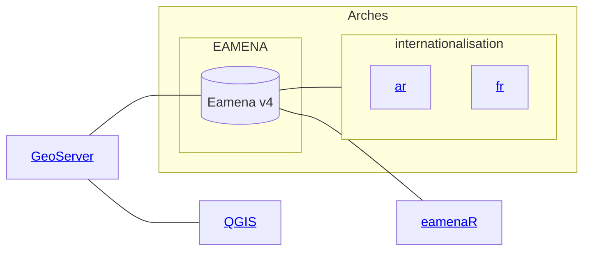
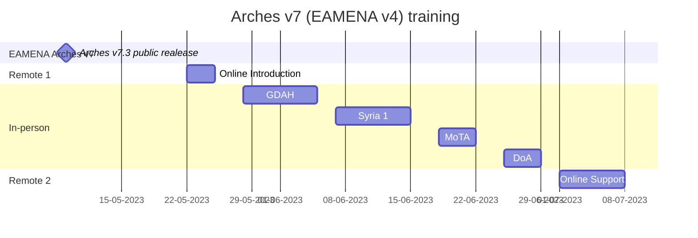

# Arches/EAMENA Trainings

by year:

* [2022](https://github.com/eamena-project/eamena-arches-dev/tree/main/training#2022)
* [2023](https://github.com/eamena-project/eamena-arches-dev/tree/main/training#2023)

by theme:

* [related computer applications](https://github.com/eamena-project/eamena-arches-dev/tree/main/training#related-computer-applications)

---

# Related Computer Applications

---

# 2022 
> Arches/EAMENA Database Manager CPF Training (part 2/2)

This is the second part of Database Management training for Arches-powered platform, EAMENA compliant, for cultural heritage management. The previous part (part 1) took place in person, in Amman, Jordan (5/12/21 - 9/12/21). This part focuses on database management of three Arches/EAMENA instances hosted on AWS. The provisional timetable consists of 3 different slots of 3-hours each:

  1. Slot 1: Documentation and customization of the project

  2. Slot 2: Arches Management tools

  3. Slot 3: Installing the project on a server

---
## Timetable

This online training will be hosted online (ZOOM): "Arches/EAMENA Database Manager Zoom Meeting part 2"  
  
* Monday 14 February, 8:00 - 11:00 (BCT) / 10:00 - 13:00 (EET)
  - ~~https://zoom.us/j/94050549401?pwd=VTgraWRRRGRlNkhBMXRXdWdPVHVWQT09~~  

* Tuesday 15 February, 8:00 - 11:00 (BCT) / 10:00 - 13:00 (EET)
  - ~~https://zoom.us/j/91691114706?pwd=NTh6YlBENFVSalVCTG5IN3FtanpGQT09~~ 

* Wednesday 16 February, 8:00 - 11:00 (BCT) / 10:00 - 13:00 (EET)~~
  - ~~https://zoom.us/j/96809107674?pwd=d2llQXhnMDgwN2dpa2tLczZSL3VlZz09~~  

---

## Documentation

### Part 2/2

* Requirements installation tuto: 
  - https://docs.google.com/presentation/d/1qkF8w4J4BCjR_LEzWJ9Pn2lvQXO7zpW8A5MVF6obPSw/edit?usp=sharing
    + SSH clients for terminal commands and file transfer: [PuTTY](https://www.putty.org/) and [FileZilla](https://filezilla-project.org/)
    + IDE for code edition: [Microsoft VS Code](https://code.visualstudio.com/), *or* Sublime, *or* Notepad++, etc.  
    + (opt) Create a [GitHub](https://github.com/join) account for co-development between your institution and the EAMENA team

* Part 2 slides:
  - https://docs.google.com/presentation/d/1Si44scv7N9XxaGBCKYyRMorDnrj6gc362ZHQ-622cfM/edit?usp=sharing
 
* GitHub: https://github.com/eamena-project
  - training material: https://github.com/eamena-project/eamena-arches-dev/tree/main/training
    + IT reference commands: https://github.com/eamena-project/eamena-arches-dev/blob/main/training/commands.md ~~https://github.com/eamena-project/eamena-arches-dev/blob/main/training/commands.sh~~
    + Issue threads:
      + Jordan: https://github.com/eamena-project/eamena-arches-dev/issues/2
      + Lebanon: https://github.com/eamena-project/eamena-arches-dev/issues/3
      + Palestine: https://github.com/eamena-project/eamena-arches-dev/issues/4
      
  - Arches/EAMENA package: https://github.com/eamena-project/eamena-arches-package

### Part 1/2

* Part 1 slides:
  - day 1: https://docs.google.com/presentation/d/1k9JMuj5oSZXHO3Z9RSVMogn4CUSJ1EK8Plus8sK7xDo/edit#slide=id.p
  - day 2: https://docs.google.com/presentation/d/1zsqCzLDIotaShU9OUXg4tMWfaTrMF5fF5bZoLuhavKs/edit#slide=id.p
  - day 3: https://docs.google.com/presentation/d/16wjDpFGCn20tQcDdjrchhp9ZJiJvJsL6dKlF_rH-QjI/edit#slide=id.p
  - day 4: https://docs.google.com/presentation/d/1ki9Uefiop3SG3qOrLHUYrjzTekoaLXK5Iy2bMiFR0kM/edit#slide=id.p
  - day 5: https://docs.google.com/presentation/d/1G_2cqayQZDrL68W9Fcs1UIKRaSBW1k8YhnkKAysJ-zM/edit#slide=id.p

* Part 1 reference glossary:
  - https://docs.google.com/spreadsheets/d/13JwjiHjx6pqlSjRYxPc0yW0Rj3voGDJVqTe23j2kO3g/edit#gid=0

### Arches full stack

* project: https://www.archesproject.org/
* demo (v5): http://v5demo.archesproject.org/search?paging-filter=1
* documentation: https://arches.readthedocs.io/en/stable/
  - documentation 5.2: https://arches.readthedocs.io/en/5.1/
* forum: https://community.archesproject.org/
* GitHub: https://github.com/archesproject/arches
* development: https://www.archesproject.org/development/

### Main Arches dependencies

* Django: https://www.djangoproject.com/
* Python: https://www.python.org/
  - online Python compiler editor: 
    + Chrome: https://chrome.google.com/webstore/detail/python-compiler-editor/cbobmdabfjfogbodncgennjhpcmdlfin
    + other browsers: https://www.programiz.com/python-programming/online-compiler/
* PostgreSQL: https://www.postgresql.org/
  - pgAdmin4: https://www.pgadmin.org/
* ElasticSearch: https://www.elastic.co/

---

# 2023

Training on online & support on the Arches v7 (EAMENA v4) database for:
* sys admins only: [Remote 1](https://github.com/eamena-project/eamena-arches-dev/tree/main/training#sys-admin-training) and [Support](https://github.com/eamena-project/eamena-arches-dev/tree/main/training#online-support);  

* users & database managers & sysadmins: [In-person](https://github.com/eamena-project/eamena-arches-dev/tree/main/training#users--database-managers--sys-admins-training);

From the MoTA (Palestine) and DoA (Jordan). The following table shows which part of the training the users, database managers and sys admin are expected to attend.

|   | user  | database manager  | sys admin  |
|---|---|---|---|
| [Remote 1](https://github.com/eamena-project/eamena-arches-dev/tree/main/training#sys-admin-training)  |   |   | x |
| [In-person](https://github.com/eamena-project/eamena-arches-dev/tree/main/training#users--database-managers--sys-admins-training)  | x | x | x |
| [Support](https://github.com/eamena-project/eamena-arches-dev/tree/main/training#online-support) |   |   | x |

## Time table

Time table for the trainings and online support. 

## 'sys admin' training

### Remote 1
> Online training for Arches platform system administrators, prepared by Reuben Osborne and Thomas Huet

Monday 22 May, Tuesday 23 May and Wednesday 24 May 2023, between 9-11am ~~and 12-2pm~~ (UK time):

|   | Jordan/Palestine  | UK  | GMT  |
|---|---|---|---|
| morning  | 11am-1pm  | 9am-11am | 8am-10am |
| ~~afternoon~~  | ~~2pm-4pm~~ | ~~12pm-2pm~~ | ~~11am-1pm~~ |

#### Introduction
> Thomas Huet

* What is Arches?
* What problem does it solve?

#### Training
> Reuben Osborne

Understanding the purpose, architecture and software stack of Arches
* ~~Key features and use cases~~
* Software architecture diagram
* ~~Core concepts:~~
    - ~~Resource models and Branches~~
    - ~~Cidoc CRM and ontologies~~
    - ~~Concepts~~
    - ~~Collections~~

How to install Arches on a Linux OS
* Pip install
* Git clone install
* Install script for deps
* Requirements file
* Docker and docker-compose
* ~~Creating a project~~
* Serving to the internet, Apache, WSGI

~~File/Folder hierachical system~~

~~Understand project and packages~~
* ~~What is a project?~~
* ~~What is a package?~~
* ~~Why are packages useful in Arches?~~
* ~~Layout of a package~~

Understand the CLI reference
* Apache
  - status, stop, restart
* ElasticSearch (ES)
  - status, stop, restart
  - indexing
* Others
  - Celery
* Runserver
* Collectstatic
* ~~Load package~~
* ~~Load data~~
* Looking at different logs

Debug
* Debug SSH connection
* Understand the `DEBUG = True` in settings.py
* Uses cases of a browser inspector

Backups
* Dumping db
* Scheduling cronjob db dump
* ~~Creating packages~~
* AWS snapshot
* Other options

~~Usage of online and collaborative resources~~
* ~~Docs~~
* ~~Community Forum~~
* ~~GitHub~~
* ~~Popular Django forums~~

## 'users & database managers & sys admins' training
> In-person training for users, database managers and sys admins

The training material is available on the EAMENA website: https://eamena.web.ox.ac.uk/cpf-training

### Day 1

1.1.    Introduction to the database

1.2.    PRACTICAL: Simple navigation, login, select language etc

+ Introduction to the EAMENA Database Version 3 | [English](https://eamena.web.ox.ac.uk/sites/default/files/eamena/documents/media/0_-_eamena_v3_db_general_introduction.pdf) | [عربي](https://eamena.web.ox.ac.uk/sites/default/files/eamena/documents/media/0_-_eamena_v3_db_general_introduction_arabic_compressed.pdf) |
    + [Part 1 – Introduction](https://youtu.be/HwGb9R1vYMw)
    + [Part 2 – Logging In](https://youtu.be/bfV4qRPTCxk)
    + [Part 3 – Resources Overview](https://youtu.be/eTzQWbLb0mk)
    + [Part 4 – Navigating](https://youtu.be/WWQrjI1hLhc)

1.3.    PRACTICAL: Simple searching and viewing records

+ Searching the Database (Basic) | [English](https://eamena.web.ox.ac.uk/sites/default/files/eamena/documents/media/1_-_eamena_v3_-_searching_the_database_-_basic.pdf) | [عربي](https://eamena.web.ox.ac.uk/sites/default/files/eamena/documents/media/1b_-_eamena_v3_-_finding_your_records.pdf) |
    + [Searching the Database – Basic](https://youtu.be/9bJeTLpFvQs)

1.4.    PRACTICAL: Database terms intro and create own Person/Organisation record

+ Creating a new Person/Organization Record | [English](https://eamena.web.ox.ac.uk/sites/default/files/eamena/documents/media/2_-_eamena_v3_-_person_and_organisation.pdf) | [عربي](https://eamena.web.ox.ac.uk/sites/default/files/eamena/documents/media/2_-_eamena_v3_-_person_and_organisation_arabic.pdf) |
    + [Person/Organization Records](https://youtu.be/Q35uPjthQo8)

### Day 2

2.1.    PRACTICAL: Heritage Place – Assessment Summary

+ Assessment Summary | [English](https://eamena.web.ox.ac.uk/sites/default/files/eamena/documents/media/3_-_eamena_v3_-_assessment_summary.pdf) | [عربي](https://eamena.web.ox.ac.uk/sites/default/files/eamena/documents/media/3_-_eamena_v3_-_assessment_summary_arabic.pdf) |
    + [A Heritage Place example: Rujm al Faridiyyeh, Jordan](https://youtu.be/HHGN8FJTv8Y)
    + [Part 1 – Assessment Summary](https://youtu.be/c7qh3PwROgI)
    + [Part 2 – Assessment Summary](https://youtu.be/-sopmEZY1Zc)
    + [Part 3 – Assessment Summary](https://youtu.be/XbAxJJQXJw8)

2.2.    PRACTICAL: Heritage Place – Resource Summary, Geometry, Geography

+ Resource Summary | [English](https://eamena.web.ox.ac.uk/sites/default/files/eamena/documents/media/4_-_eamena_v3_-_resource_summary.pdf) | [عربي](https://eamena.web.ox.ac.uk/sites/default/files/eamena/documents/media/4_-_eamena_v3_-_resource_summary_arabic.pdf) |
    + [Resource Summary](https://youtu.be/vogizPGzk9A)
+ Geometries | [English](https://eamena.web.ox.ac.uk/sites/default/files/eamena/documents/media/5_-_eamena_v3_-_geometries.pdf) | [عربي](https://eamena.web.ox.ac.uk/sites/default/files/eamena/documents/media/5_-_eamena_v3_-_geometries_arabic.pdf) |
    + [Part 1 – Introduction](https://youtu.be/92Z_J1wwAD0)
    + [Part 2 – Adding a polygon](https://youtu.be/DtJ_DROyKf8)
    + [Part 3 – Location and Geometry Extent Certainties, Geometry Type](https://youtu.be/MK0LYdXyk2k)

+ Geography  | [English](https://eamena.web.ox.ac.uk/sites/default/files/eamena/documents/media/6_-_eamena_v3_-_geography_updated.pdf) | [عربي](https://eamena.web.ox.ac.uk/sites/default/files/eamena/documents/media/6_-_eamena_v3_-_geography_arabic_updated.pdf) |
    + [Geography (Part 1)](https://youtu.be/bDIpbBfxOw8)
    + [Geography (Part 2)](https://youtu.be/wnAXmrlij3s)

2.3.    PRACTICAL: Heritage Place – Archaeological Assessment

+ Archaeological Assessment | [English](https://eamena.web.ox.ac.uk/sites/default/files/eamena/documents/media/7_-_eamena_v3_-_archaeological_assessment_updated.pdf) | [عربي](https://eamena.web.ox.ac.uk/sites/default/files/eamena/documents/media/7_-_eamena_v3_-_archaeological_assessment_arabic_updated.pdf) |
    + [Part 1 - Overall Morphology and Chronology](https://youtu.be/38ElNVPEBKI)
    + [Part 2 - Site Features](https://youtu.be/oUYDVzyCp6M)
    + [Part 3 - Measurements, Materials and Geoarchaeology](https://youtu.be/ikvU6TdRBpk)

2.4.    PRACTICAL: Heritage Place – Environment Assessment and practice

+ Environment Assessment | [English](https://eamena.web.ox.ac.uk/sites/default/files/eamena/documents/media/8_-_eamena_v3_-_environment_assessment.pdf) | [عربي](https://eamena.web.ox.ac.uk/sites/default/files/eamena/documents/media/8_-_eamena_v3_-_environment_assessment_arabic.pdf) |
    + [Environment Assessment](https://youtu.be/7HzOIo4a3UM)

### Day 3

3.1.    PRACTICAL: Heritage Place – Condition Assessment

+ Condition Assessment Site | [English](https://eamena.web.ox.ac.uk/sites/default/files/eamena/documents/media/12_-_eamena_v3_-_condition_assessment.pdf) | [عربي](https://eamena.web.ox.ac.uk/sites/default/files/eamena/documents/media/12_-_eamena_v3_-_condition_assessment_site_arabic.pdf) |
    + [Part 1 - Condition Assessment](https://youtu.be/HnQF4EiOCFA)
    + [Part 2 - Condition Assessment](https://youtu.be/pGrob0SeNfc)
    + [Part 3 - Condition Assessment](https://youtu.be/niK2J33PTRA)

3.2.    PRACTICAL: Information Resource

+ Information Resource | [English](https://eamena.web.ox.ac.uk/sites/default/files/eamena/documents/media/15_-_eamena_v3_-_information_resource_1_compressed.pdf) | [عربي](https://eamena.web.ox.ac.uk/sites/default/files/eamena/documents/media/15_-_eamena_v3_-_information_resource_arabic_compressed.pdf) |
    + [Part 1 - Introduction](http://youtu.be/WE3GZ0Xj8As)
    + [Part 2a - Bibliography](https://youtu.be/7jRXBp6Mkqo)
    + [Part 2b - Photographs](https://youtu.be/fOgKYzZU0yU)
    + [Part 2c - Google Earth](https://youtu.be/fmqTkwhsi1o)
    + [Part 2d - Cartography](https://youtu.be/IQ4zbqQttsk)
    + [Part 3 - Location, File Upload and Additional Information](https://youtu.be/iqegOtkkugw)

3.3.    PRACTICAL: Built Component

+ Built Component: Observation, Measurements, Material, Geometry, Assessment Summary | [English](https://eamena.web.ox.ac.uk/sites/default/files/eamena/documents/media/13_-_eamena_v3_-_built_component.pdf) | [عربي](https://eamena.web.ox.ac.uk/sites/default/files/eamena/documents/media/13_-_eamena_v3_-_built_component_arabic.pdf) |
    + [Part 1 – Introduction](https://youtu.be/NHSuz8XeqgY)
    + [Part 2 – How to Create a Built Component](https://youtu.be/gph1hz7qKuQ)

3.4.    PRACTICAL: Detailed Condition Assessment (we can take the trainees outside to old Amman for a practical session)

+ Detailed Condition Assessment | [English](https://eamena.web.ox.ac.uk/sites/default/files/eamena/documents/media/14_-_eamena_v3_-_detailed_condition_assessment.pdf) | [عربي](https://eamena.web.ox.ac.uk/sites/default/files/eamena/documents/media/14_-_eamena_v3_-_detailed_condition_assessment_arabic.pdf) |
    + [Part 1 – Introduction](https://youtu.be/Dq64KukGyIA)
    + [Part 2 - Measurements, Location, Modification and Construction](https://youtu.be/kSaDkEmLrh4)
    + [Part 3 - Damage Assessment](https://youtu.be/saes0xtNy6s)
    + [Part 4 - Threat and Risk Assessment](https://youtu.be/6agJZB2A0-4)
    + [Part 5 - Overall Condition, File Upload and Related Resources](https://youtu.be/pA_zkWaa1Uc)

### Day 4

4.1.    PRACTICAL: Advanced Search and making graphs

+ Advanced (complex) Searches | [English](https://eamena.web.ox.ac.uk/sites/default/files/eamena/documents/media/17_-_eamena_v3_searching_the_database_2_-_advanced_final2.pdf) | [عربي](https://eamena.web.ox.ac.uk/sites/default/files/eamena/documents/media/17_-_eamena_v3_searching_the_database_2_-_advanced_arabic_compressed.pdf) |
    + [Part 1 - Introduction](https://youtu.be/-dKez1iYa5Q)
    + [Part 2 - 'And' and 'Or' Searches](https://youtu.be/92IvC_ojEuo)
    + [Part 3 - Combining Simple and Advanced Searches](https://youtu.be/SkylErStQcw)
    + [Part 4 - Time Filter](https://youtu.be/Kz5F3WGkzFg)
    + [Part 5 - Examples](https://youtu.be/aD4oF0xNye4)
+ Making tables and graphs based on database data | [English](https://eamena.web.ox.ac.uk/sites/default/files/eamena/documents/media/18_-_making_tables_and_graphs-compressed.pdf) | [عربي](https://eamena.web.ox.ac.uk/sites/default/files/eamena/documents/media/18_-_making_tables_and_graphs_final_-_arb_compressed.pdf) |
    + [Part 1 - Introduction](https://youtu.be/0XlKgpsfcQs)
    + [Part 2](https://youtu.be/L7G7EkdqHAI)
    + [Part 3](https://youtu.be/_ht91zEqneA)
    + [Part 4 - Searching](https://youtu.be/1YU5injzdig)
    + [Part 5 - Percentages](https://youtu.be/KRpsOlJQYn8)
    + [Part 6a - In Google Sheets](https://youtu.be/SfvKPNpNjVg)
    + [Part 6b - In Excel](https://youtu.be/UmGl9IoE1tk)
    + [Part 6c - In Open Office](https://youtu.be/a-xNw5qMLfE)
    + [Part 7 - Export a Graph as an Image](https://youtu.be/afAqzY1F6g4)

4.2.    PRACTICAL: QGIS Introduction to map making

+ QGIS Recap | [English](https://eamena.web.ox.ac.uk/sites/default/files/eamena/documents/media/gis_1_-_introduction_to_qgis_and_making_a_simple_map_final.pdf) | [عربي](https://eamena.web.ox.ac.uk/sites/default/files/eamena/documents/media/gis_1_-_introduction_to_qgis_and_making_a_simple_map_arabic_compressed_1.pdf) |
    + [GIS 1.1 - Introduction](https://youtu.be/6-Cvf8KzBzM)
    + [GIS 1.2.1 - Simple Map (XYZ Tiles)](https://youtu.be/RBLJSkFt6gc)
    + [GIS 1.2.2 - Simple Map (Natural Earth)](https://youtu.be/4CTEFq2exV8)
    + [GIS 1.2.3 - Simple Map (OpenStreetMap)](https://youtu.be/wqJT91sOzrM)
    + [GIS 1.2.4 - Simple Map (Exporting a Map)](https://youtu.be/sebD-_TRiqY)

4.3.    PRACTICAL: export data and import into QGIS

+ Exporting from the database | [English](https://eamena.web.ox.ac.uk/sites/default/files/eamena/documents/media/19_-_eamena_v3_exporting.pdf) | [عربي](https://eamena.web.ox.ac.uk/sites/default/files/eamena/documents/media/19_-_eamena_v3_exporting_arabic_compressed.pdf) |
    + [Part 1 - Introduction](https://youtu.be/LssKo9rBekg)
    + [Part 2 - Using the Excel Reorganising Macro](https://youtu.be/rjWepf_iQCc)
    + [Part 3 - Using the Google Sheets Macro](https://youtu.be/QQN-Wobmibs)
    + [Part 4 - Importing Shapefiles to Google Earth](https://youtu.be/p3Lgvq8dyrA)

4.4.   PRACTICAL: Trainees prepare for a short 10mins presentation on the final day about what they have learnt

### Day 5

5.1. Presentation by trainees

5.2. Presentation by trainees

5.3. Ceritificate distribution by Bill

5.4. Packing

## Online support
> Online support for sys admins

EAMENA offers 10 days of online support, led by Reuben Osborne and Thomas Huet, to program on demand

