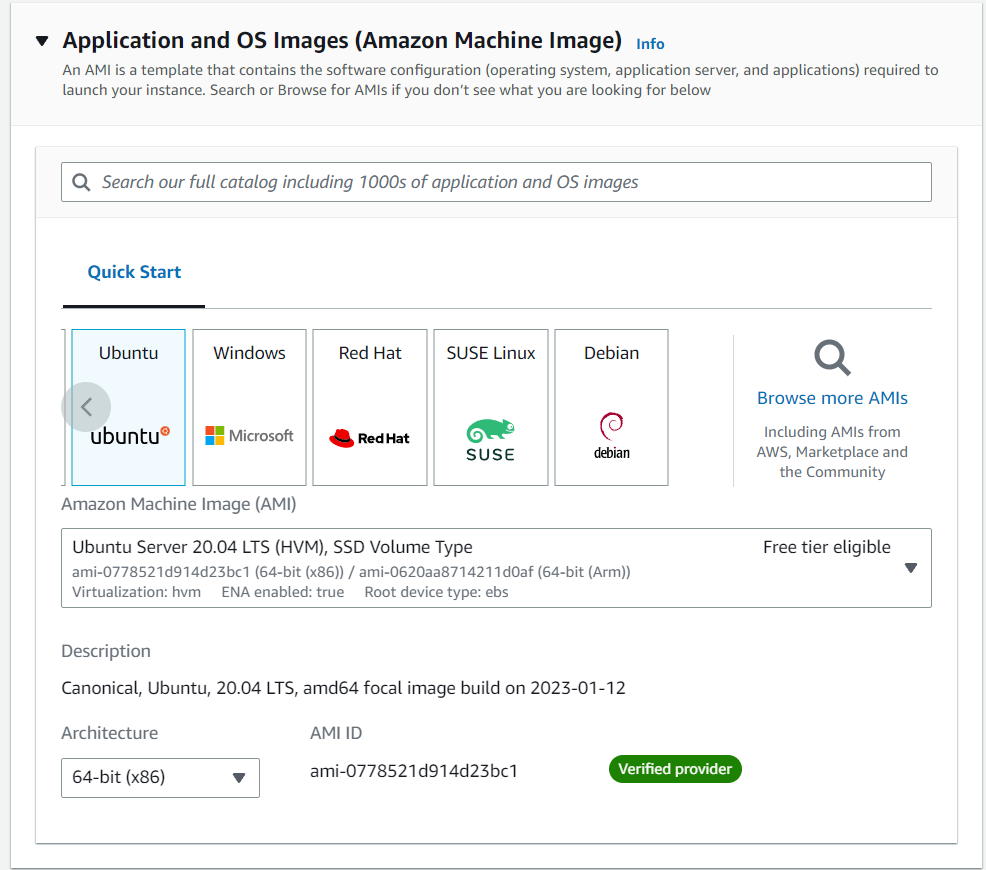

# Arches v7

## OS

It works for 18.04 and 20.04, and preliminary testing shows it be compatible with 22.04 as well ([source](https://arches.readthedocs.io/en/stable/requirements-and-dependencies/))

-> Ubuntu 20.04

  
   
    <em>xxx</em>

