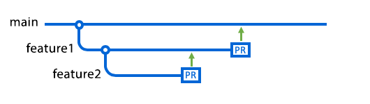

# GitHub presentation
> how GitHub can improve IT and data management in the EAMENA project

**Objectives**: transferring most of the development of the EAMENA database from standalone files (XLSX, DOCX, etc.), Slack, Mail, Google Doc, etc., to GitHub

  

## GitHub purpose

Collaboration & Versioning

## Glossary

| term       | description                                                                                                     |
|------------|-----------------------------------------------------------------------------------------------------------------|
| repository | contains all of your project's files and each file's revision history                                           |
| branch     | represents an independent line of development                                                                   |
| pull request | represents an independent line of development                                                                   |

## Git
> git version control system, version control system
  

---
🔎 Distributed version control system for tracking changes to a set of files. Typically used to coordinate the work of programmers who collaborate on source code during software development. The objectives are speed, data integrity and support for distributed and non-linear workflows.
---

### Main commands

#### from local to remote
> from *downstream* to *upstream*

`$ git add .; git commit -m "training GitHub" ; git push`

| command    | description                                                                                                     |
|------------|-----------------------------------------------------------------------------------------------------------------|
| git add    | Moves every changes from the working directory to the staging area before committing it to the official history |
| git commit | Takes the staged snapshot and commits it to the project history                                                 |
| git push   | Move a local branch to the remote repository (*push upstream*)                                                  |

#### from remote to local
> from *upstream* to *downstream*

| command    | description                                                                                                     |
|------------|-----------------------------------------------------------------------------------------------------------------|
| git pull   | Downloads a branch from a remote repository to the local branch                                                 |
| git clone  | Downloads a copy of an existing GitHub repository in your local computer                                           |

## GitHub architecture

### Syntaxes

- Markdown, and HTML, for free text
- [YAML](https://github.com/zoometh/thomashuet/blob/4588894ae1eb6600ad983c313b1d016d8c904593/profiles/oxford/R4A/1_Rmarkdown_Theory.Rmd#L2) headers
- Programming languages for coding: [Python](https://github.com/ads04r/po2excel), [R](https://github.com/eamena-project/eamenaR)
- [Mermaid](https://github.com/eamena-project/eamena-arches-dev/blob/main/data/bulk/temp.md) to create diagrams

R + Markdown:
- [R Markdown](https://github.com/zoometh/thomashuet/tree/main/profiles/oxford/R4A#report-with-r-markdown-)
- [Quarto](https://github.com/zoometh/thomashuet/blob/main/profiles/oxford/stats/GOA/index.qmd)

### Files & Folders

| files      | description                                                                                                     |
|------------|-----------------------------------------------------------------------------------------------------------------|
| README.md  | first displayed file in GH. Uses markdown syntax                                                                |
| .gitignore | list the files/folders that will be ignored in Git operations                                                   |
| LICENCE    | determine the permissions for any potential reuse of your repository                                            |

### Issue threads

https://github.com/eamena-project/eamena-arches-dev/issues

### GitHub pages

https://zoometh.github.io/neonet/results/neonet_atl

## Connection

SSH connection

### Test you connection

## Workflow

## Case of study

### 1: Working with GeoJSON files and the *eamenaR* package

1. Install/Load the *eamenaR* package
2. Read an online and/or local GeoJSON file
3. Run an *eamenaR* function on this GeoJSON file

### 2: Editing the Bulk README tutorial file

## Documentation

the CAA22 Special Interest Group SSLA workshop:  "How to navigate the coding archaeology world": https://github.com/sslarch/caa2022_GitGitHub_workshop
