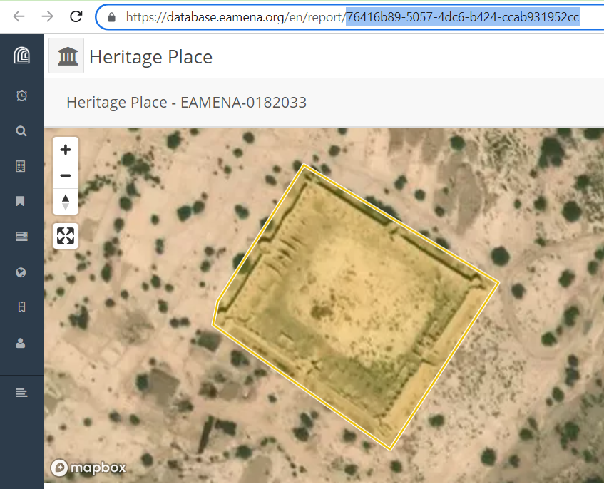
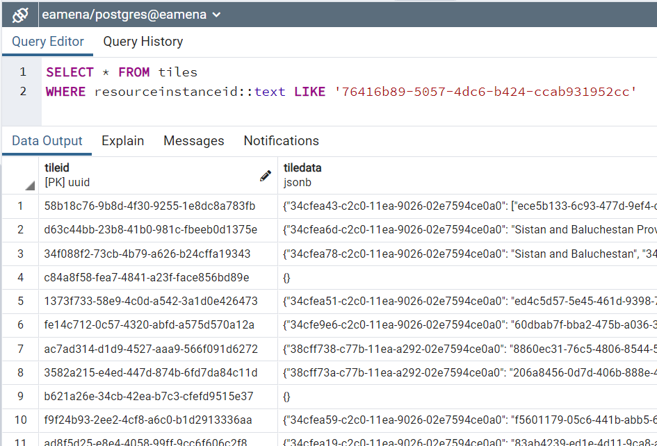
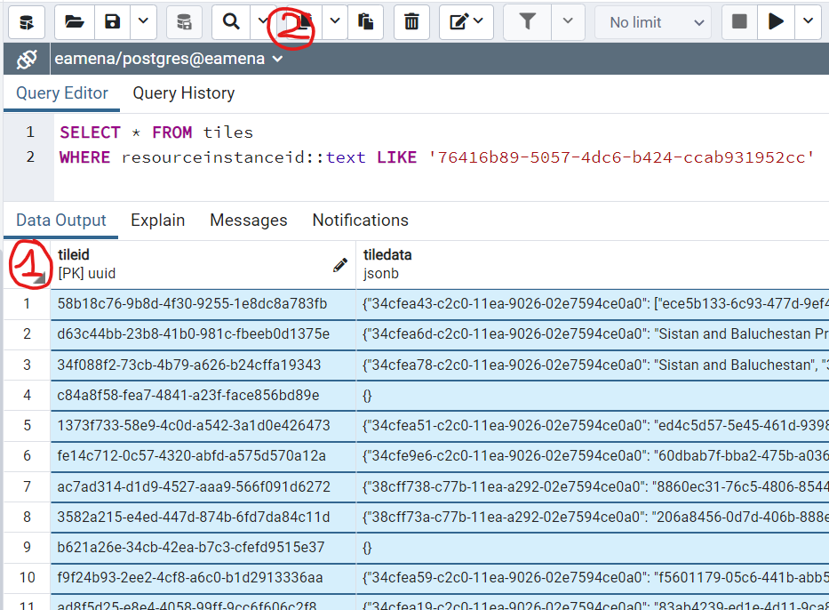
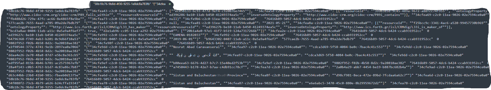
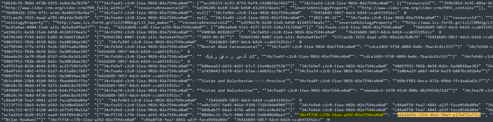
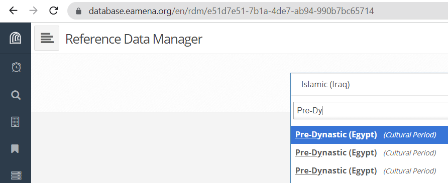
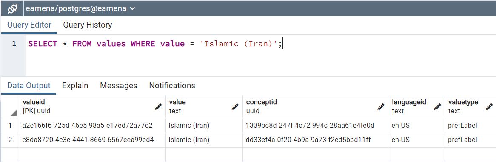

# Search and update in the Postgres database


## Get all data of a given HP

### Get the UUID

For a given HP, here `EAMENA-0182033`, copy its UUID from the Arches interface

<p align="center">
  
  <br>
    <em>screenshot of the Arches interface, copy the UUID in the URL of `EAMENA-0182033` </em>
</p>

The `EAMENA-0182033`'s UUID is: `76416b89-5057-4dc6-b424-ccab931952cc`. 

### Collect all data

Use this UUID to collect all the data from this `EAMENA-0182033` by running in PgAdmin (Postgresql), this SQL (Tools > Query Tool):

```
SELECT * FROM tiles 
WHERE resourceinstanceid::text LIKE '76416b89-5057-4dc6-b424-ccab931952cc'
```

<p align="center">
  
  <br>
    <em>screenshot of the SQL on the table `tiles`</em>
</p>

Then copy all these data by clicking on the top left corner of the Data Output (1) and clicking on the copy button (2)

<p align="center">
  
  <br>
    <em>copy all the data of `EAMENA-0182033` from Postgres</em>
</p>

Paste all this data in a text editor, for example Sublime:

<p align="center">
  
  <br>
    <em>paste all the data of `EAMENA-0182033` to a text editor</em>
</p>

We will take advantage of the UUID; by definition they are unique. So, if we search for one in particular, we will be sure we get the right one. 

<p align="center">
  
  <br>
    <em>search for `a2e166f6-725d-46e5-98a5-e17ed72a77c2` in the text editor</em>
</p>

The `a2e166f6-725d-46e5-98a5-e17ed72a77c2` value has been found, let's copy the key of this value (`38cff73b-c77b-11ea-a292-02e7594ce0a0`) here below in yellow and light yellow

## Issues

### Issue 1

There are 3 different concepts with exactly the same value (`Pre-Dynastic (Egypt)`). There 136 HPs with this value. We want all of same having the same value.

<p align="center">
  
  <br>
    <em>screenshot of the dedicated <a href="https://community.archesproject.org/t/duplicated-values-find-and-replace-bis/1811?u=zoometh">Arches forum's thread</a> </em>
</p>

In the 

<p align="center">
  
  <br>
    <em>screenshot of the dedicated <a href="https://community.archesproject.org/t/duplicated-values-find-and-replace-bis/1811?u=zoometh">Arches forum's thread</a> </em>
</p>


#### Solution

In PgAdmin (Postgresql), run this SQL (Tools > Query Tool)

```
SELECT * FROM values WHERE value = 'Islamic (Iran)'
```

<p align="center">
  
  <br>
    <em>screenshot of the SQL on the table `values`</em>
</p>

The only differences between the records are the UUID, `valueid` and `conceptid`  
> here, one of the `valueid` is `a2e166f6-725d-46e5-98a5-e17ed72a77c2`  

From the remote CLI, we can see the difference between these records, starting with the `conceptid` = `1339bc8d-247f-4c72-994c-28aa61e4fe0d`. Run:

``` 
python manage.py whatisthis 1339bc8d-247f-4c72-994c-28aa61e4fe0d
```
Gives: 

```
================================================================================
This UUID is the primary key for 1 object:
--------------------------------------------------------------------------------
Node object (38cff73b-c77b-11ea-a292-02e7594ce0a0)
_state
  <django.db.models.base.ModelState object at 0xffff9ec7efa0>
config
  {'rdmCollection': '2207326d-e72a-48f7-ae7b-6f223d555a7a'}
datatype
  concept
description
  None
exportable
  True
fieldname
  Period
graph_id
  34cfe98e-c2c0-11ea-9026-02e7594ce0a0
isrequired
  False
issearchable
  True
istopnode
  False
name
  Cultural Period Type
nodegroup_id
  38cff734-c77b-11ea-a292-02e7594ce0a0
nodeid
  38cff73b-c77b-11ea-a292-02e7594ce0a0
ontologyclass
  http://www.ics.forth.gr/isl/CRMinf/I4_Proposition_Set
sortorder
  0
```

Now the second `conceptid`:

```
python manage.py whatisthis dd33ef4a-0f20-4b9a-9a73-f2ed5bbd11ff
```
Gives:

```
================================================================================
This UUID is the primary key for 1 object:
--------------------------------------------------------------------------------
Concept object (dd33ef4a-0f20-4b9a-9a73-f2ed5bbd11ff)
_state
  <django.db.models.base.ModelState object at 0xffff973547c0>
conceptid
  dd33ef4a-0f20-4b9a-9a73-f2ed5bbd11ff
legacyoid
  http://localhost:8000/dd33ef4a-0f20-4b9a-9a73-f2ed5bbd11ff
nodetype_id
  Concept
================================================================================
```


  
---
  
[^1]: the working directory should be something like `(ENV) root@ip-172-31-39-197:/opt/arches/eamena#` where the *user* is `root` and the Python virtual environment (`ENV`) has been activated.