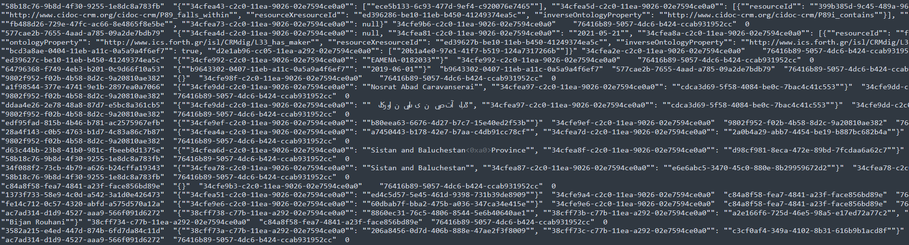
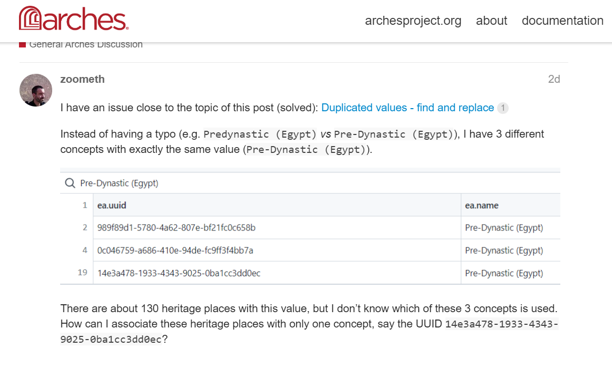

# Search and update in the Postgres database


## Get all data of a given HP

### Get the UUID

For a given HP, here `EAMENA-0182033`, copy its UUID from the Arches interface

<p align="center">
  
  <br>
    <em>screenshot of the Arches interface, copy the UUID in the URL of `EAMENA-0182033` </em>
</p>

The `EAMENA-0182033`'s UUID is: `76416b89-5057-4dc6-b424-ccab931952cc`. 

### Collect all data

Use this UUID to collect all the data from this `EAMENA-0182033` by running in PgAdmin (Postgresql), this SQL (Tools > Query Tool):

```
SELECT * FROM tiles 
WHERE resourceinstanceid::text LIKE '76416b89-5057-4dc6-b424-ccab931952cc'
```

<p align="center">
  
  <br>
    <em>screenshot of the SQL on the table `tiles`</em>
</p>

Then copy all these data by clicking on the top left corner of the Data Output (1) and clicking on the copy button (2)

<p align="center">
  
  <br>
    <em>copy all the data of `EAMENA-0182033` from Postgres</em>
</p>

Paste all this data in a text editor, for example Sublime:

<p align="center">
  
  <br>
    <em>paste all the data of `EAMENA-0182033` to a text editor</em>
</p>

We will take advantage of the UUID; by definition they are unique. So, if we search for one in particular, we will be sure we get the right one. 


## Issues

### Issue 1

There are 3 different concepts with exactly the same value (`Pre-Dynastic (Egypt)`). There 136 HPs with this value. We want all of same having the same value.

<p align="center">
  
  <br>
    <em>screenshot of the dedicated <a href="https://community.archesproject.org/t/duplicated-values-find-and-replace-bis/1811?u=zoometh">Arches forum's thread</a> </em>
</p>

#### Solution

In PgAdmin (Postgresql), run this SQL (Tools > Query Tool)

```
SELECT * FROM values WHERE value = 'Islamic (Iran)';
```

<p align="center">
  
  <br>
    <em>screenshot of the SQL on the table `values`</em>
</p>
